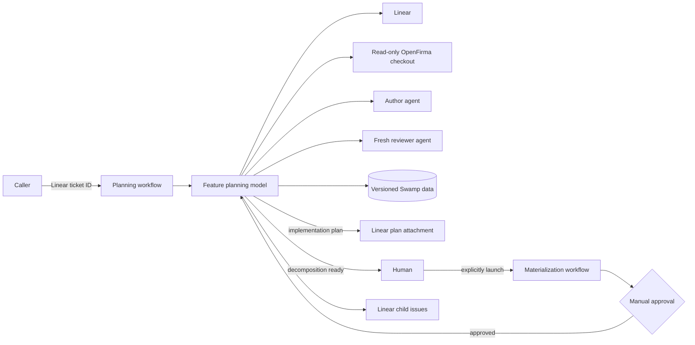
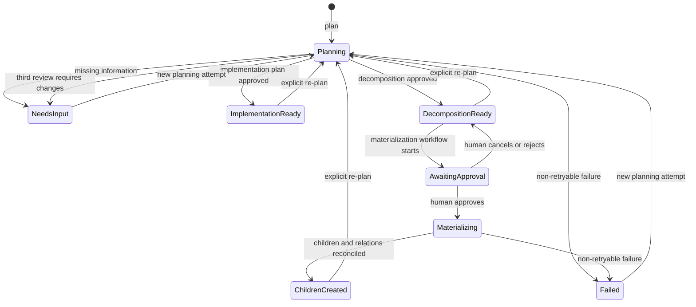

# OpenFirma Feature Planning Workflow

| Field           | Value                                                         |
| --------------- | ------------------------------------------------------------- |
| Status          | Proposed v1                                                   |
| Canonical scope | Linear ticket to reviewed implementation plan or child issues |
| Primary input   | Linear issue identifier, for example `FIR-123`                |
| Target runtime  | Swamp model plus two thin workflows                           |
| Last updated    | 2026-07-23                                                    |

## Purpose

This document specifies a state machine that turns one OpenFirma Linear ticket
into one of three product outcomes:

1. A reviewed implementation plan attached to the original ticket.
2. A reviewed decomposition materialized as child Linear tickets after human
   approval.
3. A terminal escalation asking a human to improve the ticket or resolve review
   findings.

A repository-aware headless agent drafts and repairs plans. A fresh,
repository-aware agent reviews every plan-based result without seeing the
author's transcript, hidden reasoning, or repair rationale. Review and repair
are bounded to three completed reviews.

This is a design contract. It does not claim that the required Linear or
headless-agent adapters already exist in this repository.

## Goals

- Accept one Linear issue identifier.
- Produce plans grounded in the current OpenFirma repository.
- Distinguish cohesive implementation work from work that needs decomposition.
- Escalate when missing product or architecture decisions prevent a tight plan.
- Run every review in a fresh context with independent repository access.
- Permit at most three completed adversarial reviews.
- Require hash-bound human approval before creating child issues.
- Persist ticket context, candidates, reviews, effects, and outcomes as versioned
  Swamp data.
- Project coarse lifecycle state and triage information into Linear.
- Reconcile partial child creation without knowingly creating duplicates.

## Non-goals

- Implement the feature, open a pull request, or modify the OpenFirma working
  copy.
- Build a general distributed workflow engine inside the planning model.
- Guarantee transactional consistency between Swamp and Linear.
- Invalidate a run for minor edits to the source ticket.
- Automatically dispatch or resume the decomposition workflow.
- Prevent a privileged operator with direct model-method access from bypassing
  the documented workflow path; deployment permissions own that boundary.
- Automatically process private security reports through public Linear comments.

## Design Summary

The design follows the useful boundary demonstrated by Swamp's
`@swamp/issue-lifecycle` extension:

- One persistent model owns typed lifecycle state and versioned artifacts.
- Model preflight checks enforce important transitions.
- Agents produce semantic artifacts; the model validates and stores them.
- Linear is a collaborative projection, while Swamp is authoritative for run
  state and history.

OpenFirma deliberately strengthens two areas compared with that extension:

- Adversarial review uses a fresh agent rather than the authoring session.
- Decomposition uses a native, digest-bound manual approval gate before any
  child issue is created.

The v1 design has one planning model and two workflows:

1. A planning workflow containing one model call.
2. A materialization workflow explicitly started by a human after reviewing a
   decomposition.



## Core Boundaries

### Ticket baseline

The model fetches the Linear ticket at the start of each planning attempt and
stores a normalized baseline. Author and reviewer use that content throughout
the attempt. Minor edits made in Linear do not disturb the active loop.

When a human wants later ticket changes reflected in the plan, they start a new
planning attempt. Before decomposition approval, the workflow warns if Linear's
`updatedAt` differs from the baseline; the human decides whether the reviewed
decomposition is still appropriate. V1 does not use an LLM ticket-delta
classifier.

### Repository baseline

The model resolves the configured repository revision to an immutable Git commit
hash or Jujutsu commit ID before the first agent call. It never records a
Jujutsu change ID, because a change ID can retain its identity while its content
is rewritten. Author and reviewer receive independent read-only access to the
same immutable commit and applicable repository instructions, including
`AGENTS.md`.

### Agent separation

The author receives:

- The ticket baseline.
- The read-only repository.
- Planning conventions and output schema.
- The latest review report when repairing a candidate.

Each reviewer receives:

- The ticket baseline.
- The current candidate only.
- The read-only repository.
- Review conventions and output schema.

The reviewer does not receive earlier review reports, repair notes, author
transcripts, drafting rationale, or hidden reasoning. Every review attempt uses
a new agent session.

## Lifecycle State

The model stores only phases meaningful to operators. Drafting, reviewing,
repairing, uploading, and retrying are derived from versioned resources rather
than represented as durable top-level states.



| Phase                  | Meaning                                                         |
| ---------------------- | --------------------------------------------------------------- |
| `planning`             | Author/reviewer loop is active.                                 |
| `needs_input`          | Ticket or review findings require human work.                   |
| `implementation_ready` | Approved implementation plan has been persisted.                |
| `decomposition_ready`  | Approved decomposition is waiting for explicit materialization. |
| `awaiting_approval`    | Materialization workflow is suspended at its human gate.        |
| `materializing`        | Approved child issues are being reconciled and created.         |
| `children_created`     | All proposed children and relations are confirmed.              |
| `failed`               | A non-retryable operational failure needs intervention.         |

The model instance serializes method execution through Swamp's per-model lock.
V1 does not add custom leases, fencing tokens, or compare-and-set state claims.

## Model Identity and Attempts

One model instance represents one Linear ticket, for example
`openfirma-plan-fir-123`. Its state includes:

```typescript
interface PlanningState {
  issueIdentifier: string;
  attempt: number;
  phase:
    | "planning"
    | "needs_input"
    | "implementation_ready"
    | "decomposition_ready"
    | "awaiting_approval"
    | "materializing"
    | "children_created"
    | "failed";
  repositoryRevision?: string;
  currentCandidateVersion?: number;
  activeMaterializationRunId?: string;
  completedReviewAttempts: number;
  updatedAt: string;
}
```

Calling `plan` from `needs_input`, `failed`, `implementation_ready`,
`decomposition_ready`, or `children_created` starts a new attempt and captures
fresh ticket context. Calling it in `planning` resumes the current attempt from
the latest valid resource; it never resets the attempt. It cannot run in
`awaiting_approval` or `materializing`.

Repeated webhook delivery is deduplicated by an optional trigger event ID stored
with the attempt.

## Planning Workflow

`openfirma-feature-planning` accepts:

```yaml
type: object
additionalProperties: false
properties:
  ticket_id:
    type: string
    pattern: "^[A-Za-z][A-Za-z0-9_]*-[1-9][0-9]*$"
  repository_revision:
    type: string
  trigger_event_id:
    type: string
required:
  - ticket_id
```

It contains one step that calls `plan` on the ticket's planning model. Branching
and the bounded author/reviewer loop remain inside that method because Swamp
workflows are DAGs and cannot express a data-dependent sequential loop.

### Planning algorithm

```text
reserve next attempt and set state = planning
capture ticket baseline if absent for this attempt
resolve immutable repository commit if absent for this attempt
project Linear status = Planning

candidate = author(ticket, repository)

if candidate is needs_input:
    persist outcome
    project Needs input
    stop

persist candidate and use the returned native Swamp data version

for review_attempt in 1..3:
    report = fresh_reviewer(ticket, candidate, repository)
    persist report bound to candidate.version

    if report is approved:
        publish implementation plan or decomposition
        stop

    if review_attempt == 3:
        persist review-exhausted outcome
        project Needs input
        stop

    candidate = author_repair(ticket, candidate, report, repository)

    if candidate is needs_input:
        persist outcome
        project Needs input
        stop

    persist next candidate and use its returned native Swamp data version
```

A provider or schema failure that produces no valid review report does not
consume a review attempt.

The attempt reservation and `planning` phase are one first checkpoint, before
ticket or repository capture. `plan` then checkpoints the baseline, resolved
commit, every candidate, every review, and every Linear effect. If the process
exits while phase is `planning`, rerunning `plan` inspects those resources and
resumes at the first incomplete step.
Candidate and review data versions are monotonic across the model's lifetime;
every record also stores `attempt` so versions from separate attempts cannot be
confused.

## Planning Contracts

### Author result

```typescript
type AuthorResult =
  | {
      kind: "needs_input";
      summary: string;
      blockingQuestions: Array<{
        question: string;
        whyBlocking: string;
      }>;
    }
  | { kind: "implementation_plan"; plan: Plan }
  | { kind: "decomposition_plan"; plan: Decomposition };
```

### Common plan content

```typescript
interface Plan {
  attempt: number;
  ticket: string;
  repositoryRevision: string;
  objective: string;
  currentBehavior: string[];
  scope: string[];
  nonGoals: string[];
  assumptions: string[];
  invariants: string[];
  design: string;
  phases: Array<{
    title: string;
    changes: string[];
    codeTouchpoints: string[];
    tests: string[];
    documentation: string[];
    gate: string[];
  }>;
  risks: string[];
  acceptanceCriteria: string[];
  verificationCommands: string[];
}
```

Plans must cite concrete repository paths and consider OpenFirma's fail-closed
behavior, local hot path, deterministic enforcement, immutable execution
envelopes, supported Unix/Windows targets, strict Rust lint policy, tests, and
documentation impact when relevant.

### Decomposition content

```typescript
interface Decomposition {
  attempt: number;
  ticket: string;
  repositoryRevision: string;
  objective: string;
  whyDecompositionIsRequired: string[];
  sharedConstraints: string[];
  childTickets: Array<{
    key: string;
    ordinal: number;
    title: string;
    descriptionMarkdown: string;
    acceptanceCriteria: string[];
    dependencies: string[];
  }>;
  integrationStrategy: string[];
  overallAcceptanceCriteria: string[];
}
```

Child keys and ordinals must be unique. Dependencies must refer to proposed
children and form a DAG. Children must be non-overlapping and jointly sufficient
for the parent objective.

### Review report

```typescript
interface ReviewReport {
  attempt: number;
  candidateVersion: number;
  verdict: "approved" | "changes_required";
  summary: string;
  findings: Array<{
    id: string;
    severity: "blocking" | "high" | "medium" | "low";
    category: string;
    location: string;
    problem: string;
    requiredChange: string;
  }>;
  residualRisks: string[];
}
```

An approval is valid only for the current candidate version. `approved`
requires no actionable findings. `changes_required` requires at least one
finding.

## Swamp Model

The recommended model type is `@openfirma/feature-planning`.

### Methods

| Method                   | Purpose                                                                   |
| ------------------------ | ------------------------------------------------------------------------- |
| `plan`                   | Capture context and run the bounded author/reviewer loop.                 |
| `prepareMaterialization` | Load and bind the exact decomposition used by the approval workflow.      |
| `materialize`            | Reconcile and create children after the approval gate.                    |
| `cancelMaterialization`  | Record a rejected/abandoned approval and return to `decomposition_ready`. |
| `syncLinear`             | Retry pending Linear projection effects without changing plan state.      |
| `getOutcome`             | Read current phase and latest typed outcome without side effects.         |

`cancelMaterialization` is an explicit operator action after rejecting or
abandoning a Swamp approval run. It must be called before starting a corrected
planning attempt. V1 does not include a scheduled timeout watchdog or
gate-reconciliation workflow.

### Preflight checks

- `plan` resumes, rather than resets, `planning`; it cannot run in
  `awaiting_approval` or `materializing`.
- `prepareMaterialization` requires the current approved decomposition version
  and digest and stores the exact gate payload.
- `materialize` requires the current approved decomposition version and digest.
- `cancelMaterialization` requires `awaiting_approval`.
- `syncLinear` may not modify semantic state.
- A review must reference the current candidate version.
- No candidate may be published without an approved current review.

### Versioned resources

| Resource          | Purpose                                                     |
| ----------------- | ----------------------------------------------------------- |
| `state`           | Coarse phase, attempt, candidate version, and review count. |
| `ticketBaseline`  | Normalized Linear context captured per attempt.             |
| `candidate`       | Versioned implementation or decomposition candidates.       |
| `review`          | Versioned reports bound to candidate versions.              |
| `effects`         | Linear effect keys, status, remote IDs, and last errors.    |
| `materialization` | Gate payload, plan digest, and child-key-to-ID map.         |
| `outcome`         | Latest typed planning or materialization result.            |

Native Swamp data versions provide history. Retention and garbage-collection
counts must be configured explicitly; the design does not claim indefinite
retention of every version.

## Linear Projection

Swamp is authoritative for semantic state. Linear makes the lifecycle visible
and holds human-facing artifacts.

| Workflow outcome              | Linear status              | Additional signal                                               |
| ----------------------------- | -------------------------- | --------------------------------------------------------------- |
| Planning started              | `Planning`                 | Lifecycle comment with model and attempt ID                     |
| Human information required    | `Needs input`              | Structured blocking questions                                   |
| Review attempts exhausted     | `Needs input`              | Review report attachment                                        |
| System failure                | `Planning failed`          | Redacted diagnostic summary                                     |
| Decomposition ready           | `Awaiting approval`        | Hash-bound decomposition attachment                             |
| Implementation plan published | `Ready for implementation` | Reviewed implementation-plan attachment                         |
| Child tickets created         | `Planned`                  | Parent summary with ordered child links and dependency overview |

Status IDs are configured per Linear team. The model does not assume display
names are valid API identifiers.

### Lifecycle comment

Each attempt owns one marked Linear comment, for example:

```text
openfirma-planning:model=openfirma-plan-fir-123;attempt=2
```

The model updates that comment with current phase, latest artifact, review count,
failure summary, and restart instructions. It does not append a new progress
comment for every internal transition.

### Status ownership

The model records the issue's status at attempt start. It moves an allowed
intake status to `Planning`, then performs convergent updates to statuses in the
table. It does not overwrite an unexpected human-selected status.

Workflow-authored status, comment, label, and attachment changes are not treated
as ticket-content changes.

### Attachments

Approved plans are rendered to Markdown and uploaded through Linear's
`fileUpload` flow. The model stores one SHA-256 digest of canonical structured
plan JSON. The Markdown includes that digest and is associated with the issue as
an attachment.

The implementation plan filename is `<IDENTIFIER>-implementation-plan.md`. The
decomposition filename is `<IDENTIFIER>-decomposition-plan.md`.

### Effects and retries

The `effects` resource stores a small record for each externally visible effect:

```typescript
interface Effect {
  key: string;
  inputDigest: string;
  status: "pending" | "confirmed" | "failed";
  remoteId?: string;
  attempts: number;
  lastError?: string;
}
```

Status and lifecycle-comment updates are convergent and retried with bounded
backoff. If projection still fails, Swamp keeps the semantic result and records
that Linear is pending. `syncLinear` retries those effects later.

V1 does not use per-effect leases or fencing tokens. Swamp serializes methods on
the model instance.

## Decomposition Materialization Workflow

The human reviews the decomposition attachment, generates a fresh UUID approval
ID, then explicitly starts `@openfirma/feature-materialization` with the
planning model name, candidate version, plan digest, and approval ID.

The workflow performs:

1. Call `prepareMaterialization` with the requested candidate version, digest,
   and approval ID.
2. The method loads the exact decomposition, verifies its digest, re-fetches the
   Linear issue, stores its current `updatedAt`, persists the immutable gate
   payload, and sets phase `awaiting_approval`.
3. Suspend at a native `manual_approval` gate. The operator inspects the
   approval-specific materialization resource, which shows the issue, digest,
   attachment, child count, and whether the ticket changed since planning.
4. After approval and explicit resume, pass the exact version and digest from
   the persisted pre-gate step output to `materialize`.
5. `materialize` re-fetches Linear before creating anything. If `updatedAt`
   changed while the gate was suspended, it records `approval_stale`, creates no
   children, and returns to `decomposition_ready` so the workflow can be
   relaunched with a fresh warning.
6. Otherwise, set phase `materializing` and reconcile the children.

The model stores the active approval ID and rejects stale approval runs. The
post-gate step loads the candidate version and digest from the preparation
resource named by that approval ID rather than accepting them directly as
resume inputs.

Current Swamp model methods do not receive a cryptographic receipt proving that
a workflow gate was approved. In v1, the native gate and workflow dependency are
the enforcement boundary for the supported path, and deployment permissions
must prevent untrusted callers from invoking `materialize` directly or replacing
the approval ID through malicious resume inputs. A future Swamp
approval-receipt capability would allow the model to enforce this independently.

If the human rejects or abandons the gate, no children are created. The caller
invokes `cancelMaterialization` to return the model to `decomposition_ready` and
project `Needs input`; they may then call `plan` for a corrected decomposition.
Automatic rejection/timeout reconciliation is deferred from v1.

### Child creation

`materialize` serially reconciles each proposed child by stable child key:

1. Check the stored child-key-to-Linear-ID map.
2. If no ID is stored, search for the marker containing model, attempt, digest,
   and child key.
3. Adopt one exact match or create the child under the original ticket.
4. Persist the Linear ID immediately.
5. Create dependency relations after all child IDs are known.
6. Upsert the parent lifecycle comment with the child summary.
7. Project parent status `Planned` and set phase `children_created`.

Ambiguous matches or a materially different existing child stop materialization
as `failed`. The model never deletes already-created children as automatic
rollback.

Linear cannot atomically couple issue comparison with child creation. The human
approval warning is the v1 protection against ticket drift; the design does not
claim transactional exclusion.

## Errors and Recovery

Adapters return typed errors that distinguish:

- Not found.
- Authentication or authorization failure.
- Rate limit.
- Timeout or temporary unavailability.
- Invalid model output.
- Linear conflict or ambiguous reconciliation.

Transient failures receive bounded exponential backoff. Agent output may be
correctively re-prompted twice for schema errors. These retries do not consume a
review attempt unless a valid review report is produced.

A non-retryable planning failure stores phase `failed`, a typed outcome, and a
redacted diagnostic summary. A new `plan` call starts a fresh attempt. Partial
child creation resumes through another call to `materialize`, which reconciles
stored IDs and markers before creating anything.

## Security

- Ticket, plan, review, and comment text are untrusted prompt data.
- Instructions inside untrusted data cannot override agent or repository
  instructions.
- Author and reviewer receive read-only repository access and no Linear mutation
  credentials.
- Reviewer sessions receive no author transcript or hidden reasoning.
- Linear and model-provider credentials come from Swamp vaults and never enter
  prompts or artifacts.
- Every Linear ticket must belong to a vault-configured project UUID before any
  mutation; unassigned and out-of-scope tickets fail closed.
- Model responses validate against closed schemas.
- Attachment URLs are not fetched into agent context automatically.
- Private security intake produces only a private operator report and no public
  Linear comment.
- Materialization checks candidate version, digest, and approval before creating
  children.

## Acceptance Criteria

1. The planning workflow accepts a Linear ticket identifier and calls one
   persistent model instance for that ticket.
2. Author and each fresh reviewer independently inspect the same immutable
   repository commit.
3. Reviewer input excludes authoring history, hidden reasoning, prior reports,
   and repair rationale.
4. Draft output is exactly one of `needs_input`, `implementation_plan`, or
   `decomposition_plan`.
5. Every plan-based result has an approved review bound to its current candidate
   version.
6. No more than three valid review reports are completed in one attempt.
7. A repair after review 1 or 2 creates a new candidate version and requires a
   fresh review.
8. Review 3 with required changes projects `Needs input` and cannot publish the
   candidate as approved.
9. Approved implementation plans are persisted, uploaded, attached, and
   projected as `Ready for implementation`.
10. Approved decompositions are persisted with one canonical digest and projected
    as `Awaiting approval`.
11. The supported materialization workflow cannot reach child creation before a
    native manual approval of the exact decomposition version and digest.
12. Partial materialization resumes by stable child key without knowingly
    duplicating or deleting child issues.
13. Linear projection failures do not erase semantic Swamp state and can be
    retried through `syncLinear`.
14. Unexpected human Linear status changes are not overwritten.
15. Minor ticket edits do not interrupt an active planning attempt.
16. A ticket edit made while the approval gate is suspended invalidates that
    approval run before child creation and requires a fresh gate.
17. A crashed `planning` invocation resumes from persisted resources without
    resetting the attempt or duplicating completed reviews.

## Verification Strategy

- Exercise every allowed and rejected model transition.
- Verify `plan` cannot reset active planning or materialization.
- Crash and resume `plan` after every persisted checkpoint.
- Verify reviews are bound to candidate versions and capped at three.
- Snapshot reviewer prompts and assert author history is absent.
- Verify reviewer repository access is read-only.
- Test all three author result branches and reclassification during repair.
- Retry status, comment, attachment, and file-upload effects after ambiguous
  failures.
- Resume partial child creation before and after each Linear mutation.
- Detect duplicate child markers and dependency cycles.
- Verify approval uses pre-gate candidate version and digest despite resume input
  overrides.
- Verify pre-gate ticket drift appears as an approval warning.
- Verify ticket drift during gate suspension creates no children and requires a
  fresh approval run.

## Implementation Order

1. Define model schemas, phases, resources, and preflight checks.
2. Implement typed Linear reads and the single lifecycle comment.
3. Implement repository resolution and author/reviewer adapters.
4. Implement the bounded planning method and version-bound reviews.
5. Implement Markdown rendering, file upload, attachments, and status projection.
6. Implement the explicit materialization workflow and native approval gate.
7. Implement stable-key child reconciliation and relations.
8. Add effect synchronization, failure injection, reports, and operator guidance.

## Deferred Hardening

Add these only after concrete operational need:

- Automatic materialization dispatch.
- Scheduled gate rejection/timeout reconciliation.
- A dedicated blocked-run resume workflow.
- Per-state or per-effect leases and fencing tokens.
- Semantic ticket-delta classification.
- Revalidation before every Linear child mutation.
- Controller-generated evidence excerpts and per-excerpt hashes.
- A second digest for rendered Markdown bytes.
- Transaction-like confirmation of every progress status, label, and comment.
- A Swamp-issued approval receipt verifiable inside model methods.

## References

- OpenFirma contributor and architecture rules: `AGENTS.md`
- OpenFirma adversarial-review precedent: `.skills/adversarial-review/SKILL.md`
- Swamp issue lifecycle:
  <https://github.com/swamp-club/swamp-extensions/tree/main/issue-lifecycle>
- Swamp workflow reference: <https://swamp.club/manual/reference/workflows>
- Swamp manual approval guide:
  <https://swamp.club/manual/how-to/gate-a-workflow-with-manual-approval>
- Linear attachment API: <https://linear.app/developers/attachments>
- Linear file upload guide:
  <https://linear.app/developers/how-to-upload-a-file-to-linear>
