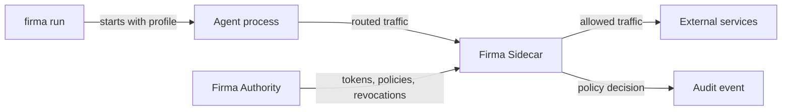

# OpenFirma

AI agents are becoming software operators: they call APIs, read and write files, query databases, send messages, run tools, and execute code. Uncontrolled agents do not just make mistakes; they can leak data, let you lose money, change production systems, and execute code before anyone notices.

Firma is a governed runtime for those agents.

Firma starts an agent with a runtime profile, routes the agent's outbound traffic through a local enforcement process, checks protected actions against policy, and records the result. The goal is simple: an agent should only be able to do what it was allowed to do, and every important decision should be visible afterwards.

## How Firma is structured

Firma has three main runtime pieces.

`firma run` is the launcher. It starts the agent command with a selected profile. A profile defines how the process should run, what environment it receives, how traffic is routed, and which runtime backend is used.

The **Sidecar** is the local enforcement point. It receives outbound requests from the agent, turns each request into a clear action, checks whether that action is allowed, and forwards only allowed traffic. The Sidecar is not the sandbox. The sandbox constrains the process; the Sidecar decides application-level policy.

The **Authority** is the source of permission. It loads policy, signs short-lived permission tokens, and sends policy updates and revocations to Sidecars. A revocation cancels a token before it naturally expires. A permission token is a signed statement that says what an agent may do, where it may do it, and for how long.



## What happens during a run

A typical Firma run follows this sequence:

1. You start an agent with `firma run`.
2. Firma chooses a profile and creates a session identity.
3. The Authority issues or refreshes permission for that session.
4. The Sidecar receives the Authority public key, policy updates, and revocation updates.
5. The agent starts inside the selected runtime backend.
6. Outbound traffic is routed toward the Sidecar.
7. The Sidecar identifies the action the agent is trying to perform.
8. The Sidecar verifies the agent's permission token.
9. The Sidecar checks policy for that action and resource.
10. The request is allowed or denied.
11. Firma writes an audit event for the decision.

The important runtime property is local enforcement. Once the Sidecar has the current policy and revocation data, it can decide on each request without calling the Authority on the hot path.

## Authority, tokens, and certificates

Firma uses two different kinds of cryptographic material.

The **Authority signing key** is used to sign permission tokens. The Authority keeps the private key. The Sidecar gets the matching public key so it can verify tokens locally.

The **Sidecar HTTPS CA** is used when the Sidecar decrypts selected HTTPS traffic for policy enforcement. The CA lets the Sidecar create certificates for intercepted hosts. This is separate from the Authority signing key.

The basic setup flow is:

1. Start the Authority with a policy directory and signing key.
2. Configure the Sidecar with the Authority address and public key.
3. Issue a permission token for an agent session.
4. Start the Sidecar with policies, mappings, and token material.
5. Run the agent through `firma run` so traffic reaches the Sidecar.

## Repository map

```text
crates/          Rust workspace crates for the launcher, Sidecar, Authority, shared types, and demos.
examples/        Runnable demo stacks, demo agents, policy files, mapping files, and end-to-end assets.
docs/            Architecture notes, configuration references, CLI docs, security analysis, and release notes.
context/         Internal design material and early proof-of-concept references.
.github/         GitHub Actions workflows.
.cursor/         Cursor workspace guidance.
```

The top-level `Cargo.toml` defines the Rust workspace. The `Makefile` contains the common build, lint, test, and demo commands.

## Build

```bash
cargo build --workspace
make check
```

## License

This project is licensed under the [Apache 2.0 License](LICENSE).
