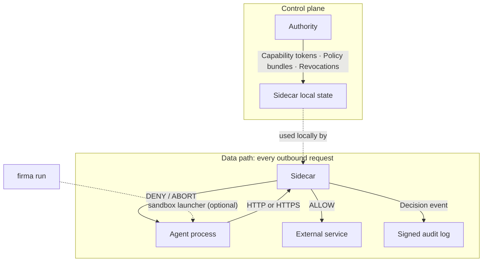

<p align="center">
  
</p>

# OpenFirma

OpenFirma is a runtime enforcement boundary for AI agents. Every outbound call an agent makes is intercepted, classified against policy, and audited before it leaves the machine.

[Docs](https://firma-ai.github.io/openfirma/) · [Quickstart](https://firma-ai.github.io/openfirma/quickstart/) · [Architecture](https://firma-ai.github.io/openfirma/concepts/architecture/) · [Blog](https://firma-ai.github.io/openfirma/blog/)

## Install

```bash
curl -sSf https://install.openfirma.ai | sh
```

On macOS you can also use Homebrew:

```bash
brew tap Firma-AI/openfirma
brew install firma
```

If you prefer to build from source, you need Rust 1.86+, `protoc`, and `make`:

```bash
git clone https://github.com/firma-ai/openfirma
cd openfirma
make install
cargo build --workspace
```

## Run the demo

```bash
firma stack init
make demo-ci
```

No API keys required. The demo starts a local Authority and Sidecar, sends one allowed and one denied request, and verifies both decisions were audited.

## Govern your first agent

### 1. Start the stack

```bash
firma stack init
firma stack start --detach
```

### 2. Run any command through the enforcement boundary

```bash
firma run --profile generic -- curl https://example.com
```

### 3. Watch live decisions

```bash
firma monitor
```

### 4. Stop

```bash
firma stack stop
```

## How it works

OpenFirma has three pieces.

**The Sidecar** is the local enforcement point. It intercepts every outbound request, normalizes it into a canonical action class, validates the agent's capability token, evaluates Cedar policy, and writes a signed audit event.

**The Authority** is the trust root. It signs short-lived capability tokens, streams policy bundles, and pushes revocations. The Sidecar holds everything in local memory and does not call the Authority on each request.

**`firma run`** is the optional sandbox launcher. It starts the agent inside an OS-native sandbox (`bwrap` on Linux, `sandbox-exec` on macOS, WSL2 on Windows) and forces all traffic through the Sidecar. Without it, proxy environment variables route cooperative agents. With it, bypassing the Sidecar is structurally prevented.



## CLI

`firma stack init` — scaffold config, keys, and policy dirs  
`firma stack start [--detach]` — start Authority and Sidecar  
`firma stack stop` — graceful shutdown  
`firma stack status` — check health  
`firma run --profile <name> -- <command>` — wrap a command with enforcement  
`firma monitor` — live tail of audit events  
`firma policy validate <file>` — validate a Cedar policy offline  
`firma policy test <fixture>` — test a policy decision against a fixture  
`firma authority issue` — issue a capability token  
`firma doctor` — diagnose installation issues  

## Repository layout

```
crates/       Rust workspace: sidecar, authority, launcher, shared types, demos
examples/     Demo stacks, agents, policy files, mapping files, e2e assets
docs/         Architecture notes, CLI reference, configuration reference
docs-site/    OpenFirma documentation site
```

## License

[Apache 2.0](LICENSE)