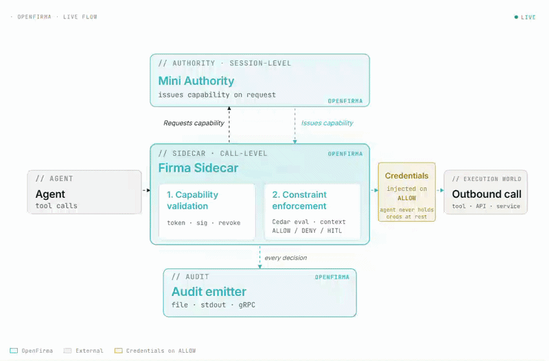

<div align="center">
  

  <br/>


  <br/>
<br/>

  **Every call passes through a sidecar that decides whether it happens.**
  <br/>
  Policy in, signed decision out. Open by default. Deterministic.


  [Docs](https://firma-ai.github.io/openfirma)
  &nbsp;·&nbsp;
  [Website](https://openfirma.netlify.app/)

</div>

<br/>
<div align="center">
  
</div>
<br/>


## What is OpenFirma?

OpenFirma is a runtime enforcement boundary that sits between your AI agents and the outside world. Every outbound call an agent makes passes through a local Sidecar that decides whether it happens: using Cedar policies you own, evaluated locally, with no model on the hot path.

**Why we built it:** AI agents are becoming software operators. They call APIs, read and write files, send messages, and execute code. That is useful but it also means a bad prompt, a compromised dependency, or a confused model can turn into a real outbound action before anyone notices. OpenFirma gives those actions a boundary.

**How it works:** You define a Cedar policy that says what each agent is allowed to do. When an agent makes an outbound call, the Sidecar intercepts it, classifies it into a canonical action class (e.g. `code.read`, `communication.external.send`), validates the capability token, and evaluates the policy. On ALLOW, the call goes through and credentials are injected just-in-time. On DENY, the call is blocked and a signed audit event is written. The agent code contains none of this logic.

<br/>

## Run your coding agent with OpenFirma

### Install

**macOS:**

```bash
brew tap Firma-AI/openfirma
brew install firma
```

**Linux / other:**

```bash
curl -sSf https://install.openfirma.ai | sh
```

**Build from source** (requires Rust 1.86+ and `protoc`):

```bash
git clone https://github.com/firma-ai/openfirma
cd openfirma
cargo build --release
```

### Quickstart

Wrap your agent with a single command:

```bash
firma run --profile claude-code -- claude
```

`firma run` autostarts a per-run Sidecar and Mini Authority, applies the `claude-code` policy profile, and tears everything down when the agent exits. On first run with no Authority configured, it prompts once to confirm the local autostart and persists the choice.

To run a persistent stack instead:

```bash
firma stack init          # scaffold keys + config
firma stack start --detach
firma run --profile claude-code -- claude
firma monitor             # tail the live audit stream
```

### Usage patterns

The **Sidecar** sits next to each agent process and enforces every outbound call. The **Authority** is a single trust root — it issues capability tokens and streams policy bundles to one or more Sidecars. A single Authority can govern many agents concurrently; the Sidecar enforces locally without calling back on every request.

**1. Single agent, zero config**

One developer, one agent. `firma run` handles everything.

```bash
firma run --profile claude-code -- claude
```

**2. Local Authority, multiple agents**

Start a persistent stack once, then run several agents concurrently. All Sidecars pull policy from the same local Authority.

```bash
firma stack init
firma stack start --detach

firma run --profile claude-code -- claude   &
firma run --profile codex       -- codex    &
firma run --profile generic     -- opencode
```

Rotate or update policy without restarting any agent.

**3. Team Authority, agents on multiple machines**

Run one Authority on a shared server or in CI. Each developer or runner points `firma run` at it with `--authority`:

```bash
# On each developer machine or CI runner:
firma run --authority https://authority.internal --profile claude-code -- claude
```

All ALLOW and DENY decisions flow into a shared audit log. One place to see what every agent on the team is doing.

**4. Custom Authority, custom agents without `firma run`**

For agents that are not Claude Code or Codex — custom Python loops, LangChain pipelines, CI workers — the Sidecar is a standalone HTTP proxy. Point outbound traffic at it via environment variables; no `firma run` or SDK required.

```bash
# Start Authority and Sidecar
firma authority --config firma.toml
firma sidecar   --config firma.toml

# Point your agent at the Sidecar
export HTTP_PROXY=http://127.0.0.1:8080
export HTTPS_PROXY=http://127.0.0.1:8080
python my_agent.py
```

The Authority can be the Mini Authority included in this repo or your own implementation of the `FirmaAuthority` gRPC interface.

### CLI reference

| Command | Description |
|---|---|
| `firma run` | Wrap an agent process: autostarts Sidecar + Authority, applies a policy profile, tears down on exit |
| `firma stack init` | Scaffold a deployment: writes `firma.toml`, keys, policy dirs, and revocation file |
| `firma stack start` | Boot Authority + Sidecar as one unit. `--detach` forks a supervisor |
| `firma stack stop` | Graceful shutdown with configurable timeout |
| `firma stack status` | Per-component pid, listen address, state, and uptime. `--json` for machine output |
| `firma monitor` | Tail the live audit stream and component logs from a running stack |
| `firma doctor` | Structured diagnostic report: installed components, reachable endpoints, config status |
| `firma authority` | Run the Mini Authority: issues capability tokens, streams Cedar policy bundles |
| `firma sidecar` | Run the Sidecar standalone |
| `firma policy` | Validate and unit-test Cedar policy bundles |
| `firma token` | Manage local-exec governance tokens (approve / revoke) |

Key flags for `firma run`:

| Flag | Default | Description |
|---|---|---|
| `--profile <id>` | `generic` | Built-in policy profile (`claude-code`, `codex`, `generic`, …) |
| `--authority <local\|url>` | unset | Skip the bootstrap prompt: `local` autostarts on loopback; any URL points at a remote Authority |
| `--authority-profile <name>` | `developer` | Profile materialised by the autostarted Mini Authority |
| `--sidecar-endpoint <url>` | auto | Override Sidecar endpoint (`tcp://…` or `unix://…`) |
| `--no-autostart` | off | Fail with a typed error instead of autostarting — CI safety net |
| `--config <path>` | auto | Runtime config path (`.toml` or `.yaml`) |
| `--backend <kind>` | platform default | Override sandbox backend: `bwrap`, `vz`, `wsl2`, `firecracker` |
| `--print-effective-config` | off | Dump resolved config as JSON before exec |

> Full CLI reference: [`docs/cli.md`](docs/cli.md)

<br/>

## Architecture

<div align="center">
  
</div>
<br/>

**[Mini Authority](crates/firma-authority/):** reference local Authority for development. Mints short-lived, cryptographically signed permission tokens for agents, loads policy rules from disk, and streams policy updates and revocation events to connected Sidecars over persistent connections. Sits off the per-request path.

**[Sidecar](crates/firma-sidecar/):** application-layer enforcement proxy sitting next to your agent. Intercepts every outbound call (plain HTTP, HTTPS by tunnel or by transparent decryption, remote-procedure calls, Unix sockets) and decides allow / deny / abort through a fully-local two-stage check (capability validation, then policy evaluation), with credential injection after an allow and a signed audit record for every decision. Fail-closed by construction.

**[Audit emitter](crates/firma-core/):** signs and emits an audit record for every enforcement decision, capturing the agent, session, action class, target resource, the token that authorized the call, the outcome, and timing. Runs as a background task draining a bounded channel into pluggable destinations (standard output, a file, a remote service, or a local write-ahead log on disk), each record independently verifiable.

### Features

- **Structural interception:** every modality of action funnels through the Sidecar, with the kernel sandbox as the floor
- **Deterministic intent:** every tool call is classified into an enforceable action class; Cedar evaluates the same input to the same decision, every time
- **Per-call enforcement:** policy is evaluated before execution, against current policy and accumulated session state
- **JIT credentials:** a federated broker issues credentials per call on ALLOW; the agent never holds raw tokens; exfiltration is structurally impossible
- **Signed audit:** every decision emits a signed execution event with the exact envelope the policy saw

<br/>

## Repo structure

**Infrastructure**

| | |
|---|---|
| [`crates/firma`](crates/firma/) | CLI entrypoint: `firma run`, `firma stack`, `firma monitor`, `firma doctor` |
| [`crates/firma-sidecar`](crates/firma-sidecar/) | The enforcement Sidecar: interceptors, pipeline, connectors |
| [`crates/firma-authority`](crates/firma-authority/) | Mini Authority: file-based trust root for local development |
| [`crates/firma-core`](crates/firma-core/) | Shared types, Cedar schema, action classes, audit event format |
| [`crates/firma-run`](crates/firma-run/) | Agent process confinement: bwrap backend, profile resolution, autostart |
| [`crates/firma-stack`](crates/firma-stack/) | Stack supervisor: Authority + Sidecar lifecycle as one unit |
| [`crates/firma-proto`](crates/firma-proto/) | Protobuf/gRPC service definitions |

**Examples**

| | |
|---|---|
| [`examples/demos`](examples/demos/) | TUI demo runner with three self-contained enforcement scenarios |
| [`examples/agents`](examples/agents/) | Intentionally risky demo agents (OpenAI Agents SDK + Google ADK) |
| [`examples/generic-agent`](examples/generic-agent/) | `firma run` profile and stack runner for wrapping any agent command |

**Docs**

| | |
|---|---|
| [`docs/`](docs/) | Architecture, CLI reference, configuration reference |
| [`docs-site/`](docs-site/) | Astro/Starlight documentation site |

<br/>

## License

Apache 2.0. See [LICENSE](LICENSE).