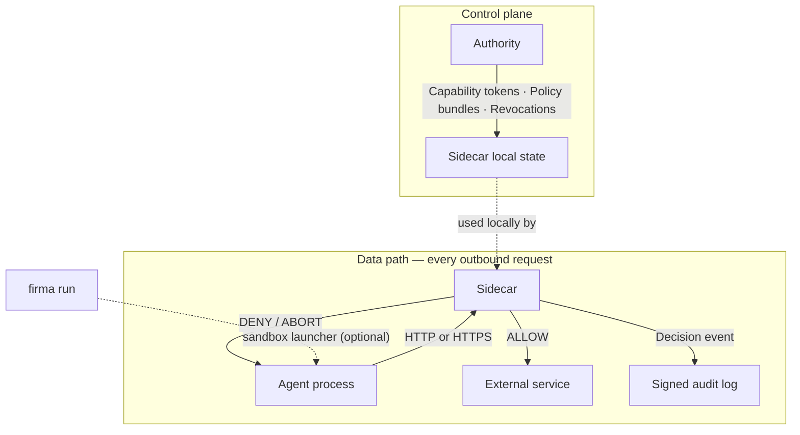

<p align="center">
  
</p>

<p align="center">
  <strong>OpenFirma</strong> — a runtime enforcement boundary for AI agents.
</p>

<p align="center">
  <a href="https://firma-ai.github.io/openfirma/">Docs</a> ·
  <a href="https://firma-ai.github.io/openfirma/quickstart/">Quickstart</a> ·
  <a href="https://firma-ai.github.io/openfirma/concepts/architecture/">Architecture</a> ·
  <a href="https://firma-ai.github.io/openfirma/blog/">Blog</a>
</p>

---

OpenFirma governs what an AI agent is allowed to do at the process boundary. Every outbound call is intercepted, classified, checked against policy, and audited — before it leaves the machine.

---

## Quickstart

### Install

The fastest way to install is with the install script — no Rust or build tools required:

```bash
curl -sSf https://install.openfirma.ai | sh
```

This downloads a precompiled static binary for your platform and puts `firma` on your `PATH`.

**Supported platforms:** Linux x86_64, Linux aarch64, macOS aarch64, macOS x86_64, Windows x86_64, Windows aarch64.

On macOS you can also use Homebrew:

```bash
brew tap Firma-AI/openfirma
brew install firma
```

> **Build from source** — if you prefer to build from source, you need Rust 1.86+, `protoc`, and `make`. Run `make install` from the repo root to install all dependencies, then `cargo build --workspace`.

---

### Run the demo

Once `firma` is installed, run the deterministic demo — no API keys required:

```bash
firma stack init
make demo-ci
```

Expected output:

```
[allow] 200 OK   path=/allow
[deny]  403 Forbidden  path=/deny  reason="PolicyDenied"
[ok]    ALLOW + DENY round-trips matched expectation.
```

The demo starts a local Authority and Sidecar, issues a short-lived capability token, sends one allowed and one denied request, and verifies both decisions were audited.

---

### Run your own command

```bash
# Scaffold config and keys
firma stack init

# Start the stack (Authority + Sidecar) in the background
firma stack start --detach

# Watch live decisions
firma monitor

# Wrap any command — all outbound traffic is governed
firma run --profile generic -- curl https://example.com

# Stop the stack
firma stack stop
```

`firma run` can also autostart a per-run Sidecar on the fly, without a pre-started stack:

```bash
firma run --profile generic -- curl https://example.com
```

For CI or production paths where the Sidecar is managed externally:

```bash
# Use an already-running Sidecar, never autostart
firma run --sidecar=external --profile generic -- python my_agent.py

# Fail loudly if no Sidecar is reachable
firma run --no-autostart --profile generic -- python my_agent.py
```

---

## CLI reference

### `firma stack`

Supervises the Authority and Sidecar as one unit.

| Command | Description |
|---|---|
| `firma stack init` | Scaffold config dirs, keys, and policy dirs |
| `firma stack start [--detach]` | Start Authority + Sidecar. `--detach` runs in background |
| `firma stack stop` | Graceful shutdown |
| `firma stack status` | Check health of running components |

### `firma run`

Wrap any command with runtime enforcement.

| Flag | Description |
|---|---|
| `--profile <name>` | Runtime profile (`generic`, `codex`). Default: `generic` |
| `--backend <name>` | Sandbox backend override (`bwrap`, `vz`, `wsl2`, `firecracker`) |
| `--sidecar=external` | Use existing Sidecar, never autostart |
| `--no-autostart` | Fail if no Sidecar is reachable |
| `--capability-file <path>` | Load a capability token for this run |

```bash
firma run --profile generic -- python my_agent.py
firma run --profile codex -- claude --dangerously-skip-permissions
```

### `firma monitor`

Live tail of audit events and component logs from a running stack.

```bash
firma monitor
```

### `firma policy`

Validate and test Cedar policies offline, without a running Sidecar or Authority.

```bash
# Validate a policy file against the Firma schema
firma policy validate policies/allow-read.cedar

# Test a policy decision against a fixture
firma policy test tests/fixtures/allow-read.toml
```

### `firma authority`

Manage the local Authority for development.

```bash
# Generate a signing keypair
firma authority generate-key -o .local/firma-authority.key

# Issue a capability token
firma authority issue \
  --agent-id my-agent \
  --session-id my-session \
  --action communication.external.send \
  --resource-scope 'api.example.com*' \
  --ttl-seconds 3600 \
  --output .local/capability.toml
```

### `firma doctor`

Diagnose installation and configuration issues.

```bash
firma doctor
```

---

## Architecture

OpenFirma has three runtime pieces.

**The Sidecar** is the local enforcement point. Every outbound request from the agent passes through it. It normalizes the request into a canonical action class, validates the agent's capability token, evaluates Cedar policy, injects credentials if needed, dispatches allowed traffic, and writes a signed audit event.

**The Authority** is the trust root. It signs short-lived capability tokens, streams policy bundles, and pushes revocations. The Sidecar holds all of this in local memory — it does not call the Authority on every request.

**`firma run`** is the optional sandbox launcher. It starts the agent inside an OS-native sandbox (`bwrap` on Linux, `sandbox-exec` on macOS, WSL2 on Windows) and routes all network traffic toward the Sidecar. Without it, proxy environment variables can route cooperative agents. With it, bypassing the Sidecar is structurally prevented.



The enforcement pipeline inside the Sidecar:

```
ReadinessFlag → Normalizer → Stage 1: Capability validation → Stage 2: Cedar policy → Credential injection → Connector → Audit
```

Every stage short-circuits on failure. If the policy bundle is stale, if the capability token is expired or revoked, or if the action cannot be classified — the request is denied. There is no LLM on the decision path.

Four invariants shape every design choice:

- **Fail closed** — uncertainty becomes DENY
- **No network on the hot path** — authorization is local, deterministic, sub-millisecond
- **Determinism** — same request + same state = same decision, always
- **Envelope immutability** — policy sees the same envelope that audit records

For more detail: [Architecture & invariants](https://firma-ai.github.io/openfirma/concepts/architecture/) · [The enforcement pipeline](https://firma-ai.github.io/openfirma/concepts/pipeline/) · [Action classes](https://firma-ai.github.io/openfirma/concepts/action-classes/)

---

## Repository layout

```
crates/       Rust workspace — sidecar, authority, launcher, shared types, demos
examples/     Demo stacks, agents, policy files, mapping files, e2e assets
docs/         Architecture notes, CLI reference, configuration reference
docs-site/    OpenFirma documentation site (Starlight)
```

---

## Build from source

```bash
cargo build --workspace
make check
```

---

## License

[Apache 2.0](LICENSE)