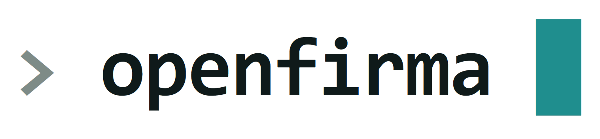
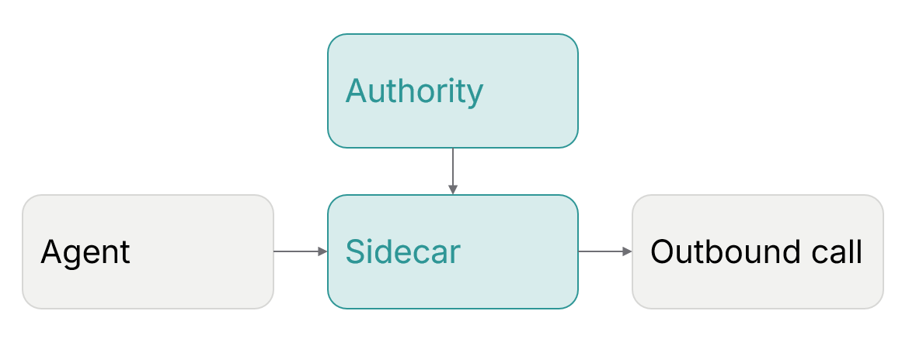
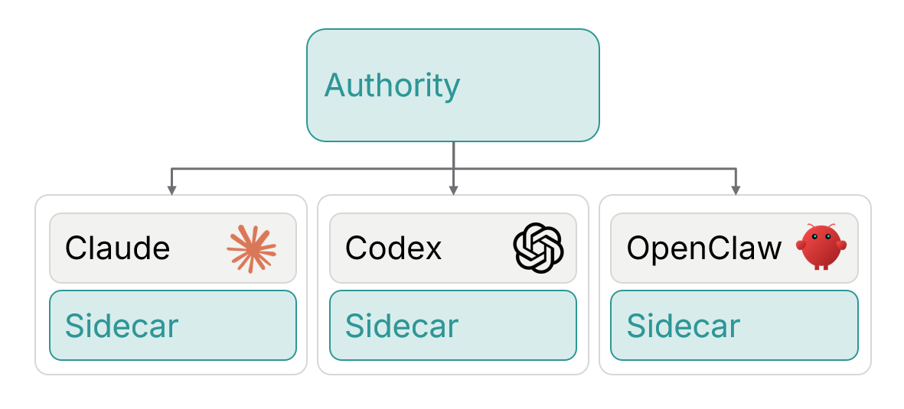
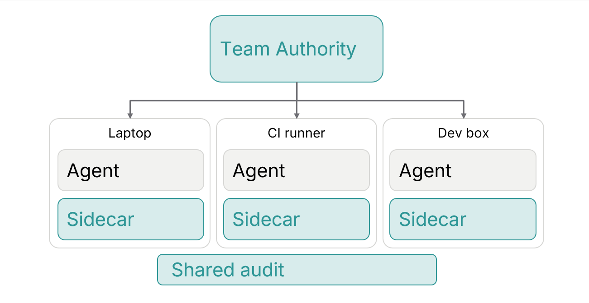
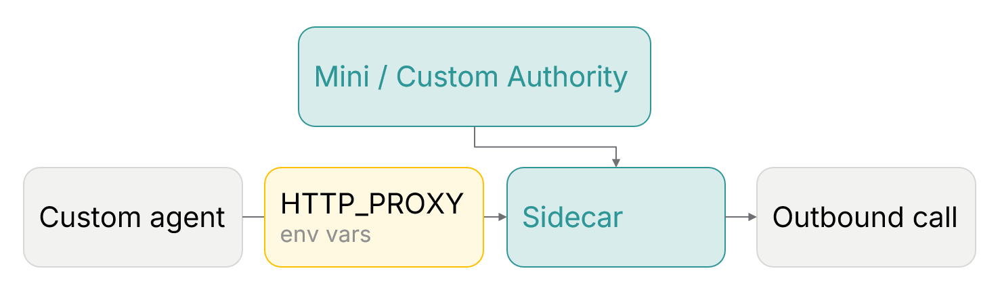

<div align="center">
  

  <br/>


  <br/>
<br/>

  **Every call passes through a sidecar that decides whether it happens.**
  <br/>
  Policy in, signed decision out. Deterministic. At call-level.


  [Docs](https://firma-ai.github.io/openfirma)
  &nbsp;·&nbsp;
  [Website](https://openfirma.netlify.app/)

</div>

<br/>
<div align="center">
  
</div>
<br/>


## What is OpenFirma?

OpenFirma is a runtime enforcement boundary that sits between your AI agents and the outside world. Every outbound call an agent makes passes through a local Sidecar that decides whether it happens: using Cedar policies you own, evaluated locally, with no model on the hot path.

**Why we built it:** AI agents are becoming software operators. They call APIs, read and write files, send messages, and execute code. That is useful but it also means a bad prompt, a compromised dependency, or a confused model can turn into a real outbound action before anyone notices. OpenFirma gives those actions a boundary.

**How it works:** You define a policy that says what each agent is allowed to do. Every outbound call passes through the Sidecar, which intercepts the request and evaluates it locally before execution. The Sidecar classifies the action (e.g. `code.read`, `communication.external.send`), validates the capability token, and checks the policy. On ALLOW, the call proceeds and credentials are injected just-in-time. On DENY, the call is blocked and a signed audit event is written. The enforcement logic lives outside the agent process.

<br/>

## Run your coding agent with OpenFirma

### Install

**macOS:**

```bash
brew tap Firma-AI/openfirma
brew install firma
```

**Linux / other:**

```bash
curl -sSf https://install.openfirma.ai | sh
```

**Build from source** (requires Rust 1.86+ and `protoc`):

```bash
git clone https://github.com/firma-ai/openfirma
cd openfirma
cargo build --release
```

### Quickstart

Wrap your agent with a single command:

```bash
firma run --profile claude-code -- claude
```

`firma run` autostarts a per-run Sidecar and Mini Authority, applies the `claude-code` policy profile, and tears everything down when the agent exits. On first run with no Authority configured, it prompts once to confirm the local autostart and persists the choice.

To run a persistent stack instead:

```bash
firma config              # scaffold keys + config
firma sidecar start --detach
firma run --profile claude-code -- claude
firma monitor             # tail the live audit stream
```

### Different operating models

The **Sidecar** sits next to each agent process and enforces every outbound call. The **Authority** is a single trust root: it issues capability tokens and streams policy bundles to one or more Sidecars. A single Authority can govern many agents concurrently; the Sidecar enforces locally without calling back on every request.

<table><tr><td width="55%">

**1. Single agent (like Quickstart)**

OpenFirma first looks for an existing Authority. If none is configured, it offers to autostart a local Mini Authority and Sidecar for the session, wraps the agent process, and applies the selected policy profile automatically.

```bash
firma run --profile claude-code -- claude
```

</td><td>

</td></tr></table>

<table><tr><td width="55%">

**2. Local Authority, multiple agents**

The Authority becomes persistent and shared across local agent sessions. Each new `firma run` attaches to the same trust root and pulls the current policy bundle without restarting existing agents.

```bash
firma config
firma sidecar start --detach

firma run --profile claude-code -- claude   &
firma run --profile codex       -- codex    &
firma run --profile generic     -- opencode
```

</td><td>

</td></tr></table>

<table><tr><td width="55%">

**3. Team Authority, agents on multiple machines**

Each Sidecar enforces policy locally on its own machine while the shared Authority distributes policy bundles, capability tokens, and revocation updates across the team.

```bash
# On each developer machine or CI runner:
firma run \
  --authority https://authority.internal \
  --profile claude-code \
  -- claude
```

</td><td>

</td></tr></table>

<table><tr><td width="55%">

**4. Custom Authority, custom agents without `firma run`**
<br/><em>Ideal for more structured enterprise use cases</em>

The Sidecar runs independently as a standalone enforcement proxy. Any agent, CI worker, or custom runtime that respects `HTTP_PROXY` / `HTTPS_PROXY` can be governed without SDK integrations or agent-specific wrappers.

```bash
firma authority --config firma.toml
firma sidecar   --config firma.toml

export HTTP_PROXY=http://127.0.0.1:8080
export HTTPS_PROXY=http://127.0.0.1:8080
python my_agent.py
```

The Authority can be the Mini Authority included in this repo or your own implementation of the `FirmaAuthority` gRPC interface.

</td><td>

</td></tr></table>

### CLI reference

| Command                | Description                                                                                         |
| ---------------------- | --------------------------------------------------------------------------------------------------- |
| `firma run`            | Wrap an agent process: autostarts Sidecar + Authority, applies a policy profile, tears down on exit |
| `firma config`         | Scaffold a deployment: writes `firma.toml`, keys, policy dirs, and revocation file                  |
| `firma sidecar start`  | Boot Authority + Sidecar as one unit. `--detach` forks a supervisor                                 |
| `firma sidecar stop`   | Graceful shutdown with configurable timeout                                                         |
| `firma sidecar status` | Per-component pid, listen address, state, and uptime. `--json` for machine output                   |
| `firma monitor`        | Tail the live audit stream and component logs from a running stack                                  |
| `firma doctor`         | Structured diagnostic report: installed components, reachable endpoints, config status              |
| `firma authority`      | Run the Mini Authority: issues capability tokens, streams Cedar policy bundles                      |
| `firma sidecar`        | Run the Sidecar standalone                                                                          |
| `firma policy`         | Validate and unit-test Cedar policy bundles                                                         |
| `firma token`          | Manage local-exec governance tokens (approve / revoke)                                              |

> Full CLI reference: [`docs/cli.md`](docs/cli.md)

<br/>

## Architecture

<div align="center">
  
</div>
<br/>

**[Mini Authority](crates/firma-authority/):** issues capability tokens and distributes policy bundles to connected Sidecars. Sits off the request path.

**[Sidecar](crates/firma-sidecar/):** runs next to the agent process and intercepts outbound calls. Evaluates policy locally before execution and emits signed audit events.

**[Audit](crates/firma-core/):** every enforcement decision produces a signed audit record with the evaluated action, outcome, and metadata.

### Features

- **Structural interception:** every modality of action funnels through the Sidecar, with the kernel sandbox as the floor
- **Deterministic intent:** every tool call is classified into an enforceable action class; Cedar evaluates the same input to the same decision, every time
- **Per-call enforcement:** policy is evaluated before execution, against current policy and accumulated session state
- **JIT credentials:** a federated broker issues credentials per call on ALLOW; the agent never holds raw tokens; exfiltration is structurally impossible
- **Signed audit:** every decision emits a signed execution event with the exact envelope the policy saw

<br/>

## Repo structure

**Infrastructure**

|                                                     |                                                                               |
| --------------------------------------------------- | ----------------------------------------------------------------------------- |
| [`crates/firma`](crates/firma/)                     | CLI entrypoint: `firma run`, `firma sidecar`, `firma monitor`, `firma doctor` |
| [`crates/firma-sidecar`](crates/firma-sidecar/)     | The enforcement Sidecar: interceptors, pipeline, connectors                   |
| [`crates/firma-authority`](crates/firma-authority/) | Mini Authority: file-based trust root for local development                   |
| [`crates/firma-core`](crates/firma-core/)           | Shared types, Cedar schema, action classes, audit event format                |
| [`crates/firma-run`](crates/firma-run/)             | Agent process confinement: bwrap backend, profile resolution, autostart       |
| [`crates/firma-stack`](crates/firma-stack/)         | Stack supervisor: Authority + Sidecar lifecycle as one unit                   |
| [`crates/firma-proto`](crates/firma-proto/)         | Protobuf/gRPC service definitions                                             |

**Examples**

|                                                     |                                                                     |
| --------------------------------------------------- | ------------------------------------------------------------------- |
| [`examples/demos`](examples/demos/)                 | TUI demo runner with three self-contained enforcement scenarios     |
| [`examples/agents`](examples/agents/)               | Intentionally risky demo agents (OpenAI Agents SDK + Google ADK)    |
| [`examples/generic-agent`](examples/generic-agent/) | `firma run` profile and stack runner for wrapping any agent command |

**Docs**

|                            |                                                      |
| -------------------------- | ---------------------------------------------------- |
| [`docs/`](docs/)           | Architecture, CLI reference, configuration reference |
| [`docs-site/`](docs-site/) | Astro/Starlight documentation site                   |

<br/>

## License

Apache 2.0. See [LICENSE](LICENSE).