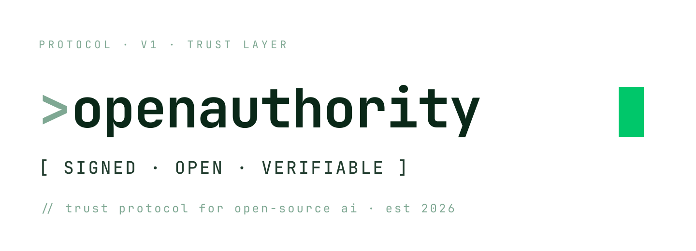
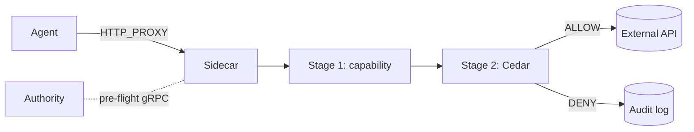

# OpenAuthority

<p align="center">
  
</p>

<p align="center">
  <strong>Trust protocol for open-source AI</strong>
</p>

<p align="center">
  <a href="https://Firma-AI.github.io/firma-oss/">Docs</a> ·
  <a href="https://github.com/Firma-AI/firma-oss/discussions">Discussions</a> ·
  <a href="LICENSE">License</a>
</p>

<p align="center">
  <a href="LICENSE"></a>
  <a href="https://conventionalcommits.org"></a>
  <a href="https://github.com/Firma-AI/firma-oss/actions/workflows/ci.yml"></a>
</p>

---

Every AI agent you ship can call anything. In production, that's a problem.

OpenAuthority is a local sidecar that intercepts every outbound agent call, validates a cryptographic capability token, evaluates a Cedar policy, and signs the outcome. Agents that are allowed get through. Agents that aren't get a 403 and an audit entry. **No agent code changes required** — set `HTTP_PROXY` and point your agent at the sidecar.

## Write a policy, gate a call

```cedar
// policies/my-agent.cedar

permit (
    principal == Firma::Agent::"my-agent",
    action    == Firma::Action::"communication.external.send",
    resource
) when {
    context.risk_score < 60
};

// Hard block — overrides any permit, regardless of risk score.
forbid (
    principal == Firma::Agent::"my-agent",
    action    == Firma::Action::"communication.external.send",
    resource  == Firma::Resource::"internal-data.corp/"
);
```

Start the sidecar. The policy fires on every call:

```sh
$ curl -x http://localhost:8080 https://api.openai.com/v1/chat
200 OK  →  decision=Allow  action_class="communication.external.send"

$ curl -x http://localhost:8080 https://internal-data.corp/secrets
403 Forbidden  →  decision=Deny  reason=PolicyDenied
```

## Architecture



## Quick Start

```bash
git clone https://github.com/Firma-AI/firma-oss
cd firma-oss
make demo-ci
```

```log
[allow] 200 OK    path=/allow  body={"ok":true}
[deny]  403 Forbidden  path=/deny   body={"denied":true,"reason":"PolicyDenied"}
[ok] ALLOW + DENY round-trips matched expectation.
```

For the full walkthrough — write a policy, issue a capability, wire your agent — see the [Getting Started guide](https://Firma-AI.github.io/firma-oss/getting-started/quick-start.html).

## How it works

- **Nothing on the hot path.** Stage 1 (token validation) targets < 1 ms p95. Stage 2 (Cedar eval) targets < 200 µs p95. Both run in-process. The Authority handles pre-flight issuance only and is never consulted on live traffic.
- **Fail-closed.** Unclassified request, bad token, stale policy bundle — all produce a DENY. There is no silent-allow path.
- **Every call leaves a trace.** ECDSA P-256 signed audit events for every decision, with capability token ID and envelope hash for correlation. Gaps in the stream are detectable.
- **Works with any agent SDK.** OpenAI Agents SDK, Google ADK, LangChain, raw `requests` — if it respects `HTTP_PROXY`, it works without modification.
- **Structural confinement.** `firma-run` on Linux (bwrap) forces all agent egress through the sidecar at the namespace level, even if the agent ignores `HTTP_PROXY` or forks subprocesses.
- **Semantic action registry.** HTTP requests are mapped to 44 canonical action classes (`communication.external.send`, `data.read`, `code.execute`, …) before Cedar sees them. Built-in mappings for GitHub, Stripe, and Gmail.
- **HTTPS enforcement.** MITM with CONNECT-bypass protection — policy sees the full method and path, not just `host:port`.

## Documentation

Full docs: **<https://Firma-AI.github.io/firma-oss/>**

Sections: Getting Started · Usage Guides · Operations · Architecture · Security · Reference · ADRs.

## Workspace Crates

| Crate             | Type    | Responsibility                                      |
| ----------------- | ------- | --------------------------------------------------- |
| `firma-core`      | Library | Shared types, capability tokens, Cedar wrapper      |
| `firma-proto`     | Library | Protobuf/gRPC wire contract                         |
| `firma-sidecar`   | Binary  | HTTP proxy + two-stage enforcement pipeline         |
| `firma-authority` | Binary  | Mini Authority (capability issuance, bundles)       |

## License

Apache 2.0 — see [LICENSE](LICENSE).
