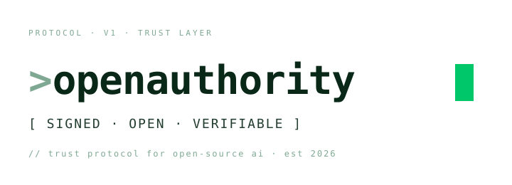
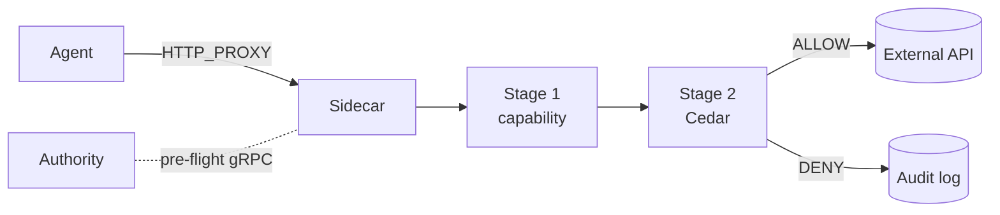

<p align="center">
  
</p>

<p align="center">
  <strong>Trust protocol for open-source AI</strong>
</p>

<p align="center">
  <a href="https://<org>.github.io/firma-oss/">Docs</a> ·
  <a href="https://github.com/<org>/firma-oss/discussions">Discussions</a> ·
  <a href="LICENSE">License</a>
</p>

<p align="center">
  <a href="LICENSE"></a>
  <a href="https://conventionalcommits.org"></a>
  <a href="https://github.com/<org>/firma-oss/actions/workflows/ci.yml">/firma-oss/ci.yml?branch=main" alt="CI"></a>
</p>

---

## What is OpenAuthority?

OpenAuthority is an open-source L7 policy enforcement sidecar for AI agents. Every outbound call from your agent — HTTP, gRPC, Unix socket — passes through the sidecar, which validates a cryptographic capability token, evaluates a Cedar policy bundle, and only then dispatches the call. Every outcome emits a signed audit event.

**Why we built it.** Agents that talk to real systems leak, over-permission, and act without an audit trail. That trust gap blocks production deployment. OpenAuthority closes it with deterministic, fail-closed enforcement that doesn't depend on the agent's good behavior.

**How it works.** A pre-flight Authority issues bounded capability tokens to agents. The Sidecar runs locally and enforces in two stages — Stage 1 verifies the token (< 1 ms p95), Stage 2 evaluates the policy bundle (< 200 µs p95). Total hot-path overhead targets < 3 ms p95. The Authority is never on the hot path.

## Architecture



- **Sidecar** — local proxy, two-stage enforcement, fully local hot path.
- **Authority** — pre-flight only, issues PASETO v4 capability tokens, streams policy bundles and revocations.
- **ExecutionEnvelope** — immutable protocol unit, one per outbound call.

## Features

- Two-stage enforcement (capability + Cedar constraint), zero network on the hot path
- 44-class action registry mapping HTTP requests → semantic intents
- Built-in connectors for GitHub, Stripe, Gmail
- HTTPS MITM with CONNECT-bypass protection
- `firma-run` sandbox launcher for structural egress confinement
- PASETO v4 + JWT RS256 capability tokens
- Deterministic, fail-closed, audit-ready

## Quick Start

```bash
git clone https://github.com/<org>/firma-oss
cd firma-oss
make demo-ci   # deterministic ALLOW + DENY round-trip
```

Read the [Getting Started guide](https://<org>.github.io/firma-oss/getting-started/installation.html) for a manual walkthrough.

## Workspace Crates

| Crate             | Type    | Responsibility                                      |
| ----------------- | ------- | --------------------------------------------------- |
| `firma-core`      | Library | Shared types, capability tokens, Cedar wrapper      |
| `firma-proto`     | Library | Protobuf/gRPC wire contract                         |
| `firma-sidecar`   | Binary  | HTTP proxy + two-stage enforcement pipeline         |
| `firma-authority` | Binary  | Mini Authority (capability issuance, bundles)       |

## Configuration

Minimum viable config — every section has defaults:

```toml
[interceptor]
mode = "http_proxy"
listen_addr = "127.0.0.1:9090"

[policy]
dir = "./policies"

[log]
level = "info"
```

Full reference: [Configuration Reference](https://<org>.github.io/firma-oss/reference/configuration.html).

## Documentation

Full docs: **<https://<org>.github.io/firma-oss/>**

Sections: Getting Started · Usage Guides · Operations · Architecture · Security · Reference · ADRs.

## License

Apache 2.0 — see [LICENSE](LICENSE).
