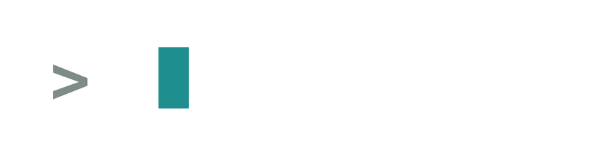
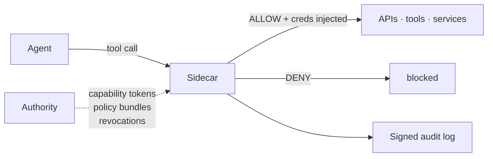

<p align="center">
  
</p>

<p align="center">
OpenFirma is a runtime enforcement boundary for AI agents. Every outbound call an agent makes is intercepted, classified against policy, and audited before it leaves the machine.
</p>

<p align="center">
  <a href="https://firma-ai.github.io/openfirma/">Docs</a> ·
  <a href="https://firma-ai.github.io/openfirma/quickstart/">Quickstart</a> ·
  <a href="https://firma-ai.github.io/openfirma/concepts/architecture/">Architecture</a> ·
  <a href="https://firma-ai.github.io/openfirma/blog/">Blog</a>
</p>

## What is OpenFirma?
 
OpenFirma is the authority layer for autonomous software. It sits in the agent's outbound path and decides, per call, whether a tool call happens: using Cedar policies you own, evaluated locally, with no model on the hot path.
 
- **Structural interception:** every modality of action funnels through the Sidecar, with the kernel sandbox as the floor
- **Deterministic intent:** every tool call is classified into an enforceable action class; Cedar evaluates the same input to the same decision, every time
- **Per-call enforcement:** policy is evaluated before execution, against current policy and accumulated session state
- **JIT credentials:** a federated broker issues credentials per call on ALLOW; the agent never holds raw tokens; exfiltration is structurally impossible
- **Signed audit:** every decision emits a signed execution event with the exact envelope the policy saw
---
 
## Architecture
 

 
**Authority** — policy lives in one place. It issues short-lived capability tokens and streams Cedar policy bundles to the Sidecar. One policy file governs every agent, every call, every surface. The Authority is never on the hot path: once the Sidecar has the token and policy bundle, all decisions are local.
 
**Sidecar** — the interception layer. Every outbound action funnels through it. Stage 1 validates the capability token locally (signature, integrity, revocation) in microseconds. Stage 2 evaluates the Cedar policy against the current session state. Sub-millisecond. Deterministic. On ALLOW, credentials are injected; the agent never holds raw tokens.
 
**Audit emitter** — every decision, ALLOW or DENY, produces a signed `ExecutionEvent` written to your configured sink (file, stdout, or gRPC).
 
> [Architecture & invariants](https://firma-ai.github.io/openfirma/concepts/architecture/) · [The enforcement pipeline](https://firma-ai.github.io/openfirma/concepts/pipeline/)
 
---
 
## Run your coding agent with containment
 
### Quickstart
 
**macOS:**
 
```bash
brew tap Firma-AI/openfirma
brew install firma
```
 
**Linux / other:**
 
```bash
curl -sSf https://install.openfirma.ai | sh
```
 
Then wrap your agent:
 
```bash
firma run --profile claude-code -- claude
```
 
No Rust toolchain, no `protoc`, no API keys required to get started.
 
> **Build from source:** if you want to contribute or run the deterministic CI demo, you need Rust 1.86+ and `protoc`. Clone the repo and run `make demo-ci`.
 
### Demo
 
> _Coming soon — the demo section will be updated once the new agent demo flow is finalized._
 
---
 
## Repo structure
 
```text
openfirma/
├── crates/
│   ├── firma/              # CLI entrypoint: firma run, firma stack, firma monitor, firma doctor
│   ├── firma-sidecar/      # Local enforcement point: interceptors, pipeline, connectors
│   ├── firma-authority/    # Mini Authority: file-based trust root for local development
│   ├── firma-core/         # Shared types, Cedar schema, action classes, audit event format
│   ├── firma-run/          # Sandbox launcher: bwrap backend, profile resolution, autostart
│   ├── firma-stack/        # Stack supervisor: Authority + Sidecar lifecycle as one unit
│   ├── firma-config/       # Platform config-path discovery
│   └── firma-proto/        # Protobuf/gRPC service definitions
│
├── examples/
│   ├── demo/               # Quickstart demo: deterministic CI, LLM-backed, interactive REPL
│   ├── agents/             # Intentionally risky demo agents (OpenAI Agents SDK + Google ADK)
│   ├── generic-agent/      # firma run profile and stack runner for wrapping any agent command
│   └── firma-run/          # Focused examples for the governed launcher
│
├── docs/                   # Architecture, CLI reference, configuration reference
├── docs-site/              # Astro/Starlight documentation site (firma-ai.github.io/openfirma)
└── fuzz/                   # Fuzz targets
```
 
**Start reading here:** [`crates/firma-sidecar`](crates/firma-sidecar) for the enforcement pipeline, [`crates/firma-authority`](crates/firma-authority) for the trust root, [`examples/demo`](examples/demo) for the fastest path to a running system.