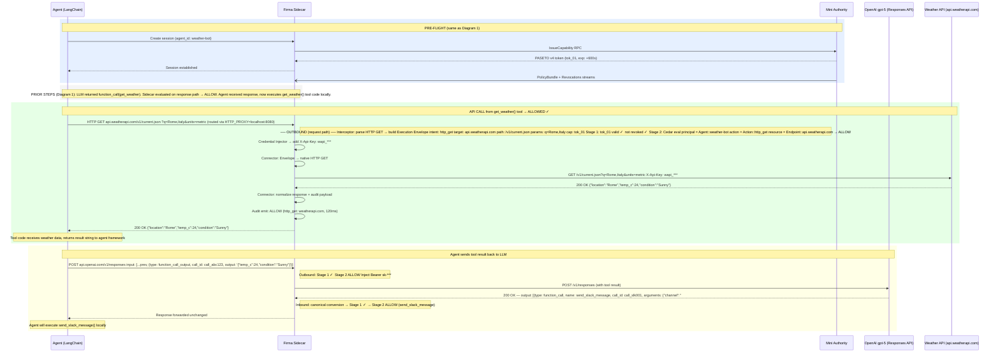
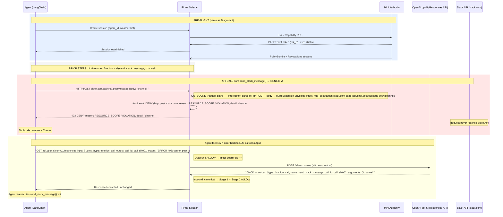

Here are the revised diagrams. Same scenario: **"Get the weather in Rome, post it to #weather-alerts on Slack."**

**Cedar policies** (unchanged):

```cedar
permit(
  principal == Agent::"weather-bot",
  action == Action::"execute_tool",
  resource in [Tool::"get_weather", Tool::"send_slack_message"]
);

permit(
  principal == Agent::"weather-bot",
  action == Action::"llm_call",
  resource == Endpoint::"api.openai.com"
);

permit(
  principal == Agent::"weather-bot",
  action == Action::"http_get",
  resource == Endpoint::"api.weatherapi.com"
);

permit(
  principal == Agent::"weather-bot",
  action == Action::"http_post",
  resource == Endpoint::"slack.com/api/chat.postMessage"
) when { context.channel == "#weather-alerts" };
```

---

## Diagram 1 — Tool Call: ALLOWED

The LLM response contains a `function_call` for `get_weather`. The Sidecar intercepts the response on the return path, parses the provider-specific format, converts it to a canonical Execution Envelope, evaluates it, and forwards the response to the agent unchanged.

```mermaid
sequenceDiagram
    participant A as Agent (LangChain)
    participant SC as Firma Sidecar
    participant MA as Mini Authority
    participant LLM as OpenAI gpt-5 (Responses API)

    rect rgb(230,240,255)
    Note over A,MA: PRE-FLIGHT — Capability Issuance
    A->>SC: Create session (agent_id: weather-bot)
    SC->>MA: IssueCapability RPC (agent: weather-bot, tools: [get_weather, send_slack_message], targets: [api.openai.com, weatherapi.com, slack.com])
    MA->>MA: Load /policies/*.cedar → Cedar eval → ALLOW
    MA-->>SC: CapabilityToken (PASETO v4) tok_id: tok_01, scope: [tools + targets], exp: +600s
    SC-->>A: Session established
    MA-)SC: WatchPolicyBundle stream
    MA-)SC: WatchRevocations stream
    end

    rect rgb(230,255,230)
    Note over A,LLM: LLM CALL + TOOL CALL EVALUATION (single proxy round-trip)
    A->>SC: POST api.openai.com/v1/responses (HTTP_PROXY=localhost:8080)

    Note right of SC: ── OUTBOUND (request path) ── Interceptor → Execution Envelope intent: llm_call, target: api.openai.com Stage 1: PASETO sig ✓ exp ✓ bloom ✓ Stage 2: Cedar(llm_call, api.openai.com) → ALLOW Credential Injector → Bearer sk-***

    SC->>LLM: POST /v1/responses model: gpt-5, strict: true tools: [{type: function, name: get_weather, ...}, ...] input: [{role: user, content: "Get weather for Rome, post to #weather-alerts on Slack"}]

    LLM-->>SC: 200 OK output: [{type: function_call, name: get_weather, call_id: call_abc123, arguments: {"location":"Rome,Italy","units":"celsius"}}]

    Note right of SC: ── INBOUND (response path) ── LLM Response Parser detects function_call  Canonical conversion (OpenAI → internal):   {type: function_call, name: get_weather,    call_id: call_abc123, arguments: ...}   ↓   Execution Envelope (canonical):   intent: execute_tool   tool: get_weather   args: {location: Rome,Italy, units: celsius}   provider: openai, call_ref: call_abc123  Stage 1: tok_01 valid ✓ Stage 2: Cedar eval   principal = Agent::weather-bot   action = Action::execute_tool   resource = Tool::get_weather   → ALLOW

    SC->>SC: Audit emit: ALLOW (execute_tool: get_weather, 0.4ms)
    SC-->>A: 200 OK — LLM response forwarded unchanged
    Note over A: Agent sees function_call in output, executes get_weather() locally (outbound HTTP follows in Diagram 3)
    end
```



**Key points:**
- The agent makes a **single HTTP call** through the proxy. It has no idea the Sidecar is evaluating tool calls.
- The Sidecar evaluates **twice** in the same round-trip: once on the **outbound request** (is the agent allowed to call this LLM?) and once on the **inbound response** (is the agent allowed to execute the tool the LLM requested?).
- The **LLM Response Parser** is provider-aware: it knows the OpenAI Responses API format (`type: function_call`, `name`, `call_id`, `arguments`). For Anthropic it would parse `type: tool_use`, `id`, `name`, `input`.
- The parser outputs a **canonical Execution Envelope** — the same internal format regardless of LLM provider. This is what Stage 1 and Stage 2 evaluate.
- Since the tool call is ALLOWED, the LLM response is forwarded to the agent **unchanged**. The agent parses `function_call` normally and runs the tool code locally.

---

## Diagram 2 — Tool Call: DENIED

The LLM response contains a `function_call` for `read_user_contacts` (not in the agent's scope). The Sidecar intercepts the response, converts to canonical form, evaluates, and **strips the denied tool call** before the response reaches the agent.

```mermaid
sequenceDiagram
    participant A as Agent (LangChain)
    participant SC as Firma Sidecar
    participant MA as Mini Authority
    participant LLM as OpenAI gpt-5 (Responses API)

    rect rgb(230,240,255)
    Note over A,MA: PRE-FLIGHT (same as Diagram 1)
    A->>SC: Create session (agent_id: weather-bot)
    SC->>MA: IssueCapability RPC
    MA-->>SC: PASETO v4 token (tok_01, exp: +600s)
    SC-->>A: Session established
    MA-)SC: PolicyBundle + Revocations streams
    end

    rect rgb(255,230,230)
    Note over A,LLM: LLM CALL + TOOL CALL EVALUATION → DENIED
    A->>SC: POST api.openai.com/v1/responses (HTTP_PROXY=localhost:8080)

    Note right of SC: ── OUTBOUND ── Stage 1 ✓ → Stage 2: Cedar(llm_call) → ALLOW Credential Injector → Bearer sk-***

    SC->>LLM: POST /v1/responses (model: gpt-5, tools: [...], input: [...])

    LLM-->>SC: 200 OK output: [{type: function_call, name: read_user_contacts, call_id: call_xyz789, arguments: {"query":"all","include_emails":true}}]

    Note right of SC: ── INBOUND (response path) ── LLM Response Parser detects function_call  Canonical conversion:   {type: function_call, name: read_user_contacts, ...}   ↓   Execution Envelope (canonical):   intent: execute_tool   tool: read_user_contacts   args: {query: all, include_emails: true}  Stage 1: tok_01 valid ✓ Stage 2: Cedar eval   principal = Agent::weather-bot   action = Action::execute_tool   resource = Tool::read_user_contacts   → DENY (tool not in capability scope)

    SC->>SC: Audit emit: DENY (execute_tool: read_user_contacts, reason: TOOL_NOT_IN_SCOPE, 0.3ms)

    Note right of SC: Response rewriting: Strip denied function_call from output. Inject function_call_output with denial reason so LLM can self-correct on next turn.

    SC-->>A: 200 OK — modified response output: [{type: function_call_output, call_id: call_xyz789, output: "FIRMA_DENY: tool read_user_contacts not permitted. Allowed: [get_weather, send_slack_message]"}]

    Note over A: Agent never sees the original function_call. Receives denial as if it were a tool result. Passes it to LLM on next turn.
    end

    rect rgb(255,255,230)
    Note over A,LLM: Agent re-prompts LLM (automatic — no special handling)
    A->>SC: POST api.openai.com/v1/responses input: [...prev context + denial output]
    Note right of SC: Outbound ALLOW, Credential Inject
    SC->>LLM: POST /v1/responses (input includes denial)
    LLM-->>SC: 200 OK — output: [{type: function_call, name: get_weather, call_id: call_def456, arguments: {"location":"Rome,Italy","units":"celsius"}}]
    Note right of SC: Inbound: canonical conversion → Stage 1 ✓ → Stage 2: ALLOW
    SC-->>A: 200 OK — forwarded unchanged
    Note over A: Agent sees get_weather, executes tool locally
    end
```



**Key points:**
- The agent **never sees the denied `function_call`**. The Sidecar strips it from the response before forwarding.
- The Sidecar rewrites the response to include a `function_call_output` with a `FIRMA_DENY` marker and the denial reason. From the agent's perspective, it looks like the tool was called and returned an error — no special Firma-aware code needed.
- On the next turn, the agent naturally passes the denial output back to the LLM as part of conversation history. The LLM sees the denial, understands the constraint, and self-corrects by calling an allowed tool.
- This design means **zero agent-side integration** for tool-call enforcement. The agent just uses `HTTP_PROXY` and everything works transparently.

---

## Diagram 3 — API Call: ALLOWED

The `get_weather` tool call was approved on the response path (Diagram 1). The agent now executes the tool code locally, which makes an outbound HTTP GET to `api.weatherapi.com`. This call goes through the Sidecar proxy on the **request path** (standard outbound interception).



**Key points:**
- This is **request-path interception** (standard outbound proxy), unlike Diagrams 1-2 which evaluated on the **response path**. The Sidecar naturally handles both directions.
- The Sidecar Interceptor builds the Execution Envelope from the raw HTTP request (method, host, path, query params).
- The **Credential Injector** adds the Weather API key — the agent tool code makes a bare `GET` with no auth. Secrets never touch agent code.
- The **Connector** translates the Execution Envelope back into native HTTP for dispatch.
- On the return leg, the LLM's next response (`send_slack_message`) is also evaluated on the response path — the same pattern as Diagram 1.

---

## Diagram 4 — API Call: DENIED

The `send_slack_message` tool call was approved at the response-path level (the agent IS allowed to use this tool). But the tool code tries to POST to Slack targeting `#general` instead of `#weather-alerts`. The Sidecar catches this on the outbound request path via granular Cedar context matching.



**Key points:**
- The tool call for `send_slack_message` **passed** the response-path evaluation (the agent is allowed to use this tool). But the actual HTTP POST is independently evaluated on the **request path** — this is defense-in-depth.
- The Sidecar Interceptor parses the POST body to extract `channel: "#general"` and injects it into the Execution Envelope context.
- The Cedar `when` clause does the granular check: `context.channel == "#weather-alerts"` fails because the actual value is `"#general"`.
- The request **never reaches Slack**. The Sidecar returns a structured 403 to the tool code.
- The agent feeds the 403 back to the LLM as a `function_call_output`. The LLM self-corrects and issues a new call with the correct channel.
- This demonstrates the two layers of enforcement: **response-path** (is the tool allowed?) and **request-path** (is this specific API call within the tool allowed?). A tool can be permitted while a specific API call from within it is denied.

---

### Summary of the two interception patterns

| | **Response-path** (Diagrams 1-2) | **Request-path** (Diagrams 3-4) |
|---|---|---|
| **What is evaluated** | Tool calls in LLM response | Outbound HTTP from tool code |
| **When it happens** | LLM response returns through proxy | Tool code makes external call |
| **Canonical conversion** | Provider-specific format (OpenAI `function_call`, Anthropic `tool_use`, etc.) → canonical Execution Envelope | Raw HTTP request (method, host, path, body) → canonical Execution Envelope |
| **On DENY** | Strip `function_call` from response, inject `function_call_output` with denial | Return 403 to tool code |
| **Agent awareness** | Zero — agent sees a normal-looking response | Minimal — tool code sees an HTTP 403 |