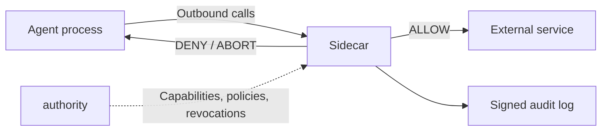

OpenFirma is a runtime boundary for AI agents. It does not judge the model's thoughts, prompts, or chain of reasoning. It controls the concrete thing an agent process eventually does: outbound traffic.

## Architecture

> **Intercepted call types:** plain HTTP, HTTPS (tunnel or transparent MITM), gRPC, Unix domain socket, and local shell commands via `local_exec`.

**Authority** is the trust root. It issues short-lived, cryptographically signed capability tokens for agents, loads Cedar policies from disk, and streams policy bundles and revocation updates to connected Sidecars over persistent gRPC connections. It sits entirely off the enforcement hot path: every allow/deny decision is made locally by the Sidecar without calling back to the Authority.

**Sidecar** is the local enforcement point. It intercepts every outbound call from the agent process, classifies it into a canonical action class, validates the capability token, evaluates Cedar policy, and on ALLOW injects credentials just-in-time. Fail-closed by construction: any error (unknown mapping, missing capability, stale policy, malformed request) produces a DENY.

**Audit emitter** runs as a background task inside the Sidecar. It signs and emits a record for every enforcement decision, capturing the agent, session, action class, target resource, the token that authorized the call, the outcome, and timing. Drains into pluggable destinations: stdout, file, remote service, or a local write-ahead log. Every record is independently verifiable.

## The four invariants

These invariants explain behaviors you will encounter while working with OpenFirma.

### Fail closed

**What:** For protected traffic, uncertainty becomes a DENY outcome. Unknown mapping, missing capability, expired token, stale policy, unavailable policy evaluator, malformed request, failed credential fetch: all of these block the request. 

**Example:** If you add a new SaaS endpoint but forget to add a mapping rule, production should discover that as a denial, not silently let the agent reach it.

### No network on the hot path

**What:** Capability validation and Cedar policy evaluation use local Sidecar state. The Sidecar does not ask the Authority during each request decision. The invariant is about authorization: the decision to allow or deny does not depend on a request-time network round trip to the control plane. 

**Example:** If for some reason the Authority connection drops, the Sidecar can continue using fresh local state until freshness checks say the policy or revocation state is no longer trustworthy. At that point it denies.

### Determinism

**What:** The enforcement decision is deterministic for the same normalized request, local capability state, runtime signals, and policy bundle. There is no LLM or probabilistic classifier in the Sidecar decision path.

**Example:** If a request was denied because `action_count` exceeded a policy threshold, you can inspect the audit event and the bundle to understand why. You are not trying to reproduce a model judgment.

If a request was denied, you can inspect the audit event and the Cedar bundle and reproduce the exact decision. You are not debugging a model judgment.

**What:** The Sidecar builds a canonical `ExecutionEnvelope` for the action being evaluated. Policy sees that envelope. Audit records that envelope. Later steps such as credential injection and connector dispatch use derived data rather than rewriting what policy saw.

**Example:** Adding an `Authorization` header after policy allows a request does not change the action class, resource, or parameters that Cedar evaluated.

The Sidecar builds a canonical `ExecutionEnvelope` once, before enforcement. Policy evaluates that envelope. Audit records that envelope. Credential injection happens after the decision and does not rewrite what policy saw.

## Why this shape matters

The architecture gives OpenFirma a narrow job: govern outbound agent actions at the process boundary. The Sidecar does not need to understand every model, framework, prompt, or tool protocol. It needs to see the outbound request, classify it into a stable action vocabulary, validate local authority material, evaluate policy, and leave a signed audit trail.

## Where to go next

- [The enforcement pipeline](../pipeline/) explains the request path stage by stage.
- [Action classes](../action-classes/) explains how raw HTTP requests become policy vocabulary.
- [The sandbox boundary](../sandbox/) explains when `firma run` becomes relevant to the architecture.
