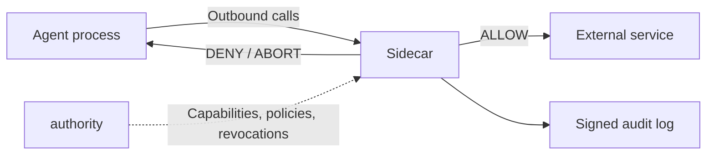

OpenFirma is a runtime boundary for AI agents. It does not judge the model's thoughts, prompts, or chain of reasoning. It controls the concrete thing an agent process eventually does: outbound traffic.

## Architecture

> **Intercepted call types:** plain HTTP, HTTPS (tunnel or transparent MITM), gRPC, Unix domain socket, and local shell commands via `local_exec`.

**Authority** is the trust root. It issues short-lived, cryptographically signed capability tokens for agents, loads Cedar policies from disk, and streams policy bundles and revocation updates to connected Sidecars over persistent gRPC connections. It sits entirely off the enforcement hot path: every allow/deny decision is made locally by the Sidecar without calling back to the Authority.

**Sidecar** is the local enforcement point. It intercepts every outbound call from the agent process, classifies it into a canonical action class, validates the capability token, evaluates Cedar policy, and on ALLOW injects credentials just-in-time. Fail-closed by construction: any error (unknown mapping, missing capability, stale policy, malformed request) produces a DENY.

**Audit emitter** runs as a background task inside the Sidecar. It signs and emits a record for every enforcement decision, capturing the agent, session, action class, target resource, the token that authorized the call, the outcome, and timing. Drains into pluggable destinations: stdout, file, remote service, or a local write-ahead log. Every record is independently verifiable.

## The four invariants

These invariants explain behaviors you will encounter while working with OpenFirma.

### Fail closed

If anything goes wrong, the call is blocked. Never the opposite.

Unknown mapping, missing capability, expired token, stale policy, malformed request, failed credential fetch: all produce a DENY. If you add a new API endpoint but forget the mapping rule, you will see `UnclassifiedIntent` in the audit log, not a silent pass-through. There is no error path that silently allows.

### No network on the hot path

The Sidecar decides on its own, without asking anyone in real time. It already has everything it needs locally: the policy bundle, the capability state, and the revocation cache.

If the Authority goes down mid-session, the Sidecar keeps enforcing against its cached state. Once that state exceeds its freshness threshold, it denies. You will never get a silent pass-through because the control plane is unreachable.

### Determinism

The same call always produces the same decision. There is no model interpreting intent, it is pure logic. Same normalized request, same policy bundle, same local state: same outcome, every time.

If a request was denied, you can inspect the audit event and the Cedar bundle and reproduce the exact decision. You are not debugging a model judgment.

### Envelope immutability

What the policy sees and what the audit log records is the same thing. Nobody can modify the request after it has been evaluated.

The Sidecar builds a canonical `ExecutionEnvelope` once, before enforcement. Policy evaluates that envelope. Audit records that envelope. Credential injection happens after the decision and does not rewrite what policy saw.

## Why this shape matters

The architecture gives OpenFirma a narrow job: govern outbound agent actions at the process boundary. The Sidecar does not need to understand every model, framework, prompt, or tool protocol. It needs to see the outbound request, classify it into a stable action vocabulary, validate local authority material, evaluate policy, and leave a signed audit trail.

## Where to go next

- [The enforcement pipeline](../pipeline/) explains the request path stage by stage.
- [Action classes](../action-classes/) explains how raw HTTP requests become policy vocabulary.
- [The sandbox boundary](../sandbox/) explains when `firma run` becomes relevant to the architecture.
