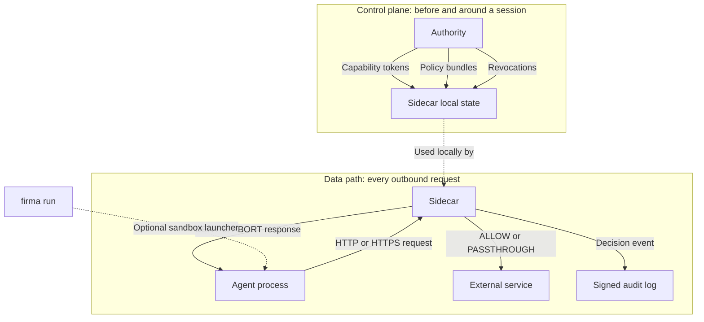

OpenFirma is a runtime boundary for AI agents. It does not judge the model's thoughts, prompts, or chain of reasoning. It controls the concrete thing an agent process eventually does: outbound traffic.

In these docs, an **agent** is software that uses a model to pursue a goal and take steps toward it. A coding agent might read files, ask a model what to edit, run tests, and call an LLM API again with the result. A GenAI web app might ask a model whether to call Stripe, GitHub, or an internal service. The agent may be autonomous, semi-autonomous, or mostly workflow-driven. OpenFirma treats all of those as processes that can make outbound calls.

This page separates the architecture into two paths:

- The **control plane**, where permission material and policy state are prepared.
- The **data path**, where every intercepted request is classified, checked, dispatched, and audited.

Keeping those paths separate makes the rest of the system easier to understand.

## The Pieces

The **Agent** is the process doing work. It might be Claude Code, a custom Python loop, a CI worker, or your application server calling model APIs.

The **Sidecar** is the local enforcement point. Interceptors feed requests into it. It normalizes each request, runs capability validation, runs policy enforcement, optionally injects credentials, dispatches allowed traffic, and emits audit payloads.

The **Authority** is the trust root. It issues capability tokens and streams policy bundles and revocation updates to Sidecars. It is not consulted for every request.

`firma run` is the optional launcher. It starts the agent inside a sandbox and routes network traffic toward the Sidecar. Without it, proxy environment variables can route cooperative agents. With it, bypassing the Sidecar is much harder.

## The Four Invariants

These invariants explain why the code is strict in places that might feel inconvenient during development.

### Fail Closed

For protected traffic, uncertainty becomes DENY. Unknown mapping, missing capability, expired token, stale policy, unavailable policy evaluator, malformed request, failed credential fetch: all of these block the request. 

If you add a new SaaS endpoint but forget to add a mapping rule, production should discover that as a denial, not silently let the agent reach it.

### No Network On The Enforcement Hot Path

Capability validation and Cedar policy evaluation use local Sidecar state. The Sidecar does not ask the Authority during each request decision. The invariant is about authorization: the decision to allow or deny does not depend on a request-time network round trip to the control plane. 

If for some reason the Authority connection drops, the Sidecar can continue using fresh local state until freshness checks say the policy or revocation state is no longer trustworthy. At that point it denies.

### Determinism

The enforcement decision is deterministic for the same normalized request, local capability state, runtime signals, and policy bundle. There is no LLM or probabilistic classifier in the Sidecar decision path.

If a request was denied because `action_count` exceeded a policy threshold, you can inspect the audit event and the bundle to understand why. You are not trying to reproduce a model judgment.

### Envelope Immutability

The Sidecar builds a canonical `ExecutionEnvelope` for the action being evaluated. Policy sees that envelope. Audit records that envelope. Later steps such as credential injection and connector dispatch use derived data rather than rewriting what policy saw.

Adding an `Authorization` header after policy allows a request does not change the action class, resource, or parameters that Cedar evaluated.

## Why This Shape Matters

The architecture gives OpenFirma a narrow job: govern outbound agent actions at the process boundary.

That narrowness is the point. The Sidecar does not need to understand every model, framework, prompt, or tool protocol. It needs to see the outbound request, classify it into a stable action vocabulary, validate local authority material, evaluate policy, and leave a signed audit trail.

## Where To Go Next

- [The enforcement pipeline](../pipeline/) explains the request path stage by stage.
- [Action classes](../action-classes/) explains how raw HTTP requests become policy vocabulary.
- [The sandbox boundary](../sandbox/) explains when `firma run` becomes part of the architecture.
