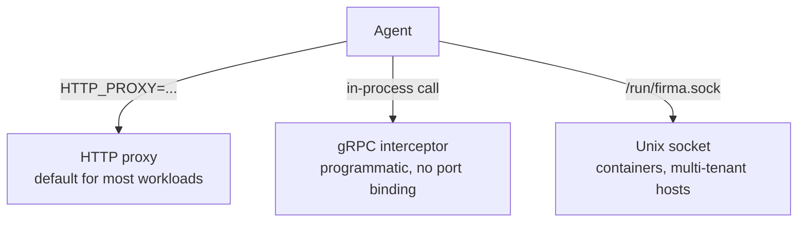

The Sidecar can only enforce on traffic it sees. **Interception** is how it gets the agent's outbound calls into the [enforcement pipeline](../pipeline/) in the first place. There are several modes, and choosing among them is one of the more impactful decisions when wiring OpenFirma into a real environment.

This page covers the three transport modes, the CONNECT vs MITM trade-off for HTTPS, and the operational consequences of each choice.

## The three transport modes



All three feed the same `RawRequest` shape into the pipeline, so the rest of the Sidecar — normalizer, Stage 1, Stage 2, audit — is identical regardless of how the request arrived.

### HTTP proxy

The default. The Sidecar listens on a TCP port (default `127.0.0.1:8080`) and the agent is configured with `HTTP_PROXY` and `HTTPS_PROXY`. Every popular language and HTTP client respects these environment variables, including Python's `requests`, Node's `fetch` and `axios`, Go's `net/http`, Rust's `reqwest`, and most LLM SDKs.

This is the right mode for almost every starting workload. It works without code changes, and you don't have to rebuild the agent to put it behind enforcement.

Configured in `firma.toml` as:

```toml
[sidecar.interceptor]
mode               = "http_proxy"
listen_addr        = "127.0.0.1:8080"
drain_timeout_secs = 5
```

### gRPC interceptor

A programmatic mode for SDKs that integrate the Sidecar in-process. The agent calls the Sidecar's gRPC interceptor service directly instead of going through a proxy. There's no port binding, no HTTPS quirks, and the Sidecar can be linked into the same address space as the agent for very tight latencies.

This is interesting when you're shipping a managed runtime (e.g. you control the agent SDK) and you want zero proxy footprint. It's not a starting mode — use HTTP proxy first, move to gRPC if and when proxy semantics become limiting.

### Unix socket

Same protocol as the HTTP proxy mode, but the listener is on a filesystem socket instead of a TCP port. Configured as:

```toml
[interceptor]
mode               = "unix_socket"
listen_addr        = "/run/firma-sidecar.sock"
drain_timeout_secs = 5
```

This is useful in three situations: (1) containerized environments where binding ports is constrained, (2) hosts with multiple tenants where port collisions are likely, and (3) any deployment where you want the Sidecar to be reachable only by processes that can also reach the filesystem path.

`firma run` uses Unix sockets internally to bridge sandboxed agents to the host-side Sidecar — see [The sandbox boundary](../sandbox/) for that path.

## HTTPS: CONNECT vs MITM

Modern agents talk HTTPS to nearly everything, which means the request is encrypted before it leaves the agent. The Sidecar has two ways to handle that traffic. The difference is simple: **CONNECT sees the destination; MITM sees the HTTP request.**

### CONNECT relay

In CONNECT mode, the agent asks the Sidecar to open a tunnel:

```text
CONNECT api.example.com:443
```

The Sidecar can allow or deny that tunnel. If it allows, the TLS handshake happens directly between the agent and `api.example.com`, and the Sidecar only relays encrypted bytes.

That means CONNECT mode can enforce destination-level rules:

- allow `api.openai.com`;
- deny `paste.rs`;
- record that the agent tried to open a tunnel to `api.example.com:443`.

It cannot enforce request-level rules such as "deny `GET /admin/*`" or "deny a POST body containing a secret", because the Sidecar never sees the inner HTTP method, path, headers, or body.

Use CONNECT when destination policy is enough, when you are not allowed to inspect the traffic, or when the upstream uses certificate pinning or mTLS that would reject inspection.

### TLS MITM

In MITM mode, the Sidecar becomes the TLS endpoint for the agent. It presents a certificate signed by the Sidecar CA, which the agent process has been configured to trust. The Sidecar decrypts the HTTP request, runs the normal pipeline, then opens a separate TLS connection to the upstream service.

That means MITM mode can enforce full L7 policy:

- everything CONNECT can enforce;
- HTTP method, path, headers, and body;
- action-class mappings such as `POST /v1/payment_intents` to `payment.transfer`;
- Cedar rules that inspect normalized request data through fields such as `context.params`.

After decryption, the request is not just treated as an endpoint to allow or deny. It goes through the normal OpenFirma pipeline: mapping to an action class, capability validation, Cedar policy evaluation, audit, and optional credential injection.

Use MITM when you control the destination, have explicit permission to inspect it, and need request-level policy. It is the mode you need for rules like "deny Stripe transfers over $1,000" or "allow only specific API paths."

### Configuring per-host

`firma.toml` controls MITM scope with three lists:

```toml
[sidecar.interceptor.https_mitm]
enabled         = true
intercept_hosts = ["api.openai.com", "api.anthropic.com", "api.stripe.com"]
bypass_hosts    = ["self-signed.internal"]
strict_hosts    = ["api.github.com"]
```

- **`intercept_hosts`** — explicit allowlist for MITM. Hosts in this list get TLS-terminated. Wildcards allowed (`*.anthropic.com`).
- **`bypass_hosts`** — explicit list to fall back to CONNECT-only. Use for hosts where MITM would break (cert pinning, mTLS) but you still want destination-level policy.
- **`strict_hosts`** — if MITM fails for any reason on these hosts (cert mismatch, handshake failure, internal error), **deny the connection** instead of falling back to CONNECT. Use for hosts where you'd rather break the call than enforce a weaker policy on it.

Hosts not in any list use the configured default (typically CONNECT-only).

:::note
`firma config` **merges** `strict_hosts` rather than overwriting it. On the first run it seeds the list to the intercepted hosts (fail-closed); on a re-run it appends any newly intercepted hosts but preserves entries you added by hand. So you can harden a single host by adding one line to `strict_hosts` without re-listing the whole set, and re-running `firma config` will not wipe that edit. (`intercept_hosts`, by contrast, is fully replaced to reflect the current selection.)
:::

For the operator-side workflow — generating the CA, trusting it on the agent host, choosing what to MITM — see [Enable HTTPS MITM](../../guides/https-mitm/).

### Composio requires strict MITM

Composio tool governance depends on the method, path, and JSON body of hosted
MCP and direct execution requests. Configure both `app.composio.dev` and
`backend.composio.dev` in `intercept_hosts` and `strict_hosts`. Do not put
either host in `bypass_hosts`: CONNECT-only traffic hides the tool slug and
arguments, so OpenFirma cannot evaluate the logical action.

The Composio decoder runs after TLS termination and before generic transport
mapping. Unsupported execution shapes fail closed instead of falling back to a
coarse host-level allow. See [Govern Composio tool
execution](../../guides/composio/) for the full integration.

## The CA: the most security-sensitive piece

When you enable MITM, the Sidecar mints a CA on first run (under `[ca].dir`). That CA's private key is the most sensitive secret in your OpenFirma deployment: anyone who possesses it can sign certificates that the agent host will trust. Two operational rules:

1. **Never regenerate the CA.** Once the agent host trusts it, you have to keep using it. Regenerating means you have to re-trust the new CA on every host. Treat the CA directory as immutable infrastructure.
2. **Restrict trust to the agent's host.** The CA should be installed in the trust store of *the agent's process*, not the operating system's global trust store. Tools like `SSL_CERT_FILE`, `REQUESTS_CA_BUNDLE`, or per-language equivalents let you scope trust narrowly. The bundled demo uses `SSL_CERT_FILE` for exactly this reason.

If the CA private key is ever exposed, the only correct response is to stop using MITM until you've issued a new CA, re-trusted it everywhere, and rotated anything the old CA might have signed for.

## Comparison and recommendation

| Need                                                | Recommended mode                       |
| --------------------------------------------------- | -------------------------------------- |
| Try OpenFirma against an existing agent             | HTTP proxy + CONNECT-only              |
| Local coding agent on your dev machine              | HTTP proxy + MITM for known hosts      |
| Containerized agent in a multi-tenant host          | Unix socket + MITM                     |
| Production web app calling LLM APIs                 | HTTP proxy + MITM, `strict_hosts` set  |
| Custom SDK with no proxy support                    | gRPC interceptor                       |
| Third-party agent talking to a host you don't own   | CONNECT-only via `bypass_hosts`        |

Start in CONNECT-only mode. Add MITM hosts as you decide which ones you want L7 policy on. Use `strict_hosts` for the small set of hosts you *cannot* afford to talk to under weaker rules.

## Where to go next

- [Connectors](../connectors/) — what happens to a request *after* the Sidecar allows it.
- [The sandbox boundary](../sandbox/) — how `firma run` forces traffic through the Sidecar even for agents that ignore env vars.
- [Enable HTTPS MITM](../../guides/https-mitm/) — operator-side walkthrough.
- [Rehydrate & mask secrets (secret gateway)](../../guides/secret-gateway/) — MITM'd HTTP vault responses feed this path once you need placeholder-based secret handling.
