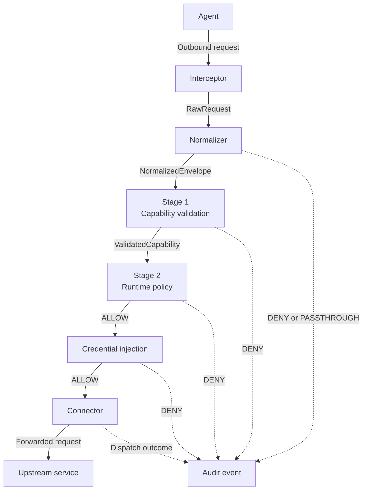
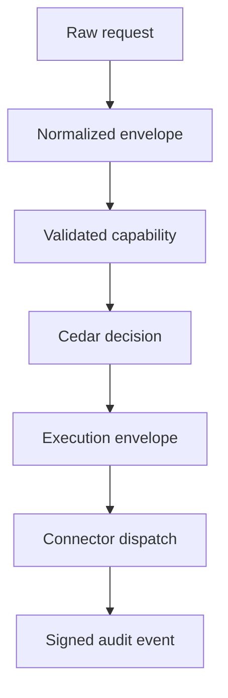

The enforcement pipeline is the request path inside the Sidecar. It takes one outbound call from an agent and answers a narrow question:

**Should this call be allowed to leave the agent's environment?**

This page follows a single request through that path. Each step adds one piece the next step needs: first the Sidecar sees the traffic, then it turns the request into stable policy vocabulary, then it checks whether the agent has authority to attempt the action, it then asks runtime policy whether this exact attempt is acceptable, and only at the end does the request leave.

## The Shape Of The Flow



All interception modes feed the same entry point. Once the request is inside the pipeline, the downstream stages do not care whether it arrived through an HTTP proxy, a gRPC hook, or a Unix socket.

That is the first simplifying idea: **transport is an input, not the policy model**.

## Before The Request Arrives

The hot path is fast because the Sidecar is already holding the state it needs locally.

Before or around an agent session, the Authority prepares three kinds of material:

- **Capability tokens**: signed [PASETO](https://paseto.io/) tokens that say what an agent may attempt.
- **Policy bundles**: compiled [Cedar](https://docs.cedarpolicy.com/) policy and schema used for runtime decisions.
- **Revocations**: token ids that are no longer valid even if their expiry is in the future.

The Sidecar keeps those in local memory. It does not ask the Authority, a database, or an LLM for permission during each request. If the local state is not ready or no longer fresh enough to trust, the pipeline denies protected traffic.

That is why the pipeline can be strict without being slow: request-time enforcement is local, deterministic work.

## Step 1: Get The Request Into The Sidecar

The pipeline begins when the Sidecar sees outbound traffic from the agent.

Traffic can enter the Sidecar directly through proxy, gRPC, or Unix socket modes, or indirectly through `firma run`, which uses platform sandboxing and a proxy bridge to force agent egress through the same pipeline.

The intercepted request is represented as a `RawRequest`: method, host, path, headers, optional body, and whether the original transport was HTTP or HTTPS. At this point the request is still transport-shaped:

```text
POST https://paste.rs/
Authorization: Bearer ...
Content-Type: text/plain

hello from an agent
```

This is not yet a good policy object. A policy should not have to know every API route, every SaaS URL shape, or every HTTP client detail. The rest of the pipeline needs something more stable than "POST to this host and path".

That is the normalizer's job.

## Step 2: Normalize Raw Traffic Into Intent

The normalizer turns transport details into OpenFirma's canonical vocabulary. It uses the configured mapping table to translate a `(method, host, path)` tuple into an **action class** and a structured **resource**.

For example:

```text
POST https://paste.rs/
```

can become:

```text
intent.action_class: communication.external.send
intent.resource.host: paste.rs
intent.resource.path: /
intent.raw_transport: https
intent.raw_action_ref: POST /
```

The important shift is from "what HTTP request is this?" to "what kind of action is the agent trying to perform?"

That shift gives policies a portable language. A rule about `communication.external.send` can cover a paste service, a webhook, an email API, or a future connector without hard-coding every destination into the policy itself. The destination still matters, but it lives in the resource fields where policy can inspect it deliberately.

Normalization also strips sensitive headers such as `Authorization`, `Cookie`, and `x-api-key` before the request becomes an auditable envelope. Policy needs to know what the agent is trying to do; it should not accidentally receive or log bearer secrets.

### Protected, Denied, Or Passthrough

The mapping table also decides whether a request is protected.

If the request is not protected, the normalizer can return `PASSTHROUGH`. That means the call is outside the enforcement surface you configured, so it can be forwarded without Stage 1 or Stage 2.

If the request is protected but cannot be classified, the pipeline returns `DENY` before capability validation. This is fail-closed behavior: an unclassified protected action is an action policy cannot reason about.

If the request is protected and classified, the pipeline carries a `NormalizedEnvelope` into Stage 1.

For example, suppose your mapping rules contain only this GitHub route:

```toml
[[rules]]
method       = "GET"
host         = "api.github.com"
path         = "/repos/*"
action_class = "code.read"
```

With `default_protected = false`, a request like `GET https://example.com/health` matches no rule and is treated as `PASSTHROUGH`: it is outside the configured enforcement surface.

With `default_protected = true`, a request like `POST https://api.github.com/repos/acme/app/issues` also matches no rule, but it is treated as protected and unclassified, so the pipeline returns `DENY`.

In either stance, `GET https://api.github.com/repos/acme/app` matches the rule, becomes `code.read`, and continues as a `NormalizedEnvelope`.

## Step 3: Validate The Capability

Stage 1 asks:

**Did an Authority authorize this agent to attempt this kind of action against this kind of resource?**

The proof is a capability token. A capability is a short-lived, signed PASETO token with claims like:

```json
{
  "token_id": "79dd9ffb-ebc8-4883-8f1e-72eb74a26e33",
  "agent_id": "demo-agent",
  "session_id": "demo-session",
  "action_set": ["communication.external.send"],
  "resource_scope": "wttr.in*",
  "expiry": "2026-05-04T21:34:08Z"
}
```

The Sidecar validates the token locally:

1. Select a matching token from the in-memory `CapabilityMap`.
2. Verify the PASETO signature using the Authority public key.
3. Check that the token has not expired.
4. Check local revocation state for the token id.
5. Confirm the normalized action class and resource match the token scope.

Each check removes a different class of risk.

Signature verification proves the token came from the Authority. Expiry limits how long leaked or stale authority can be useful. Revocation lets an operator kill a token before expiry. Scope matching makes sure a token for one mission cannot be stretched to cover another.

If any check fails, the request is denied and Stage 2 never runs. A Cedar policy cannot rescue a missing, expired, revoked, or out-of-scope capability.

If all checks pass, Stage 1 emits a `ValidatedCapability`. Now the pipeline knows who the agent is, which session the call belongs to, and which signed claims are authoritative.

## Step 4: Evaluate Runtime Policy

Stage 2 asks a different question:

**Given the current policy bundle and runtime context, is this exact call OK right now?**

This is why OpenFirma has both capabilities and policies.

The capability says the agent may attempt a bounded class of action. Runtime policy decides whether the specific attempt should be allowed under current rules. A capability might authorize `payment.transfer`, while policy still forbids transfers over a configured amount. A capability might authorize outbound communication, while policy still blocks `paste.rs`.

Before Cedar evaluation, Stage 2 checks that the local policy bundle is fresh. If the bundle is older than `bundle_ttl_seconds`, the request is denied with `PolicyBundleStale`. Stale policy is treated as unsafe because the operator may have tightened rules since the last update.

Then Stage 2 evaluates Cedar with the normalized request:

```text
principal: Firma::Agent::"demo-agent"
action:    Firma::Action::"communication.external.send"
resource:  Firma::Resource::"paste.rs/"
context:   session_id, timestamp_ms, action_count, params, risk_score, ...
```

This is the second simplifying idea: **Cedar sees the semantic action, not raw transport trivia**.

The raw request still contributes useful information. The host and path become the resource. The body can be normalized into `intent.params`, and Cedar receives that value as the `params` field in `context`. The session store provides counters such as `action_count`. But those fields are presented to policy in a stable shape, so rules can stay understandable.

If Cedar denies, the pipeline stops. If Cedar allows, the request has passed both authorization layers:

- Stage 1 proved the agent had a valid signed capability.
- Stage 2 proved current runtime policy allowed this specific attempt.

Both must pass. A valid capability cannot bypass policy, and a permissive policy cannot help an agent with no matching capability.

## Step 5: Build The Execution Envelope

After Stage 1 and Stage 2 pass, the pipeline assembles the full `ExecutionEnvelope`.

The envelope is the canonical record of the action the Sidecar approved. It contains:

- `intent`: action class, resource, params, raw transport, and original action reference.
- `capability`: the raw signed token that supported the request.
- `metadata`: agent id, session id, timestamp, budget consumed, and risk score.
- `provenance`: reserved for future causal-chain or attestation data.

The envelope matters because it is shared by later steps and by audit. OpenFirma treats it as immutable once created. If a later step injects credentials or prepares a connector-specific request, it does so by creating derived data rather than rewriting what policy saw.

That immutability is what makes audits explainable. You can inspect the envelope and know what the policy decision was based on.

## Step 6: Inject Credentials After Allow

Some upstream services require credentials. OpenFirma attaches those after the request has been allowed, not before.

That ordering is deliberate:

- The agent does not need to hold the upstream secret.
- Policy evaluates the action before any secret is added.
- A denied request never receives credentials.

If no credentials are configured for the target connector, the pipeline continues with empty injected headers. If a credential should be fetched but the fetch fails after ALLOW, the pipeline aborts the call with `CREDENTIAL_INJECTION_FAILED`. The token stays active, but the call is recorded as not completed.

Credential injection is still part of the local pipeline, but it is downstream of the authorization decision.

## Step 7: Dispatch Through A Connector

The connector is the egress side of the Sidecar. It takes the approved envelope, the original request, and any injected credentials, then sends the request to the upstream service.

Connectors are intentionally downstream of enforcement. They do not decide whether a request is allowed. Their job is operational:

- apply the configured per-host timeout and rate limits;
- attach injected headers;
- open the outbound HTTP or HTTPS connection;
- stream the upstream response back to the agent;
- report dispatch errors in a typed way.

This separation keeps the security boundary small. A connector timeout, DNS failure, request-build failure, or upstream `500` does not mean policy denied the action. A timeout, DNS failure, or request-build failure means policy allowed the action and dispatch later failed; the Sidecar returns an ABORT. An upstream `500` is a completed target response and is relayed unchanged.

V1 ABORT is sidecar-internal and local. It is triggered by:

- `CONNECTOR_TIMEOUT`: the connector exceeded its configured timeout.
- `CONNECTOR_FAILURE`: the connector failed before a target response, such as DNS, TCP, TLS, or connection reset.
- `CONNECTOR_INVALID_REQUEST`: the connector could not translate the approved envelope into a target request.
- `CREDENTIAL_INJECTION_FAILED`: required credential material could not be fetched after enforcement allowed the call.

HTTP-facing interceptors return status `504` with a body like:

```json
{
  "aborted": true,
  "reason": "CONNECTOR_FAILURE",
  "detail": "connection refused"
}
```

The audit event records those facts separately.

## Step 8: Record What Happened

Every outcome produces an audit event:

- A normalization deny records that the protected request could not be classified.
- A Stage 1 deny records which capability check failed.
- A Stage 2 deny records the policy-stage reason, such as stale bundle or Cedar deny.
- A credential-injection abort records that the Sidecar could not safely fetch required secret material after ALLOW.
- An allow records the envelope, capability claims, policy decision, injected credential metadata, and connector outcome.

Audit signing happens off the hot path with the configured ECDSA P-256 key. The important point for readers is that audit follows the same model as enforcement: the event describes the normalized action and the stage that decided the outcome.

This gives operators a useful answer to "what happened?" without replaying the agent's prompt or guessing what the model intended.

## What Can Stop A Request

The pipeline is built to short-circuit. Once a stage returns `DENY`, later stages do not run.

| Stage | Why it can stop |
| ----- | --------------- |
| Readiness | Required local Authority-backed state is not ready. |
| Normalization | The protected request cannot be mapped to a known action class. |
| Capability validation | No matching token, bad signature, expired token, revoked token, or scope mismatch. |
| Runtime policy | Stale bundle, policy timeout, evaluator error, or Cedar deny. |
| Credential injection | Required credential material cannot be fetched safely. |
| Connector | The request was allowed, but dispatch failed or timed out. |

The connector row is different from the others: by the time connector dispatch happens, enforcement has already allowed the call. A connector failure is recorded as a dispatch outcome, not as a retroactive policy denial.

## The Mental Model

The pipeline is easiest to remember as a sequence of increasingly meaningful representations:



Each representation exists because the next decision needs a cleaner input than the previous step had.

The interceptor sees bytes and HTTP metadata. The normalizer gives those bytes a semantic action class. Capability validation proves the agent had signed authority for that class and resource. Runtime policy checks current rules. The envelope freezes what was approved. The connector performs the allowed network operation. Audit records the decision in the same vocabulary policy used.

That is the core OpenFirma idea: **agents can still act, but outbound actions become explicit, bounded, and explainable before they leave the machine.**

## Where To Go Next

- [Interception](../interception/) explains how requests enter the Sidecar.
- [Action classes](../action-classes/) explains the vocabulary produced by the normalizer.
- [Capabilities](../capabilities/) explains Stage 1 in depth.
- [Policies](../policies/) explains the Cedar model used by Stage 2.
- [Connectors](../connectors/) explains how allowed requests leave the Sidecar.
- [Read & verify the audit log](../../guides/audit-log/) explains the signed record produced after decisions.
