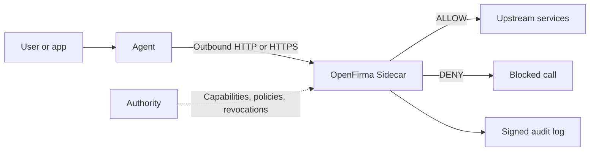

import Hero from '../../components/Hero.astro';
import FeatureGrid from '../../components/FeatureGrid.astro';

<Hero
  eyebrow={null}
  title="Give AI agents a runtime boundary."
  tagline="OpenFirma puts a local enforcement point between an agent and the outside world, so every important outbound call is checked, scoped, and recorded before it leaves the machine."
  actions={[
    { text: 'Run the quickstart', href: './quickstart/', variant: 'primary' },
    { text: 'See the architecture', href: './concepts/architecture/', variant: 'minimal' },
  ]}
/>

<FeatureGrid
  items={[
    {
      title: 'See it work',
      description: 'Run a local demo with one allowed request, one denied request, and a signed audit trail.',
      href: './quickstart/',
    },
    {
      title: 'Understand the model',
      description: 'Learn the Sidecar, Authority, capabilities, policies, interception, and sandbox in order.',
      href: './concepts/architecture/',
    },
    {
      title: 'Secure a workload',
      description: 'Wrap a coding agent, run the Sidecar standalone, inject credentials, or deploy a web app.',
      href: './guides/run-the-sidecar/',
    },
    {
      title: 'Know what happened',
      description: 'Every decision is written as an audit event you can inspect and verify later.',
      href: './guides/audit-log/',
    },
  ]}
/>

## Why this exists

AI agents are no longer just chat boxes. They call APIs, run tools, send messages, read files, and trigger workflows. That is useful, but it also means a bad prompt, a compromised dependency, or a confused model can turn into a real outbound action.

OpenFirma gives those actions a boundary. It routes agent traffic through a local Sidecar, turns each request into a clear intent, checks that intent against capabilities and Cedar policy, and records the decision.

The goal is not to make agents harmless. The goal is to make their power explicit, limited, and observable.

## The basic shape

Three pieces matter at first:

- The **Sidecar** is the local enforcement point. It sees outbound requests and decides whether to forward them.
- The **Authority** is the trust root. It signs short-lived capability tokens and streams policy updates and revocations.
- `firma run` is the optional launcher. It starts an agent inside a sandbox so traffic cannot skip the Sidecar.

Those pieces are built around four promises: fail closed, keep the hot path local, make decisions deterministic, and record the exact envelope the policy saw.

## Where to start

If you are new, start with [Quickstart](./quickstart/). It runs a deterministic local demo with no API keys.

If you want the mental model, read [Architecture & invariants](./concepts/architecture/) and then [The enforcement pipeline](./concepts/pipeline/).

If you already have a workload in mind, pick the closest guide:

- [Run the Sidecar standalone](./guides/run-the-sidecar/) for a minimal local setup.
- [Secure a local coding agent](./guides/secure-a-coding-agent/) for Claude Code, Codex, Cursor, or similar tools.
- [Deploy a GenAI web app](./guides/deploy-a-genai-webapp/) for a multi-user service that calls LLMs and SaaS APIs.

For implementation details, the [Rust API reference](./api/) is generated from the workspace crates.
