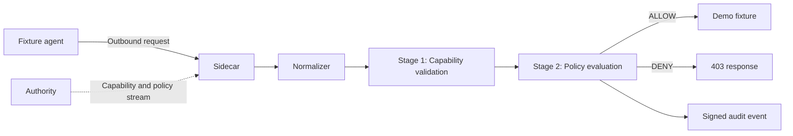

import { Steps } from '@astrojs/starlight/components';

This quickstart gets you to the smallest useful OpenFirma experience: one outbound call is allowed, one is denied, and both are written to the audit log.

You do not need API keys for the default path. The demo uses a deterministic fixture agent so you can see the enforcement loop without depending on an LLM's choices.

## Prerequisites

- Rust 1.86+ with `cargo` on `PATH`
- `protoc` (Protocol Buffers compiler)
- `make`
- Node.js 20.19+ and Corepack, if you also want to build the docs site

If you're missing any of these, `make install` from the repo root installs `protoc`, the Rust docs tooling, and the docs-site Node deps in one shot.

## Run the deterministic demo

<Steps>

1. Clone the repository.

   ```bash
   git clone https://github.com/firma-ai/firma-oss
   cd firma-oss
   ```

2. Run the CI demo.

   ```bash
   make demo-ci
   ```

3. Look for the two outcomes.

   ```text
   [allow] 200 OK path=/allow body={"ok":true,"path":"/allow"}
   [deny] 403 Forbidden path=/deny body={"denied":true,"reason":"...","detail":"..."}
   [ok] ALLOW + DENY round-trips matched expectation.
   ```

</Steps>

The command builds the binaries it needs, starts a local Authority and Sidecar, issues a short-lived capability token for the demo agent, runs the fixture client, and checks that both decisions were audited.

## What just happened

The demo starts three local pieces:

- An **Authority**, which signs a capability token and streams policies and revocations.
- A **Sidecar**, which receives outbound requests and decides ALLOW or DENY.
- A **fixture agent**, which makes one request that should pass and one that should fail.

Every request takes the same path:



The important detail is that the Sidecar does not ask the Authority on every request. Once it has the public key, policy bundle, capability seed, and revocation state, the decision path is local.

Stage 1 checks whether the agent has a valid capability for the normalized action. Stage 2 evaluates the current Cedar policy. Both stages must pass before the connector forwards the call.

## Try the LLM-backed demo

The deterministic demo is the best first run. If you want a more realistic agent loop, use the LLM-backed demo:

```bash
cp examples/demo/.env.sample examples/demo/.env
# Add OPENAI_API_KEY to examples/demo/.env
make demo
```

There is also an interactive REPL:

```bash
make demo-repl
```

These modes use the same Authority and Sidecar shape, but the model may choose different tool paths. For repeatable testing, use `make demo-ci`.

## Read the docs in order

The rest of the docs are organized from mental model to hands-on work.

Start with these Concepts pages:

1. [Architecture & invariants](../concepts/architecture/) — the three processes and the four design invariants everything else builds on.
2. [The enforcement pipeline](../concepts/pipeline/) — the stage chain in detail.
3. [Action classes](../concepts/action-classes/) — the canonical vocabulary that connects raw HTTP traffic to policy.
4. [Capabilities](../concepts/capabilities/) and [Policies](../concepts/policies/) — the two layers that decide what an agent may do.

Then move to the guide that matches your next task:

- [Run the Sidecar standalone](../guides/run-the-sidecar/) if you want to write a small config yourself.
- [Manage the stack with `firma stack` and `firma monitor`](../guides/manage-the-stack/) if you want one-command supervision and a live tail of decisions.
- [Diagnose with `firma doctor`](../guides/firma-doctor/) if anything looks wrong after install or after a config change.
- [Write your first Cedar policy](../guides/write-a-cedar-policy/) if you want to change what gets allowed.
- [Wrap an agent with `firma run`](../guides/firma-run/) if you want a sandbox boundary, not only proxy environment variables.
- [Secure a local coding agent](../guides/secure-a-coding-agent/) if your immediate goal is governing Claude Code, Codex, Cursor, or a similar tool.

## Useful references

- [Rust API Reference](../api/) — every public item in the workspace, auto-generated from rustdoc.
- [Demo README](https://github.com/firma-ai/firma-oss/tree/main/examples/demo) — details for `make demo-ci`, `make demo`, and `make demo-repl`.
- [Blog](../blog/) — release notes and design write-ups.
