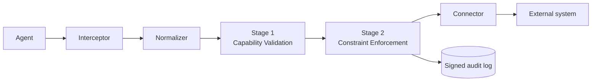

import { Steps } from '@astrojs/starlight/components';

This guide gets you to a working enforcement loop on your laptop. By the end you'll have a sidecar running, an Authority issuing capability tokens, and a real ALLOW / DENY decision printed in your terminal.

## Prerequisites

- Rust 1.86+ with `cargo` on `PATH`
- `protoc` (Protocol Buffers compiler)
- `make`

## Run the hero demo

<Steps>

1. Clone the repo and build the workspace.

   ```bash
   git clone https://github.com/firma-ai/firma-oss
   cd firma-oss
   make build
   ```

2. Launch the bundled demo. It spins up the Authority, the Sidecar, and a fixture agent in one shell.

   ```bash
   make demo
   ```

3. Watch the terminal. You'll see one signed audit event per agent call - some ALLOW, some DENY, every one of them deterministic.

</Steps>

## What just happened



Every outbound agent call passes through the sidecar's enforcement pipeline before reaching the outside world. Two stages run fully in-process - no network on the hot path:

- **Stage 1 - Capability Validation** parses, verifies, and checks expiry / revocation of the capability token attached to the action.
- **Stage 2 - Constraint Enforcement** evaluates the canonical action against the live Cedar policy bundle.

Both stages have to pass for the connector to dispatch the call. Either way, a signed audit event is emitted.

## Where to go next

- Browse the [Rust API Reference](/api/) for every public item in the workspace.
- Read the [`firma_sidecar::pipeline`](/api/firma_sidecar/pipeline/) module to see how the stages are wired.
- Read the [`firma_sidecar::enforcement`](/api/firma_sidecar/enforcement/) module to dig into the two stages.
- Check the [blog](/blog/) for release notes and design write-ups.
