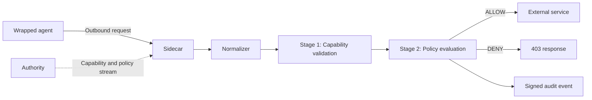

import { Steps, Tabs, TabItem } from '@astrojs/starlight/components';

This quickstart takes you from nothing installed to a real agent running under enforcement: its outbound calls are checked against policy, allowed or denied, and written to the audit log.

The default install path uses a single precompiled static binary. You do not need a build toolchain, or any API keys, unless you choose to build from source.

## Install

OpenFirma can be installed with a one-line script or built from source. The script downloads the right binary for your platform, puts it on your `PATH`, and offers to scaffold your first project.

<Tabs>
<TabItem label="Precompiled binary">

<Steps>

1. Run the installer.

   On **Linux and macOS**:

   ```bash
   curl -fsSL https://install.openfirma.ai | sh
   ```

   On **Windows** (PowerShell):

   ```powershell
   iwr -useb https://install.openfirma.ai/install.ps1 | iex
   ```

2. Confirm `firma` is on your `PATH`.

   ```bash
   firma --version
   ```

   If the command is not found, open a new terminal so your shell picks up the updated `PATH`, then try again.

</Steps>

The installer drops the binary in `~/.local/bin` by default and adds it to your shell's `PATH`.

</TabItem>
<TabItem label="From source">

Prerequisites:

- Rust 1.88 or newer.
- `protoc`, the Protocol Buffers compiler.
- `git`.

Clone the repository:

```bash
git clone https://github.com/Firma-AI/openfirma.git
cd openfirma
```

Install the current source checkout:

```bash
cargo install --path crates/firma --bin firma --locked
```

This installs `firma` into Cargo's binary directory, usually `~/.cargo/bin`. If `firma --version` is not found, make sure that directory is on your `PATH`.

</TabItem>
</Tabs>

## Set up a project

Start in the project directory you want to protect. Scaffold the local OpenFirma layout with the defaults:

```bash
firma config --yes
```

This creates `.firma/` with a `firma.toml` config file, signing keys, empty policy directories, and a placeholder mapping file.

Now make the generated profile work for this demo, where we are going to enforce a simple `curl` command.

1. Create the audit directory that `firma monitor` will tail.

   ```bash
   mkdir -p /tmp/openfirma-quickstart
   ```

2. Edit `.firma/firma.toml`.

   In the existing `[sidecar.audit]` section, add `sink` and `file_path` below the generated `signing_key_path`:

   ```toml
   sink = "file"
   file_path = "/tmp/openfirma-quickstart/audit.jsonl"
   ```

   Then append these sections to the end of the same file:

   ```toml
   [profiles.generic]
   use_http_proxy_sidecar = true

   [sidecar.preflight]
   session_id = "quickstart-session"
   resource_scope = "api.github.com/"
   ```

   The profile setting makes ordinary tools like `curl` use the HTTP proxy Sidecar. The preflight settings pin a stable session ID and grant that session access to the GitHub resource used below.

3. Replace the placeholder contents of `.firma/mapping-rules.toml` with the two rules for the GitHub request:

   ```toml
   [[rules]]
   method = "CONNECT"
   host = "api.github.com"
   path = "/"
   action_class = "communication.external.send"

   [[rules]]
   method = "GET"
   host = "api.github.com"
   path = "/users/firma-ai"
   action_class = "communication.external.send"
   ```

You do not need to add a Cedar policy file for this demo. `firma run` starts a local development Authority with a temporary policy bundle that permits `communication.external.send`.

## Run an agent under enforcement

`firma run` launches a command inside a sandbox and forces all of its outbound traffic through the enforcement Sidecar. It autostarts a local Sidecar for you, and on first use offers to start a local Authority too.

Pass any command you want to wrap after the `--` marker:

```bash
FIRMA_RUN_SESSION_ID=quickstart-session firma run --config .firma/firma.toml -- \
  curl -kfsS \
    --proxy-header 'x-firma-session-id: quickstart-session' \
    https://api.github.com/users/firma-ai
```

The first time you run a project with no Authority configured, `firma run` prompts:

```text
No Authority is configured for this project.
firma run can start a local Mini Authority for development on loopback ([::1]) using a per-run ephemeral port.
This is suitable for a single developer on a trusted workstation.

Start a local Mini Authority? [y/N]
```

Answer **`y`**. `firma run` writes an `[authority]` section into your `firma.toml`, so every later run starts the local Authority automatically and never prompts again.

Every outbound call the wrapped command makes is normalized, checked against its capability, and evaluated against the Cedar policy bundle supplied by the Authority. In this quickstart, `firma run` starts a local development Authority and uses a temporary policy bundle for the run. The `-k` flag keeps the demo short by letting `curl` accept the local HTTPS interception certificate; for real workloads, install the generated CA instead.

### Non-interactive runs (CI)

The prompt needs a terminal — on a non-TTY (a CI job, a script) it fails fast with a "no TTY" error instead of hanging. Commit the choice up front with `--authority local`, which skips the prompt and autostarts the local Authority:

```bash
firma run --authority local -- curl -s https://api.github.com/users/firma-ai
```

To target an Authority you already run, pass its URL instead: `--authority https://authority.internal:50051`.

This is the real entry point for running agents — swap `curl ...` for whatever agent command you actually run (a coding agent, a script, a shell).

## Watch the decisions

Open a second terminal and tail the audit log to see ALLOW and DENY decisions as they happen:

```bash
firma monitor --state-dir /tmp/openfirma-quickstart --tail
```

Each line is one decision: the action class, the resource, and the outcome.

## What just happened

`firma run` started three local pieces:

- An **Authority**, which signs a capability token and streams policies and revocations.
- A **Sidecar**, which receives outbound requests and decides ALLOW or DENY.
- Your **wrapped command**, sandboxed so its traffic cannot bypass the Sidecar.

Every request takes the same path:



The important detail is that the Sidecar does not ask the Authority on every request. Once it has the public key, policy bundle, capability seed, and revocation state, the decision path is local.

Stage 1 checks whether the agent has a valid capability for the normalized action. Stage 2 evaluates the current Cedar policy. Both stages must pass before the call is forwarded.

## Read the docs in order

The rest of the docs are organized from mental model to hands-on work.

Start with these Concepts pages:

1. [Architecture & invariants](../concepts/architecture/) — the three processes and the four design invariants everything else builds on.
2. [The enforcement pipeline](../concepts/pipeline/) — the stage chain in detail.
3. [Action classes](../concepts/action-classes/) — the canonical vocabulary that connects raw HTTP traffic to policy.
4. [Capabilities](../concepts/capabilities/) and [Policies](../concepts/policies/) — the two layers that decide what an agent may do.

Then move to the guide that matches your next task:

- [Run the Sidecar standalone](../guides/run-the-sidecar/) if you want to write a small config yourself.
- [Start and monitor the daemon with `firma sidecar` and `firma monitor`](../guides/manage-the-stack/) if you want one-command daemon control and a live tail of decisions.
- [Diagnose with `firma doctor`](../guides/firma-doctor/) if anything looks wrong after install or after a config change.
- [Write your first Cedar policy](../guides/write-a-cedar-policy/) if you want to change what gets allowed.
- [Wrap an agent with `firma run`](../guides/firma-run/) if you want a sandbox boundary, not only proxy environment variables.
- [Secure a local coding agent](../guides/secure-a-coding-agent/) if your immediate goal is governing Claude Code, Codex, Cursor, or a similar tool.

## Useful references

- [Rust API Reference](../api/) — every public item in the workspace, auto-generated from rustdoc.
- [Diagnose with `firma doctor`](../guides/firma-doctor/) — run this first if `firma run` misbehaves after install.
- [Blog](../blog/) — release notes and design write-ups.
