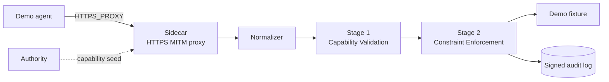

import { Steps } from '@astrojs/starlight/components';

This guide gets you to a working enforcement loop on your laptop. By the end you'll have a sidecar running, an Authority issuing capability tokens, and a real ALLOW / DENY decision printed in your terminal.

## Prerequisites

- Rust 1.86+ with `cargo` on `PATH`
- `protoc` (Protocol Buffers compiler)
- `make`

If you're missing any of these, `make install` from the repo root installs `protoc`, the Rust docs tooling, and the docs-site Node deps in one shot.

## Run the hero demo

<Steps>

1. Clone the repo and build the workspace.

   ```bash
   git clone https://github.com/firma-ai/firma-oss
   cd firma-oss
   make build
   ```

2. Launch the bundled demo. It spins up the Authority, the Sidecar, and a fixture agent in one shell.

   ```bash
   make demo
   ```

3. Watch the terminal. You'll see one signed audit event per agent call - some ALLOW, some DENY, every one of them deterministic.

</Steps>

## What just happened

`make demo` started three local processes and pointed the demo agent at the sidecar via `HTTPS_PROXY` and a trusted local CA. Every HTTP call the agent made flowed through the sidecar's enforcement pipeline before reaching the demo fixture:



The sidecar is the enforcement point. Two stages run fully in-process — no network on the hot path:

- **Stage 1 — [Capability Validation](../concepts/capabilities/)** parses, verifies, and checks expiry / revocation of the capability token attached to the action.
- **Stage 2 — [Constraint Enforcement](../concepts/policies/)** evaluates the canonical action against the live Cedar policy bundle.

Both stages have to pass for the call to reach the upstream system. Either way, a [signed audit event](../guides/audit-log/) is emitted. For the full design behind this flow, read [The enforcement pipeline](../concepts/pipeline/).

## Where to go next

### Build the mental model

The Concepts section explains *why* the system is shaped the way it is. Read in this order for the gentlest curve:

1. [Architecture & invariants](../concepts/architecture/) — the three processes and the four design invariants everything else builds on.
2. [The enforcement pipeline](../concepts/pipeline/) — the stage chain in detail.
3. [Action classes](../concepts/action-classes/) — the canonical vocabulary that connects raw HTTP traffic to policy.
4. [Capabilities](../concepts/capabilities/) — what's inside a PASETO token and why.
5. [Policies](../concepts/policies/) — the issuance vs runtime split, Cedar entity model, runtime context.
6. [Interception](../concepts/interception/) — proxy modes and the CONNECT vs MITM trade-off.
7. [Connectors](../concepts/connectors/) — what happens to a request *after* it's allowed.
8. [The sandbox boundary](../concepts/sandbox/) — when to use `firma run` instead of plain proxy env vars.
9. [Threat model & bypasses](../concepts/threat-model/) — what the system protects against and what it doesn't.

### Apply it to a real workload

The User Guides are task-shaped. Pick the closest match to what you're trying to build:

- **You want to put a real agent behind enforcement.**
  - [Run the sidecar standalone](../guides/run-the-sidecar/) — minimal hand-written config, no demo runner.
  - [Wrap an agent with `firma run`](../guides/firma-run/) — sandbox the agent process for a hard guarantee.
- **You want to write your first policy.**
  - [Write your first Cedar policy](../guides/write-a-cedar-policy/) — least-privilege agent + forbid hard limits.
  - [Issue capability tokens](../guides/issue-capability-tokens/) — stand up an Authority and mint your own.
- **You want full L7 visibility on HTTPS calls.**
  - [Enable HTTPS MITM](../guides/https-mitm/) — CA bootstrap and per-host trust setup.
- **You're integrating a new SaaS or service.**
  - [Extend the action-class mapping](../guides/extend-mapping/) — add new endpoints to the registry.
  - [Inject credentials](../guides/inject-credentials/) — keep API keys at the Sidecar, not the agent.
- **You want to debug what the agent did.**
  - [Read & verify the audit log](../guides/audit-log/) — JSONL anatomy and signature verification.
- **You're solving a specific real-world problem.**
  - [Secure a local coding agent](../guides/secure-a-coding-agent/) — Claude Code / Codex / Cursor, end to end.
  - [Deploy a GenAI web app](../guides/deploy-a-genai-webapp/) — multi-tenant assistant with per-session capabilities.

### Reference

- [Rust API Reference](../api/) — every public item in the workspace, auto-generated from rustdoc.
- [`firma_sidecar::pipeline`](../api/firma_sidecar/pipeline/) — the entry point that chains the stages together.
- [`firma_sidecar::enforcement`](../api/firma_sidecar/enforcement/) — the two-stage core.
- [Blog](../blog/) — release notes and design write-ups.
