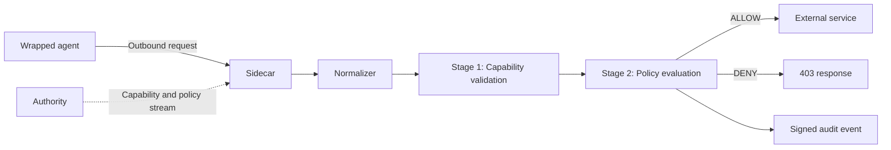

import { Steps } from '@astrojs/starlight/components';

This quickstart takes you from nothing installed to a real agent running under enforcement: its outbound calls are checked against policy, allowed or denied, and written to the audit log.

`firma` ships as a single precompiled static binary. You do not need Rust, a build toolchain, or any API keys to follow this page.

## Install

OpenFirma is installed with a one-line script. It downloads the right binary for your platform, puts it on your `PATH`, and offers to scaffold your first project.

<Steps>

1. Run the installer.

   On **Linux and macOS**:

   ```bash
   curl -fsSL https://install.openfirma.ai | sh
   ```

   On **Windows** (PowerShell):

   ```powershell
   iwr -useb https://install.openfirma.ai/install.ps1 | iex
   ```

2. Confirm `firma` is on your `PATH`.

   ```bash
   firma --version
   ```

   If the command is not found, open a new terminal so your shell picks up the updated `PATH`, then try again.

</Steps>

The installer drops the binary in `~/.local/bin` by default and adds it to your shell's `PATH`. No Rust, `protoc`, or `make` required — those were only ever build-time tools, and you are installing a finished binary.

## Set up a project

`firma init` scaffolds everything a project needs in one command: a `firma.toml` config file, signing keys, and a set of default Cedar policies.

```bash
firma init
```

The interactive wizard asks a few questions — which agent you run, which provider it talks to, and whether to use a local Authority. The defaults are sensible; press Enter to accept them. The scaffold lands in a `.firma/` directory under your current folder.

If you accepted the installer's prompt to run `firma init`, this is already done.

To skip the wizard and take all defaults (useful in CI):

```bash
firma init --yes
```

## Run an agent under enforcement

`firma run` launches a command inside a sandbox and forces all of its outbound traffic through the enforcement Sidecar. On first use it autostarts a local Authority and Sidecar for you — there is nothing else to start by hand.

Pass the command to wrap after `--`:

```bash
firma run -- curl -s https://api.github.com/users/firma-ai
```

Every outbound call the wrapped command makes is normalized, checked against your capabilities, and evaluated against your Cedar policy. Calls that pass are forwarded; calls that fail get a `403` and never leave your machine. Either way, the decision is written to the audit log.

This is the real entry point for running agents — swap `curl ...` for whatever agent command you actually run (a coding agent, a script, a shell).

## Watch the decisions

Open a second terminal and tail the audit log to see ALLOW and DENY decisions as they happen:

```bash
firma monitor
```

Each line is one decision: the action class, the resource, and the outcome.

## What just happened

`firma run` started three local pieces:

- An **Authority**, which signs a capability token and streams policies and revocations.
- A **Sidecar**, which receives outbound requests and decides ALLOW or DENY.
- Your **wrapped command**, sandboxed so its traffic cannot bypass the Sidecar.

Every request takes the same path:



The important detail is that the Sidecar does not ask the Authority on every request. Once it has the public key, policy bundle, capability seed, and revocation state, the decision path is local.

Stage 1 checks whether the agent has a valid capability for the normalized action. Stage 2 evaluates the current Cedar policy. Both stages must pass before the call is forwarded.

## Read the docs in order

The rest of the docs are organized from mental model to hands-on work.

Start with these Concepts pages:

1. [Architecture & invariants](../concepts/architecture/) — the three processes and the four design invariants everything else builds on.
2. [The enforcement pipeline](../concepts/pipeline/) — the stage chain in detail.
3. [Action classes](../concepts/action-classes/) — the canonical vocabulary that connects raw HTTP traffic to policy.
4. [Capabilities](../concepts/capabilities/) and [Policies](../concepts/policies/) — the two layers that decide what an agent may do.

Then move to the guide that matches your next task:

- [Run the Sidecar standalone](../guides/run-the-sidecar/) if you want to write a small config yourself.
- [Start and monitor the daemon with `firma sidecar` and `firma monitor`](../guides/manage-the-stack/) if you want one-command daemon control and a live tail of decisions.
- [Diagnose with `firma doctor`](../guides/firma-doctor/) if anything looks wrong after install or after a config change.
- [Write your first Cedar policy](../guides/write-a-cedar-policy/) if you want to change what gets allowed.
- [Wrap an agent with `firma run`](../guides/firma-run/) if you want a sandbox boundary, not only proxy environment variables.
- [Secure a local coding agent](../guides/secure-a-coding-agent/) if your immediate goal is governing Claude Code, Codex, Cursor, or a similar tool.

## Useful references

- [Rust API Reference](../api/) — every public item in the workspace, auto-generated from rustdoc.
- [Diagnose with `firma doctor`](../guides/firma-doctor/) — run this first if `firma run` misbehaves after install.
- [Blog](../blog/) — release notes and design write-ups.
