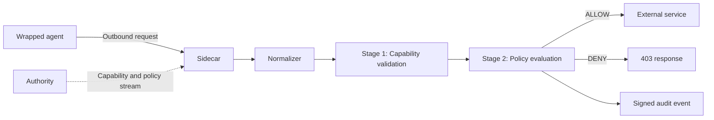

import { Steps, Tabs, TabItem } from '@astrojs/starlight/components';

This quickstart takes you from nothing installed to a real agent running under enforcement: its outbound calls are checked against policy, allowed or denied, and written to the audit log.

The default install path uses a single precompiled static binary. You do not need a build toolchain, or any API keys, unless you choose to build from source.

## Install

OpenFirma can be installed with a one-line script or built from source. The script downloads the right binary for your platform, puts it on your `PATH`, and offers to scaffold your first project.

<Tabs>
<TabItem label="Precompiled binary">

<Steps>

1. Run the installer.

   On **Linux and macOS**:

   ```bash
   curl -fsSL https://install.openfirma.ai | sh
   ```

   On **Windows** (PowerShell):

   ```powershell
   iwr -useb https://install.openfirma.ai/install.ps1 | iex
   ```

2. Confirm `firma` is on your `PATH`.

   ```bash
   firma --version
   ```

   If the command is not found, open a new terminal so your shell picks up the updated `PATH`, then try again.

</Steps>

The installer drops the binary in `~/.local/bin` by default and adds it to your shell's `PATH`.

</TabItem>
<TabItem label="From source">

Prerequisites:

- Rust 1.88 or newer.
- `protoc`, the Protocol Buffers compiler.
- `git`.

Clone the repository:

```bash
git clone https://github.com/Firma-AI/openfirma.git
cd openfirma
```

Install the current source checkout:

```bash
cargo install --path crates/firma --locked
```

This installs `firma` into Cargo's binary directory, usually `~/.cargo/bin`. If `firma --version` is not found, make sure that directory is on your `PATH`.

:::note[Development builds]
To build without installing — for example to test a local change without overwriting your global `firma` binary:
 
```bash
cargo build --release
```
 
The output lands in `target/release/firma`.
:::

</TabItem>
</Tabs>

## Set up a project

Start in the project directory you want to protect. Scaffold a local OpenFirma layout for this demo:

```bash
firma config --yes \
  --name quickstart \
  --posture dev \
  --mapping github \
  --extra-hosts api.github.com
```

This creates `.firma/` with a unified `firma.toml` (authority, sidecar, and run profiles), mapping files, policy files, and local signing material under the platform state directory. The GitHub mapping enables HTTPS interception for `api.github.com`; `--extra-hosts` adds a catch-all rule for the public profile endpoint used below.

## Run an agent under enforcement

`firma run` launches a command inside a sandbox and routes its outbound traffic through the enforcement Sidecar. It autostarts a local Sidecar and local Authority from the generated run config, then tears both down when the command exits.

Pass any command you want to wrap after the `--` marker:

```bash
firma run --config .firma/firma.toml -- \
  curl -kfsS https://api.github.com/users/firma-ai
```

Every outbound call the wrapped command makes is normalized, checked against its capability, and evaluated against the Cedar policy bundle supplied by the Authority. The `-k` flag keeps the demo short by letting `curl` accept the local HTTPS interception certificate; for real workloads, install the generated CA instead.

## Try observe-only mode first

If you want to see what firma would classify and deny before writing mapping rules, use **monitor mode**. In this mode every request is allowed through — the enforcement pipeline still runs and classifies the call, but any DENY is overridden to ALLOW. `firma monitor` shows the original deny reason prefixed with `monitor_mode:` so you can see exactly what would have been blocked.

Enable it for a single run without editing any file:

```bash
firma run --monitor -- curl https://api.github.com/users/firma-ai
```

Or set it permanently in `.firma/firma.toml`:

```toml
[sidecar]
mode = "monitor"
```

When active, the sidecar prints a warning at startup:

```
MONITOR MODE ACTIVE — enforcement is observing only; all calls are allowed through. Never use in production.
```

In `firma monitor`, overridden decisions appear with the original reason:

```
2024-05-08T14:15:51Z  ALLOW    GET  api.github.com/users/firma-ai  class=communication.external.send  agent=generic  reason=monitor_mode: scope_mismatch
```

Switch back to enforcing mode by removing the `mode` line or changing it to `mode = "enforce"`.

## Watch the decisions

After the command exits, read the audit log:

```bash
firma monitor --no-follow --format json
```

Each line is one signed execution event. For the GitHub call, expect ALLOW events (`"decision":1`) for resources like `api.github.com/` and `api.github.com/users/firma-ai`.

## What just happened

`firma run` started three local pieces:

- An **Authority**, which signs a capability token and streams policies and revocations.
- A **Sidecar**, which receives outbound requests and decides ALLOW or DENY.
- Your **wrapped command**, sandboxed so its traffic cannot bypass the Sidecar.

Every request takes the same path:



The important detail is that the Sidecar does not ask the Authority on every request. Once it has the public key, policy bundle, capability seed, and revocation state, the decision path is local.

Stage 1 checks whether the agent has a valid capability for the normalized action. Stage 2 evaluates the current Cedar policy. Both stages must pass before the call is forwarded.

## Read the docs in order

The rest of the docs are organized from mental model to hands-on work.

Start with these Concepts pages:

1. [Architecture & invariants](../concepts/architecture/) — the three processes and the four design invariants everything else builds on.
2. [The enforcement pipeline](../concepts/pipeline/) — the stage chain in detail.
3. [Action classes](../concepts/action-classes/) — the canonical vocabulary that connects raw HTTP traffic to policy.
4. [Capabilities](../concepts/capabilities/) and [Policies](../concepts/policies/) — the two layers that decide what an agent may do.

Then move to the guide that matches your next task:

- [Run the Sidecar standalone](../guides/run-the-sidecar/) if you want to write a small config yourself.
- [Start and monitor the daemon with `firma sidecar` and `firma monitor`](../guides/manage-the-stack/) if you want one-command daemon control and a live tail of decisions.
- [Diagnose with `firma doctor`](../guides/firma-doctor/) if anything looks wrong after install or after a config change.
- [Write your first Cedar policy](../guides/write-a-cedar-policy/) if you want to change what gets allowed.
- [Wrap an agent with `firma run`](../guides/firma-run/) if you want a sandbox boundary, not only proxy environment variables.
- [Secure a local coding agent](../guides/secure-a-coding-agent/) if your immediate goal is governing Claude Code, Codex, Cursor, or a similar tool.

## Useful references

- [Rust API Reference](../api/) — every public item in the workspace, auto-generated from rustdoc.
- [Diagnose with `firma doctor`](../guides/firma-doctor/) — run this first if `firma run` misbehaves after install.
- [Blog](../blog/) — release notes and design write-ups.
