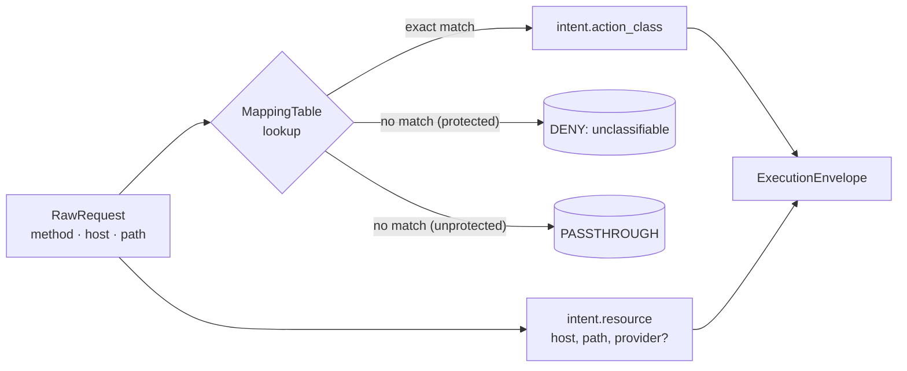

# Action Class Registry

OpenAuthority policies bind to **what an agent is trying to do**, not
to which HTTP verb it picked or which provider serves the request.
The action class registry is the bounded vocabulary that makes that
work.

## Why an action registry

Mapping HTTP and gRPC requests to a small, well-defined set of
semantic actions decouples policy from transport. A Slack message,
a Telegram bot call, and a POST to an internal mail microservice all
collapse to `communication.external.send`; a Cedar policy that wants
to gate "outbound communication to anyone outside the trust boundary"
matches on one identifier instead of cataloguing every provider URL.
The registry also gives the audit log a stable shape: every event
carries an `action_class` that stays meaningful across deployments
and over time.

## Canonical 44-class set

The registry ships 44 canonical action classes, grouped by source:

- **15 FEP v0.1 base classes** — the protocol-defined identifiers
  covering communication, credentials, filesystem, payments, memory,
  permissions, and system execution.
- **12 GitHub extensions** — code, issue, repo, notification, and
  security domains, so REST traffic to GitHub is classified
  deterministically without putting the provider into the action
  class.
- **12 Stripe extensions** — payment, customer, dispute, payout, and
  catalog domains, with `payment.transfer` reused from the FEP base
  for value transfers.
- **5 Gmail extensions** — read, draft, manage, delete, and filter
  variants of `communication.external.*` for the Gmail REST surface.

The full table — name, domain, risk level, and notes — lives in the
[Reference: Action Class Registry](../reference/action-class-registry.md).

## Provider attachment rule

Provider identity (`github`, `stripe`, `gmail`) lives in
`intent.resource`, **never** in `intent.action_class`. The normalizer
attaches `provider` to the resource map only on **exact host match**
against a curated allowlist:

- `api.github.com` and `github.com` → `provider = "github"`
- `api.stripe.com` → `provider = "stripe"`
- `gmail.googleapis.com` → `provider = "gmail"`

Exact match is deliberate: a typo-squat host like
`api.github.com.evil.example` will not earn the tag. The shared
`www.googleapis.com` host is intentionally excluded because it serves
many non-Gmail Google APIs and would mis-tag traffic.

## Mapping flow

The mapping table is loaded at startup from one or more TOML files and
sorted by specificity. At request time the normalizer does a single
deterministic lookup against `(method, host, path)`:

There is no LLM, no heuristic classifier, and no fallback inference on
the hot path. The same input always produces the same envelope.

## Extending the registry

Operators may add deployment-specific classes at **configuration
time**, provided the new identifiers conform to the FEP §2.3.2 naming
rules: `<domain>.<subdomain>.<verb>`, lowercase ASCII, no transport
names, no provider names, no implementation-layer names. Extending
the registry touches the registry definition, the Cedar schema, the
Cedar loader allow-list, and the mapping rules — see the FEP spec for
the full checklist.

Per-request runtime extension is **not** allowed. The registry is
fixed once the sidecar has loaded its configuration. This keeps
capability tokens forward-compatible: an identifier deployed into a
token in production cannot be silently repurposed.

## Fail-closed semantics

Unclassifiable protected actions DENY with reason `UnclassifiedIntent`.
The alternative — letting unmapped traffic through with a generic
"unknown" class — would break the deterministic-policy invariant and
hide real coverage gaps from operators. If the mapping table does not
know what an outbound call means, OpenAuthority does not let it
through.

See [Sidecar Interfaces](./sidecar-interfaces.md) for where the
normalizer sits in the pipeline, and the
[Reference: Action Class Registry](../reference/action-class-registry.md)
for the full 44-row table.
