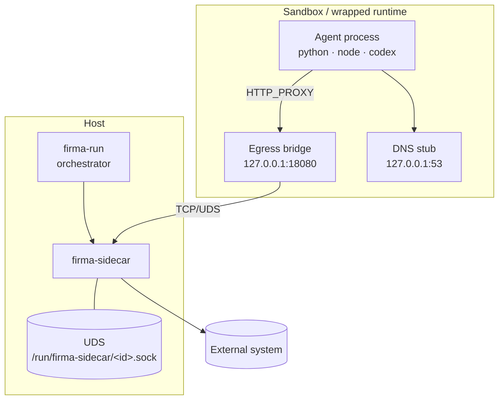

# firma-run Deep Dive

## What firma-run is

`firma-run` is a sandbox launcher that wraps an agent process in a confined
runtime so the sidecar can govern process-forking execution (shell, browser,
subprocesses) without trusting cooperative `HTTP_PROXY` settings. Unlike a
pure proxy approach, `firma-run` places the agent inside an isolated execution
environment where all egress is structurally forced through the sidecar,
regardless of whether the agent honours the proxy variable.

## Backends per OS

| OS                 | Backend                     | Isolation            | Confinement mode     |
| ------------------ | --------------------------- | -------------------- | -------------------- |
| Linux              | `bwrap` (bubblewrap)        | Namespace/seccomp    | Structural network   |
| macOS              | `vz` (Apple Virtualization) | Linux guest VM       | Proxy-mediated       |
| Windows            | `wsl2`                      | Linux guest via WSL2 | Proxy-mediated       |
| Linux (enterprise) | `firecracker`               | KVM microVM          | Structural (planned) |

Forcing structural confinement on non-`bwrap` backends is rejected at config
validation.

## Topology

## Boot sequence

1. Orchestrator validates config and selects backend.
2. Sidecar endpoint provisioned (UDS socket or TCP, depending on configuration).
3. Backend boots sandbox (bwrap namespace / vz VM / wsl2 instance).
4. Sandbox attaches local egress bridge (`127.0.0.1:18080`) and DNS stub
   (`127.0.0.1:53`).
5. Linux/bwrap: sandbox `/etc/resolv.conf` generated, pointing at DNS stub;
   stub refuses resolution fail-closed if bind fails (no host ambient DNS
   fallback). vz/wsl2: DNS confinement is backend-provided.
6. Agent process spawned with `HTTP_PROXY` pointing at the egress bridge
   (bwrap: `127.0.0.1:18080`) or directly at the sidecar endpoint (vz/wsl2).

## Failure modes

- Sidecar UDS unreachable at startup → agent does not launch (fail-closed).
- Sidecar unreachable mid-session → requests fail deterministically; no
  external fallback.
- Backend boot failure → fail-closed, wrapper exits non-zero.
- DNS stub failure → resolution fails closed (never falls back to host ambient
  DNS).

## Identity and attribution

Each run generates a fresh `sandbox_id` and `session_id` as time-ordered UUIDs
(`Uuid::now_v7()`). These identifiers are stable for the lifetime of a run and
are injected into every request mediated by the egress bridge so the sidecar's
audit log can distinguish concurrent `firma-run` instances operating on the same
host. This makes per-session policy enforcement and post-hoc attribution
unambiguous even when multiple agents run simultaneously.

## Where to read next

- [./https-mitm.md](./https-mitm.md) — HTTPS interception inside the sandbox
- [./sidecar-firma-run.md](./sidecar-firma-run.md) — component relationship
  between firma-run and firma-sidecar
- [../adrs/fir-60-sandbox-backend.md](../adrs/fir-60-sandbox-backend.md) —
  backend selection rationale
- [../guides/firma-run.md](../guides/firma-run.md) — user guide (how to run
  firma-run)
