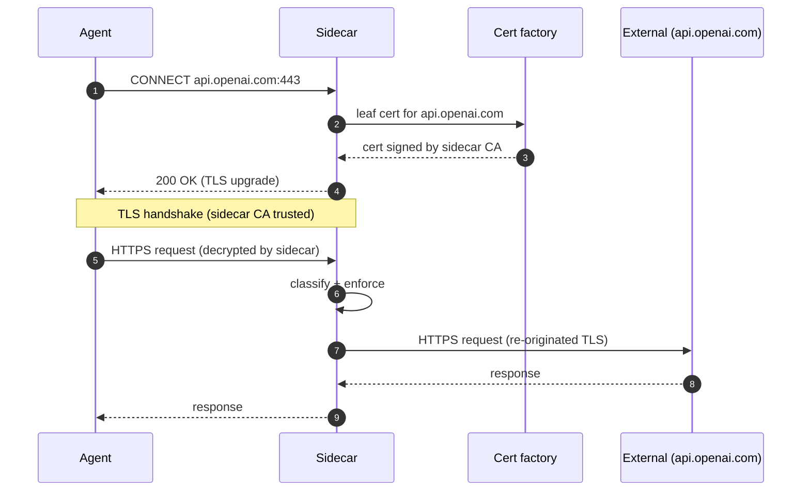

# HTTPS MITM Strategy

## Why MITM

HTTPS requests are opaque at the CONNECT level: only the host and port are
visible to a proxy. To classify the HTTP method and path for action mapping,
the sidecar must see the full request. OpenAuthority terminates TLS, decrypts
the request, classifies it through the normalizer and enforcement pipeline, then
re-originates a fresh TLS connection to the destination. This gives L7 policy
enforcement parity between plain HTTP and HTTPS traffic with no changes required
to the agent code.

## CONNECT relay flow

## Cert injection

The sidecar maintains a local CA whose material is bootstrapped on first run
under the directory specified by `ca.dir`, or loaded from existing state on
subsequent runs. On each MITM CONNECT, a leaf certificate is signed by the
sidecar CA for the target host. The CA certificate must be mounted as a trusted
root in the sandbox or agent process for TLS handshakes to succeed; without it,
clients will see an untrusted-issuer error.

Two config knobs under `[interceptor.https_mitm]` govern the certificate cache:
`cert_cache_capacity` sets the maximum number of cached leaf certificates
(bounded LRU eviction), and `cert_ttl_secs` controls how long a cached
certificate remains valid (default 86400 seconds). The `ca_cert_path` and
`ca_key_path` knobs override the default paths inside `ca.dir`. If CA material
is absent, the sidecar generates it on first run. If CA state is partial or
malformed, startup fails with an error rather than silently resetting trust.

## Hostname policy

Three lists control the scope of MITM interception:

| Config key        | Semantics                                                                                        |
| ----------------- | ------------------------------------------------------------------------------------------------ |
| `intercept_hosts` | Hosts that receive full MITM. HTTPS is decrypted, classified, and re-encrypted.                  |
| `bypass_hosts`    | Hosts excluded from MITM. Evaluated before `intercept_hosts`. Only CONNECT-level policy applies. |
| `strict_hosts`    | Hosts where any MITM setup failure is a hard DENY (no blind-tunnel fallback).                    |

A host in `bypass_hosts` always bypasses MITM even if it also appears in
`intercept_hosts`. Non-strict hosts with a MITM setup failure fall back to a
blind CONNECT tunnel — but only if CONNECT-level policy also allows the
connection. A CONNECT-level DENY still returns 403 to the agent.

Allowed host pattern forms (DNS-label-aware):

- Exact: `api.openai.com`
- Leading subdomain wildcard: `*.openai.com`
- Match-all: `*`

Rejected forms: mid-pattern (`api.*.com`), prefix-only (`*openai.com`),
top-level (`*.com`).

## CONNECT-bypass protection

A fix introduced in commit `f3d12c8` added a host-header re-check after the
CONNECT handshake to prevent TLS-to-arbitrary-host smuggling. Without this
check, an agent could CONNECT to an allowed host, then send a `Host:` header
pointing at a different destination after the TLS upgrade. The fix enforces that
the inner HTTP request's `Host` header matches the CONNECT target. Guarantee: a
successful CONNECT+MITM means the sidecar classified the actual destination, not
a spoofed one.

## Limitations

- Clients with certificate pinning fail at TLS handshake for MITM hosts
  (intended; use `bypass_hosts` for pinned endpoints).
- Trust-store bootstrap varies by runtime (`REQUESTS_CA_BUNDLE` for Python,
  `NODE_EXTRA_CA_CERTS` for Node.js, `--cacert` for curl); see
  [Integrating with Agents](../guides/integrating-agents.md).
- `firma-run` trust bootstrap for all client ecosystems is not yet fully
  standardized.
