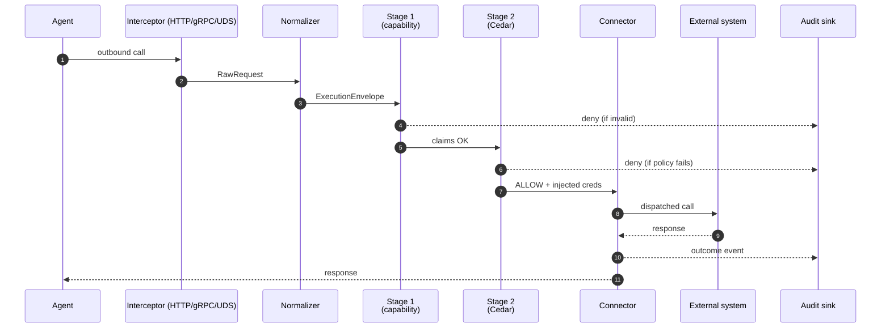

# Architecture Overview

OpenAuthority is an L7 policy enforcement sidecar that sits in front of every
outbound call an AI agent attempts. This page is the entry point to the
architecture chapter: it explains what the sidecar does, how its two
enforcement stages compose, what an `ExecutionEnvelope` looks like as it
flows through the binary, and where to read next.

## What the Sidecar does

`firma-sidecar` is the enforcement proxy that every outbound agent call
must traverse before reaching an external system. HTTP, gRPC, and Unix
socket interceptors all converge on a single pipeline that classifies
the request, validates a capability token, evaluates a Cedar policy,
and — only then — dispatches to the target with injected credentials.

Four invariants shape every line of code in the binary:

- **Fail-closed** — every error path returns DENY. There is no silent
  allow.
- **No network on the hot path** — Stage 1 and Stage 2 are fully local.
- **Deterministic** — same envelope plus same policy bundle always
  yields the same decision.
- **Envelope immutability** — the `ExecutionEnvelope` is built once and
  is never mutated in place.

The sidecar's job is to make those invariants observable per request and
auditable after the fact. See [Sidecar Interfaces](./sidecar-interfaces.md)
for the per-stage contracts.

## Two-stage enforcement

The single public entry point is `EnforcementPipeline::enforce()`. It
runs the normalizer, then chains two stages with strict latency budgets.

**Stage 1 — capability validation.** Selects a token from the
`CapabilityMap` keyed by `(session_id, action_class, resource)`, parses
and verifies the PASETO v4 signature, checks expiry against the current
clock, and looks the token up in the local revocation store. Any
sub-step failure short-circuits to DENY. Budget: under 1 ms p95.

**Stage 2 — constraint enforcement.** Checks that the request's
`action_class` is in the token's action set, asserts the policy bundle
is fresh, and runs Cedar evaluation against the validated claims and
runtime signals. Budget: under 200 µs p95.

Both stages run fully in-process. The Authority is contacted only at
pre-flight (capability issuance) and over long-lived bundle and
revocation streams that update local state off the hot path.

## ExecutionEnvelope lifecycle

The normalizer builds one `ExecutionEnvelope` per request from the
`RawRequest`. The envelope carries `intent` (the canonical
`action_class` plus a structured `resource` map of host, path, and
optional provider), `capability` (the validated token), `metadata`
(session, agent, timestamp, runtime signals), and optional
`provenance`. Once constructed, the envelope is immutable: its fields
are private and exposed through shared-reference getters. Stage 1 and
Stage 2 read it; the connector reads it; the audit sink projects it
into a single signed `ExecutionEvent`. One call in produces one audit
event out — always.

## End-to-end flow

The diagram below traces a single outbound call from agent to external
system, with each stage either short-circuiting to the audit sink on
DENY or handing off to the next.

The interceptor produces a transport-agnostic `RawRequest`. The
normalizer maps it to a canonical envelope. Stage 1 either rejects the
token or passes claims forward. Stage 2 either rejects the policy
context or admits the call. The connector dispatches and returns the
response. Every branch — ALLOW, DENY, ABORT — emits exactly one audit
event from the sink, signed off the hot path.

## Where to read next

- [Sidecar Interfaces](./sidecar-interfaces.md) — per-stage input and
  output contracts plus the gRPC wire shape.
- [Action Class Registry](./action-class-registry.md) — how raw
  requests collapse to a bounded set of semantic classes.
- [Performance Targets](./performance.md) — per-stage budgets,
  measured numbers, and how to run the benches.
- [firma-run Deep Dive](./firma-run.md) — the launcher that wraps
  agent processes around the sidecar.
- [Bypass Analysis](../security/bypass-analysis.md) — why every stage
  is hard to skip and what we still treat as residual risk.
