# Performance Targets

OpenAuthority is on the hot path for every outbound agent call, so
every stage carries a budget. This page records those budgets, the
current Criterion measurements, and how to reproduce them.

## Per-stage budgets

Reference hardware: Darwin arm64 (Apple M4 Max, release build).

| Path                    | Budget    | Bench                               | Measured (median) |
| ----------------------- | --------- | ----------------------------------- | ----------------- |
| Stage 1 p95             | < 1 ms    | `stage1_enforce`                    | 160 ns            |
| Stage 2 p95 (allow)     | < 200 µs  | `cedar_evaluate_allow`              | 58 µs             |
| Stage 2 p95 (deny)      | < 200 µs  | `cedar_evaluate_deny`               | 58 µs             |
| Stage 2 p95 (context)   | < 200 µs  | `cedar_evaluate_context`            | 58 µs             |
| End-to-end overhead p95 | < 3 ms    | `pipeline_enforce`                  | 79 µs             |
| Bundle hot-reload       | < 500 ms  | `cedar_bundle_reload`               | 680 µs            |
| Revocation lookup       | (logged)  | `is_revoked_miss`                   | 930 ns            |
|                         | (logged)  | `is_revoked_hit`                    | 59 ns             |
| Revocation propagation  | < 1 s p99 | covered by stream-integration tests | n/a               |

All budgets are currently met with substantial headroom. Numbers are
medians from Criterion; tails track close to the median because the
hot path holds no locks under contention.

## Hot-path budget timeline

The diagram below breaks the hot-path budget into per-step slices.
Times are in arbitrary units; the targets in prose use the actual
budget numbers from the table above.

```mermaid
gantt
    title Hot-path budget breakdown (target end-to-end p95 < 3 ms)
    dateFormat  X
    axisFormat  %S ms
    section Stage 1
    Token select & parse        :s1a, 0, 1
    Signature & expiry          :s1b, after s1a, 1
    Revocation lookup           :s1c, after s1b, 1
    section Stage 2
    Scope check                 :s2a, after s1c, 1
    Bundle freshness            :s2b, after s2a, 1
    Cedar evaluate              :s2c, after s2b, 2
    section Connector
    Protocol translate          :c1, after s2c, 1
    Dispatch                    :c2, after c1, 1
```



Targets per slice on reference hardware:

- Stage 1 (token select, signature, expiry, revocation) — combined
  target < 1 ms, currently around 160 ns median.
- Stage 2 (scope check, bundle freshness, Cedar evaluate) — combined
  target < 200 µs, currently around 58 µs median for both allow and
  deny outcomes.
- Connector dispatch latency depends on the external system and is not
  budgeted by enforcement; the enforcement overhead p95 budget of
  < 3 ms covers everything before the wire.

## Running benches locally

Run the full bench suite:

```bash
make bench
```

Criterion writes HTML reports under `target/criterion/`. Open
`target/criterion/report/index.html` for interactive regression plots.

Run a single bench by name:

```bash
cargo bench -p firma-sidecar --bench pipeline
```

Quick smoke variant for CI-style sanity checks:

```bash
cargo bench -p firma-sidecar --bench pipeline -- --quick
```

The available benches under `crates/firma-sidecar/benches/` are
`pipeline`, `stage1`, `cedar_eval`, `bundle_reload`, and `revocation`.

## Comparing two runs

Capture a baseline before and after a change, then diff with
`critcmp`:

```bash
cargo bench --bench pipeline -- --save-baseline before
# ... change code ...
cargo bench --bench pipeline -- --save-baseline after
cargo install critcmp
critcmp before after
```

`critcmp` highlights regressions per measurement so reviewers can spot
changes that move the median or widen the tail.

## CI gates

Bench numbers are **soft gates** today: every CI run uploads the
Criterion artifact (`target/criterion/**`, 14-day retention) so a
human can review trends, but a regression does not block a merge by
itself. Hard gating via `critcmp` against a checked-in baseline is a
follow-up task. Until that lands, treat the budget table above as the
contract and the Criterion artifact as the evidence.

See the [Architecture Overview](./overview.md) for how the stages
compose, and [Sidecar Interfaces](./sidecar-interfaces.md) for the
per-stage contracts that these budgets apply to.
