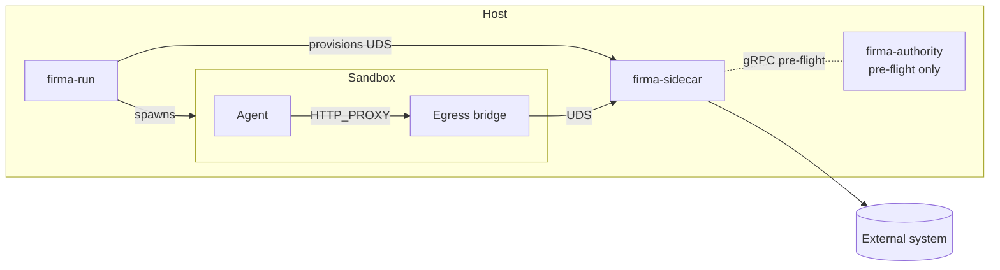

# Sidecar ↔ firma-run Relation

## Single enforcement plane

The sidecar is the only decision plane in OpenAuthority. `firma-run` provides
the structural boundary that forces all agent egress through the sidecar — it
does not evaluate policy or make trust decisions itself. This separation keeps
the enforcement logic in one auditable place regardless of which sandbox backend
is in use.

## Component diagram

## Lifecycle coupling

1. The sidecar boots and its endpoint is provisioned before the sandbox starts.
2. The sidecar process is shared on the host, but each `firma-run` invocation
   gets a dedicated socket address (UDS path or TCP port) within that shared
   sidecar process.
3. Sandbox shutdown closes the egress bridge and its connection to the sidecar,
   but the sidecar process continues serving other sandboxes.

## Failure isolation

- **Sidecar crash** → sandbox egress fails closed; the agent cannot reach
  external systems. No fallback path exists.
- **Sandbox crash** → the sidecar continues running and serves any remaining
  sandboxes connected to it. The crashed sandbox's UDS connection is cleaned up.
