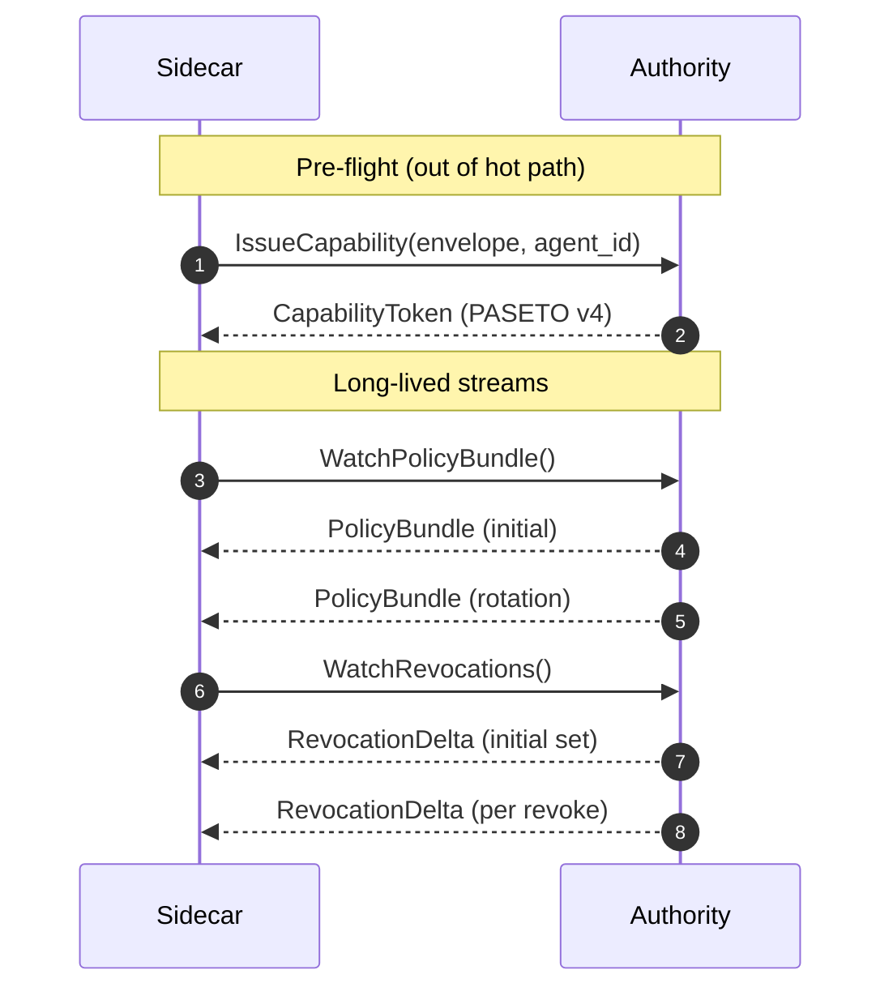

# Sidecar Interfaces

This page documents the input and output contracts that connect the
stages of the OpenAuthority enforcement pipeline. Each stage owns a
narrow API; the pipeline is the only public entry point.

## Pipeline contract

The chain is fixed:

```text
Interceptor → Normalizer → Stage 1 → Stage 2 → Envelope assembly → Connector
```

Each stage short-circuits on failure. A `Deny` exits the pipeline
immediately and is forwarded straight to the audit sink. A
`Passthrough` (non-protected host) skips Stage 1 and Stage 2 but still
emits an audit event. An `Allow` requires every stage to succeed; only
then does the pipeline assemble the final `ExecutionEnvelope` and hand
off to the connector.

## Interceptor

The `Interceptor` trait is the boundary between transport-specific
capture (HTTP proxy, gRPC hook, Unix socket) and the transport-agnostic
pipeline.

```rust,ignore
pub trait Interceptor: Send + Sync + 'static {
    fn run(
        self,
        handler: Arc<RequestHandler>,
        cancel: CancellationToken,
    ) -> impl Future<Output = Result<(), InterceptorError>>;
}
```

**Input.** Transport-specific bytes — an HTTP request, a gRPC message,
or a stream of frames over a Unix domain socket.

**Output.** A `RawRequest` — `(method, host, path, headers, body, is_https)`
— passed to `RequestHandler::handle`. The same shape comes out of all
three modes, so the downstream pipeline is transport-agnostic.

**Invariants.** Any parse failure returns a structured DENY with reason
`MALFORMED_REQUEST` (fail-closed). On `Allow` or `Passthrough` the
interceptor forwards the dispatched response upstream; on `Deny` it
returns a structured denial to the caller. On cancellation the
interceptor stops accepting new connections and drains in-flight work
before returning `Ok(())`.

## Normalizer

The `IntentNormalizer` maps a `RawRequest` to a `NormalizedEnvelope`.
The output `intent` carries:

- `action_class` — the canonical class drawn from the v0.1 registry,
  resolved by deterministic rule lookup against `(method, host, path)`.
- `resource` — a `BTreeMap<String, String>` with conventional keys
  `host`, `path`, and optionally `provider` (attached only on exact
  host match for the curated allowlist).
- `params` — structured request parameters with sensitive headers
  (`authorization`, `cookie`, `x-api-key`, etc.) stripped before they
  enter the envelope.
- `metadata` and `provenance` are populated at envelope assembly time.

Failure modes: `Deny(UnclassifiedIntent)` for protected requests that
no rule matches, `Passthrough` for non-protected hosts. See the
[Action Class Registry](./action-class-registry.md) for the canonical
class set and provider attachment rule.

## Stage 1 — Capability validation

`CapabilityValidator::enforce(envelope, session_id) -> Result<ValidatedCapability, EnforcementDecision>`

1. **Token selection.** Look up the `CapabilityMap` keyed by
   `(session_id, action_class, resource)`. No match means DENY.
2. **Parse and verify.** PASETO v4 (production) or JWT RS256 (test
   harness) signature verification through the `TokenVerifier` trait.
3. **Expiry.** Compare the token's `expiry` claim to the current clock,
   with configurable skew.
4. **Revocation.** Lookup against the local `BloomLruRevocationStore`,
   a two-layer cache fed by the Authority's revocation stream.

Every sub-step failure maps to a distinct `DenyReason`. The full chain
is fully local — no Authority round-trip on the hot path. Budget:
under 1 ms p95.

## Stage 2 — Constraint enforcement

`ConstraintEnforcer::evaluate(envelope, claims) -> Result<(), EnforcementDecision>`

1. **Scope check.** Is the request's `action_class` in the token's
   `action_set`? `"*"` wildcards pass.
2. **Bundle freshness.** Is `PolicyEvaluation::is_fresh()` true? A
   stale bundle DENYs with `PolicyBundleStale`.
3. **Cedar evaluation.** Build the `EnforcementContext` from envelope,
   claims, and per-session runtime signals; evaluate against the
   currently swapped Cedar policy snapshot.

The evaluator is held as `Arc<dyn PolicyEvaluation>` and updated via an
atomic `ArcSwap` when the policy-bundle stream pushes a new bundle, so
in-flight calls always finish against a consistent snapshot. Budget:
under 200 µs p95.

## Connector dispatch

After ALLOW, the connector executes the outbound request with injected
credentials. The connector applies only **technical** constraints:
rate limits, schema validation, protocol translation, and timeout.
Business policy lives entirely upstream of dispatch — see
[Bypass Analysis](../security/bypass-analysis.md) for why splitting
policy from dispatch matters.

The connector returns one of three outcomes: a response (any status)
becomes ALLOW in the audit event; `ConnectorError::Timeout` becomes
ABORT; any other transport error becomes DENY.

## gRPC wire contract

OpenAuthority's only network surface is the Authority gRPC service.
The `firma-proto` crate compiles three RPCs from
`crates/firma-proto/proto/firma/v1/`:

- `IssueCapability` — unary, called pre-flight when an agent needs a
  capability for a (session, action, resource) tuple.
- `WatchPolicyBundle` — server-streaming, drives the in-process Cedar
  evaluator. Each accepted bundle replaces the current snapshot
  atomically.
- `WatchRevocations` — server-streaming, feeds the local revocation
  store. The sidecar replays the latest event timestamp on reconnect
  so the Authority can replay missed events.



Both streams share a single lazy tonic `Channel` and run independent
reconnect loops with exponential backoff plus symmetric jitter. None
of these RPCs are on the hot path — they hydrate local state that
Stage 1 and Stage 2 read in-process. See
[Performance Targets](./performance.md) for measured per-stage
latencies.
