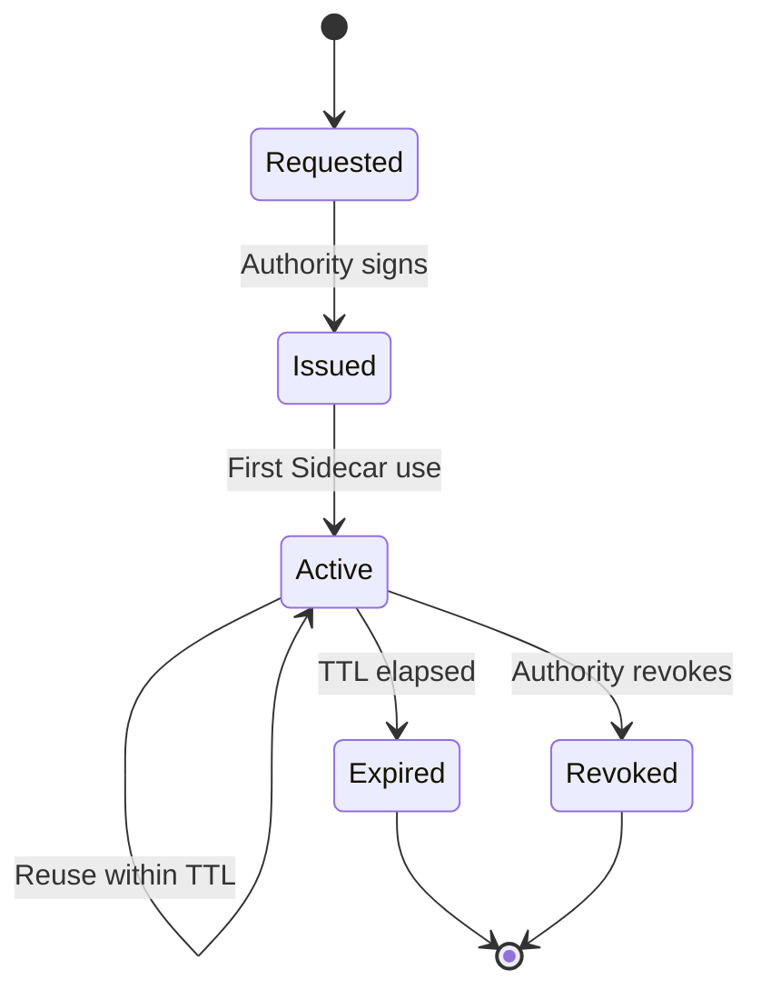

# Capability Lifecycle

## Lifecycle states

`requested → issued → active → expired | revoked`

## State diagram



## Issuance

The Authority issues PASETO v4 capability tokens via `IssueCapability` gRPC.
This is a pre-flight operation, never on the enforcement hot path. Each token
carries: `token_id`, `agent_id`, `session_id`, `action_set` (list of action
classes), `resource_scope`, `issued_at`, `expiry`, and `context_hash`. The TTL
is bounded by the Authority's `max_ttl_seconds`. The PASETO v4 public key
embedded in the token footer enables fully offline signature verification by
the Sidecar.

## Activation

On the first Sidecar call, Stage 1 selects the matching token from
`CapabilityMap` by `agent_id` and `action_class`, verifies the signature,
checks expiry, and checks the revocation cache. Verified claims are passed to
Stage 2. The token is cached for reuse within its TTL so that subsequent
calls incur no additional issuance overhead.

## Revocation

The Authority streams revocation deltas via `WatchRevocations`. The Sidecar
maintains a two-layer cache: a bloom filter for O(1) negative checks
(`capacity=1,000,000`, `fpr=0.0001`) and an LRU for confirmed-positive
revocations. Revocation propagation target is < 1 s p99. To revoke a token:

```bash
firma-authority revocations add <token-id> --reason "incident-response"
```

## Expiry

Token expiry is enforced by Stage 1, which compares the token's `expiry`
field against the current wall clock within `clock_skew_tolerance_seconds`
(default 0). Hard-expired tokens are rejected immediately without reaching
Stage 2. To renew: re-issue via `IssueCapability` before the current token
expires. Use short TTLs in production (e.g., 15–60 minutes) to limit the
window of exposure if a token is compromised and revocation is delayed.

## Operational notes

- To revoke during an incident: run
  `firma-authority revocations add <token-id> --reason "incident"`. The
  revocation takes effect on all connected Sidecars within the
  `WatchRevocations` propagation window (target < 1 s p99).
- To renew before expiry: re-issue the token with a new `ttl_seconds` before
  the old token expires. Update `[capability_seed].paths` if you are using
  static file-based seeding so the new token is picked up on the next Sidecar
  restart or reload.
