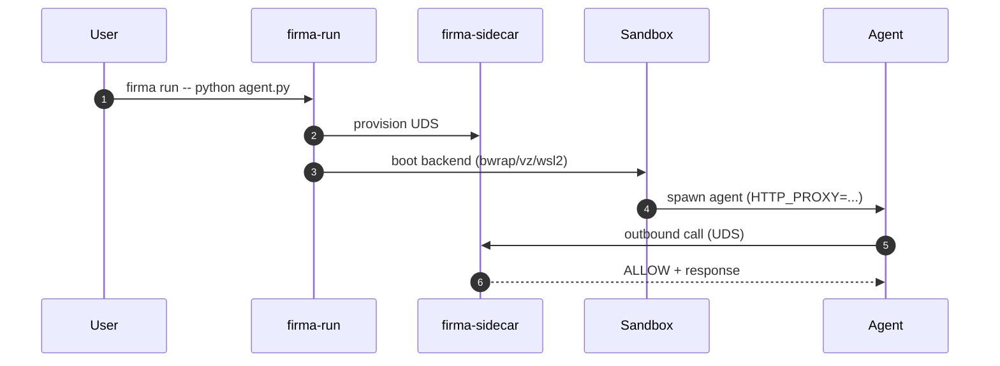

# Running the firma-run Sandbox

## When to use firma-run

Use `firma-run` when you cannot trust cooperative `HTTP_PROXY`. This includes
agents that fork subprocesses, run shell commands, use raw sockets, or are
untrusted code. `firma-run` wraps the agent in a confined runtime where
structural egress enforcement prevents any traffic from bypassing the sidecar.

## Quickstart per OS

### Linux (bwrap)

```bash
firma run -- python agent.py
```

Uses bubblewrap network namespace isolation. All outbound traffic is
structurally forced through the sidecar. Requires `bwrap` installed.

### macOS (vz)

```bash
firma run -- python agent.py
```

Uses Apple Virtualization.framework Linux guest. Proxy-mediated confinement.
Requires macOS 13+.

### Windows (wsl2)

```bash
firma run -- python agent.py
```

Uses WSL2 Linux guest. Proxy-mediated confinement. Requires WSL2 enabled.

## Workflow diagram



## Troubleshooting

- **UDS not found**: Sidecar not started before firma-run; verify boot order.
- **Agent hangs at startup**: Sidecar UDS/TCP unreachable; check
  `sidecar.toml` listen address.
- **Cert errors inside sandbox**: CA cert not mounted; set
  `REQUESTS_CA_BUNDLE` / `NODE_EXTRA_CA_CERTS` to the sidecar CA cert path.

See also: [Troubleshooting](../operations/troubleshooting.md).

## Internals

For the architecture of how firma-run and firma-sidecar interact, see
[firma-run Deep Dive](../architecture/firma-run.md).
