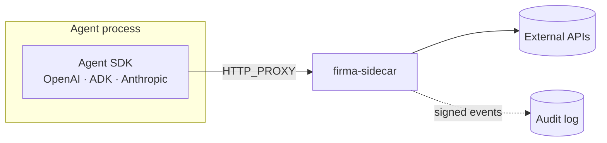

# Integrating with Agents

## Why integrate at the network layer

`HTTP_PROXY` and `HTTPS_PROXY` are honored by virtually every HTTP client
library without code changes. Setting these env vars routes the agent's
outbound calls through the sidecar without SDK-specific patches. This works
with OpenAI SDK, Google ADK, Anthropic SDK, LangChain, and any library that
respects the proxy convention.

## Topology

## Common environment variables

| Variable              | Purpose                                          |
| --------------------- | ------------------------------------------------ |
| `HTTP_PROXY`          | Routes HTTP calls through the sidecar            |
| `HTTPS_PROXY`         | Routes HTTPS calls (used for CONNECT-based MITM) |
| `REQUESTS_CA_BUNDLE`  | Python: trust the sidecar's MITM CA cert         |
| `NODE_EXTRA_CA_CERTS` | Node.js: trust the sidecar's MITM CA cert        |
| `SSL_CERT_FILE`       | Go / Ruby / others                               |

## SDK-specific guides

- [OpenAI Agents SDK](./integrating-agents/openai-agents-sdk.md)
- [Google ADK](./integrating-agents/google-adk.md)

## Beyond HTTP_PROXY

For agents that fork subprocesses, run shell commands, or use raw sockets,
cooperative `HTTP_PROXY` is not enough. Use `firma-run` for structural egress
confinement — it wraps the entire agent process in an isolated runtime where
all outbound traffic is forced through the sidecar regardless of proxy
settings. See [Running the firma-run Sandbox](./firma-run.md).
