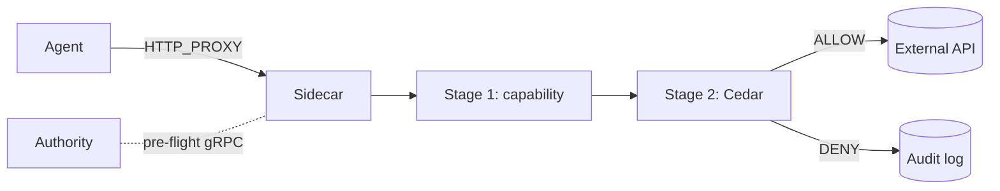

# OpenAuthority

OpenAuthority is the trust protocol for open-source AI. An L7 enforcement sidecar that gates every outbound agent call through Cedar policy and cryptographic capability tokens.

## Why OpenAuthority

AI agents that interact with real systems — APIs, databases, tools — often have overly relaxed permissions, leak credentials, and act without an audit trail. The result is a trust gap that blocks production deployment: you cannot ship an agent you cannot audit or constrain. Production deployment requires deterministic, fail-closed enforcement that doesn't depend on the agent's good behavior. OpenAuthority closes this gap with cryptographic capability tokens (pre-flight issuance by Authority), Cedar policy evaluation (local, sub-millisecond), and a signed audit trail for every decision. No probabilistic classifiers, no silent allows, no runtime phone-home.

## How it works

## Where to start

- [I want to install it](./getting-started/installation.md)
- [I want to run the demo](./getting-started/quick-start.md)
- [I want to understand the design](./architecture/overview.md)
- [I want to integrate my agent](./guides/integrating-agents.md)
- [I'm operating it](./operations/authority.md)

## Project links

- Repo: <https://github.com/Firma-AI/firma-oss>
- License: Apache 2.0 ([LICENSE](LICENSE))
- GitHub Discussions: <https://github.com/Firma-AI/firma-oss/discussions>
