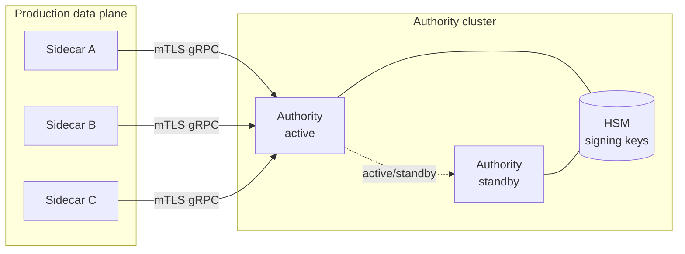

# Operating the Authority

## Production posture

The Mini Authority shipped here is reference-grade for local development and
demos. Production deployments should run a hardened build behind mutual TLS with
HSM-backed signing keys. The reference implementation intentionally exposes the
full gRPC surface for development simplicity; production hardening should
restrict the `IssueCapability` endpoint to authorized callers only and place the
Authority behind a network policy that permits inbound connections only from
known Sidecar peers.

## Topology



## Configuration

Minimal working configuration:

```toml
listen_addr        = "127.0.0.1:50051"
policy_dir         = "./policies"
revocation_file    = "./revocations.txt"
key_file           = "./firma-authority.key"
max_ttl_seconds    = 3600
bundle_ttl_seconds = 30
log_level          = "info"
```

Key fields:

- `max_ttl_seconds` — caps the TTL of any issued capability token. Requests for
  a longer TTL are clamped to this value at issuance time.
- `bundle_ttl_seconds` — controls how frequently Sidecars are expected to
  receive a refreshed policy bundle. Sidecars treat bundles older than this
  threshold as stale and fail closed.

## Capability issuance

The Authority issues PASETO v4 capability tokens via the `IssueCapability` gRPC
call. This call is pre-flight only and never on the enforcement hot path. Token
TTL is bounded by `max_ttl_seconds`; any requested TTL above this cap is
silently clamped at issuance. The `issue` CLI subcommand can pre-issue a
capability seed file for demo use without requiring a running gRPC server,
making it suitable for offline bootstrap and CI scenarios.

## Policy bundle distribution

Sidecars call `WatchPolicyBundle` (server-streaming gRPC). The Authority streams
the full bundle on connect, then pushes incremental updates whenever a policy
file changes on disk. Bundle freshness is governed by `bundle_ttl_seconds`.
Sidecars track the bundle timestamp and fail closed — denying all requests — if
the bundle becomes stale beyond the configured TTL without receiving a refresh.
This ensures a partitioned Authority cannot silently permit previously denied
actions.

## Revocation

The Authority maintains a flat `revocations.txt` file. To add a revocation entry
at runtime:

```bash
firma-authority revocations add <token-id> --reason "operator-revoked"
```

Sidecars subscribe via `WatchRevocations` (server-streaming gRPC). The Authority
streams the full revocation set on connect, then pushes deltas as new entries
are added. Compacting the revocation log removes entries for tokens whose TTL
has already expired:

```bash
firma-authority revocations compact
```

## Key rotation

To rotate the signing key without a hard cutover:

1. Generate a new key: `firma-authority generate-key --output new.key`
2. Configure Sidecars to accept both old and new public key during the
   transition window. This prevents verification failures while in-flight tokens
   signed with the old key are still live.
3. Update `key_file` in the Authority config to point at the new key.
4. Restart the Authority. Sidecars pick up the new public key during the next
   `IssueCapability` handshake.

Allow the old key's `max_ttl_seconds` window to elapse before decommissioning
the old public key from Sidecar trust configuration.

## Backups

Back up the following paths on a schedule appropriate to your retention policy:

- `key_file` — the Authority private signing key. Treat as a secret; restrict
  filesystem permissions and store encrypted offsite.
- `revocation_file` — append-only revocation log. Loss means previously revoked
  tokens could pass Stage 1 validation until the next full re-issuance cycle.
  Minimum recommended retention: 90 days.
- `policy_dir` — Cedar policy files. These are source-controlled in most
  deployments; back up the directory if they are managed outside version control.
