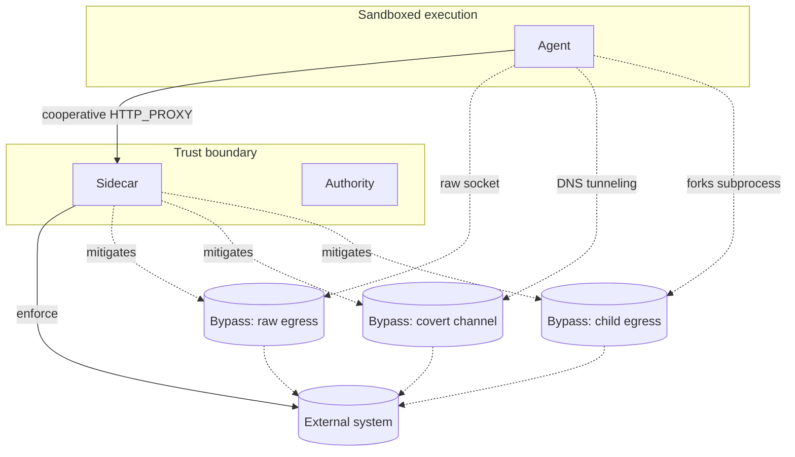

# Bypass Analysis

## Purpose

This document is OpenAuthority's security model disclosure for the interception
boundary. It maps known bypass vectors, evaluates `ExecutionEnvelope` integrity
against transport-layer tampering, and defines the structural constraints a
future eBPF enforcement layer would need to satisfy. The goal is an honest
accounting of what the sidecar enforces, where the gaps are, and what
mitigations exist or are planned.

## Scope

This document is grounded in the sidecar's normalization and enforcement
primitives as implemented today. Coverage includes HTTP/HTTPS interception,
`ExecutionEnvelope` construction and integrity, and the architectural limits of
a cooperative-proxy model.

Out of scope:

- eBPF implementation details and kernel programming specifics
- Host/container sandboxing implementation
- Cloud firewall or service-mesh policy configuration
- Exploit proof-of-concept development

## Executive summary

1. OpenAuthority V1 is an L7 policy enforcement layer, **not** a
   process-containment boundary. The sidecar does not, by itself, stop
   arbitrary process behavior or raw socket access.
2. Interception covers outbound HTTP/HTTPS routed through the sidecar proxy.
   Not covered: raw TCP/UDP and other non-proxied transports, local tool
   execution.
3. Strongest bypass vectors: raw TCP, in-process SDK, and MCP stdio.
4. Inside the covered request path, capability scope enforcement has a known
   host-boundary gap in `CapabilityMap` prefix matching (tracked; fix in
   progress).
5. `ExecutionEnvelope` integrity is strong for capability authenticity and
   normalized action/resource selection, but post-construction immutability
   is currently a convention rather than a type-enforced property.
6. eBPF can close some bypass classes but cannot fully solve local tool
   execution, stdio, or semantic intent reconstruction for encrypted protocols
   without additional userspace hooks.

## Threat model

## Bypass vectors

### HTTP_PROXY non-cooperation

An agent that ignores `HTTP_PROXY`, uses a custom TLS stack, or opens raw
sockets never routes through the sidecar. No `ExecutionEnvelope` is created,
and no capability check or policy evaluation fires. This is a structural limit
of the cooperative-proxy model. **Status:** deferred post-V1. **Mitigation:**
host-level egress forcing via iptables, eBPF, or network policy.

### Raw socket egress

An agent that opens a direct TCP or UDP socket bypasses the proxy entirely.
This is the highest-severity structural bypass class: arbitrary data leaves
the host without normalization, capability check, or Cedar policy evaluation.
**Status:** deferred post-V1. **Mitigation:** same as HTTP_PROXY
non-cooperation; `firma-run` structural confinement closes this on Linux.

### DNS tunneling

An agent can encode data in DNS query payloads to a controlled resolver,
sidestepping HTTP-level policy entirely. The sidecar has no visibility into
DNS traffic. **Status:** deferred post-V1. A DNS stub in `firma-run` provides
partial mitigation on Linux/bwrap by restricting which resolvers can be
reached.

### Process forking

An agent that spawns a subprocess may inherit a clean environment without
`HTTP_PROXY` set, or produce file, shell, or subprocess effects that never
cross the network at all. Local tool execution — file writes, shell commands,
spawned interpreters — is invisible to network-layer enforcement.
**Status:** partial in V1. **Mitigation:** `firma-run` structural confinement;
response-path enforcement for supported LLM providers.

### Cert pinning bypass

A client with certificate pinning will fail the MITM TLS handshake. In strict
mode the sidecar denies the connection. In non-strict mode the sidecar falls
back to a blind CONNECT tunnel, where only CONNECT-level (host:port) policy
is enforced; the HTTP payload and headers are opaque. **Status:** closed with
strict mode; known limitation in non-strict. See
[HTTPS MITM Strategy](../architecture/https-mitm.md).

### CONNECT smuggling

The sidecar now re-checks the `Host:` header after TLS upgrade (commit
`f3d12c8`). Before this fix, an agent could CONNECT to an allowed host, then
send a `Host:` header pointing at a different destination after the TLS
upgrade, bypassing policy on the real target. **Status:** closed.

## ExecutionEnvelope integrity

Capability claims are sidecar-selected and cryptographically verified:
signature, expiry, and revocation are all checked before Stage 2 runs.
Stage 2 evaluates the normalized `action_class` and `resource` fields, not
raw transport fields. Sensitive headers (`Authorization`, `Cookie`,
`Proxy-Authorization`, `X-Api-Key`) are stripped before the envelope is
constructed.

Two gaps are tracked and in progress. First, `ExecutionEnvelope` fields are
currently public, making immutability a convention rather than a type-enforced
guarantee — a downstream caller can mutate the envelope after construction.
Second, the caller-supplied `session_id` is written into `ExecutionMetadata`
without validation against the verified token claims.

The audit record produced for every enforcement decision includes the envelope
hash and the capability token ID, enabling post-hoc correlation between a
policy outcome and the specific token and request that produced it.

## eBPF-layer requirements

If a future eBPF interception layer is added, it must satisfy these constraints
to preserve current enforcement invariants:

- Capture outbound TCP connect/sendmsg calls, loopback traffic, and
  container-local traffic — not just external NIC egress.
- Attribute traffic to the correct workload (agent vs. sidecar vs. authority)
  to avoid self-interception loops.
- Preserve enough HTTP metadata for the normalizer (socket-level visibility
  alone cannot reconstruct semantic intent).
- Explicit fail-closed semantics if eBPF program attachment fails.
- Recognize that shell/file/stdio/local effects cannot be closed by network
  eBPF alone.

## Cross-references

- [Bypass Risks](./bypass-risks.md)
- [firma-run Deep Dive](../architecture/firma-run.md)
- [HTTPS MITM Strategy](../architecture/https-mitm.md)
