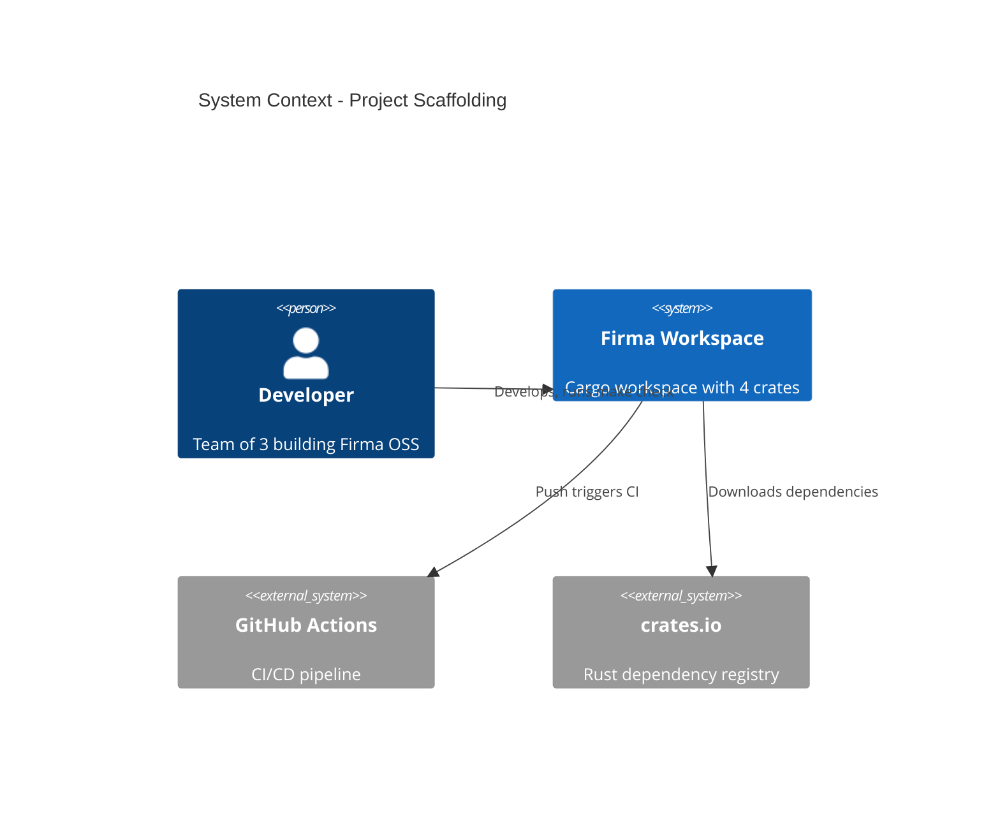

# Project Scaffolding - System Context

## System Overview

This intent establishes the Cargo workspace structure for Firma OSS. No runtime behavior — purely project setup, build tooling, and CI configuration.

## Context Diagram

## External Integrations

- **GitHub Actions**: CI pipeline triggered on push/PR — runs fmt, clippy, test, build
- **crates.io**: Dependency resolution for tokio, tracing (minimal deps at this stage)

## High-Level Constraints

- Must compile offline after initial dependency fetch
- No runtime services or external APIs
- Rust stable toolchain only
