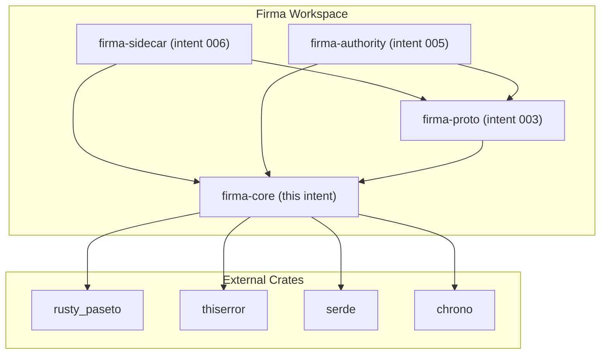

# Core Types & Shared Library - System Context

## System Overview

`firma-core` is the shared library crate at the bottom of the Firma workspace dependency graph. It defines the types, traits, and crypto primitives that both `firma-sidecar` and `firma-authority` depend on. It has no runtime behavior of its own — it is pure types, traits, and computation (token signing/verification).

## Context Diagram

## External Integrations

- **rusty_paseto**: PASETO v4 token signing and verification (Ed25519)
- **thiserror**: Derive macros for typed error enums
- **serde / serde_json**: Serialization of claims and types
- **chrono**: Timestamp handling for token expiry and issued-at

No network integrations. No runtime services. Pure library.

## High-Level Constraints

- Must not depend on `cedar-policy` — Cedar evaluation is an implementation detail of intents 005/006
- Must not perform any I/O — pure computation and types
- API surface must be stable — every other crate in the workspace depends on this
- Must pass all workspace-level Clippy lints including `deny(unwrap_used)`, `deny(expect_used)`, `deny(unsafe_code)`

## Key NFR Goals

- PASETO v4 verify < 500µs (Stage 1 latency budget)
- PASETO v4 sign < 1ms (Authority issuance path)
- Zero `unsafe` code
