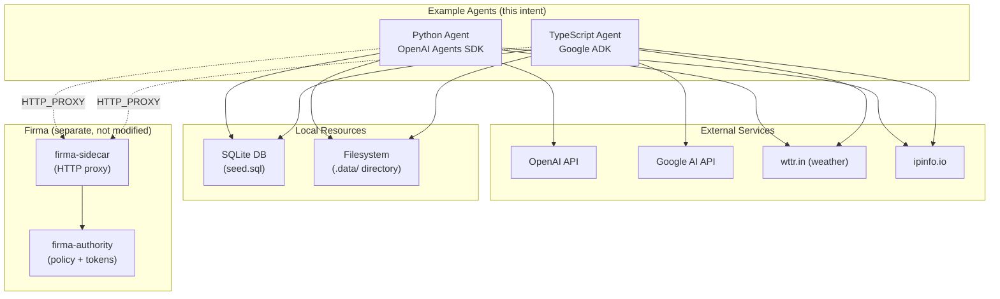

# Example Agents - System Context

## System Overview

Two standalone example agents that demonstrate how AI agents built with different SDKs integrate with Firma. The agents are intentionally simple — they exist to show that Firma enforcement and credential injection work transparently, without any agent-side code changes. Each agent provides an interactive REPL where a user can chat with the agent, which has access to network, database, file, email, and shell tools.

## Context Diagram

## External Integrations

- **OpenAI API**: LLM backend for the Python agent (gpt-4.1)
- **Google AI API**: LLM backend for the TypeScript agent via ADK
- **wttr.in**: Free weather API used by the `get_weather` tool
- **ipinfo.io**: IP geolocation API demonstrating credential injection (token injected by Firma)
- **SQLite**: Embedded database seeded with a products table for `db_query` tool

## High-Level Constraints

- Examples must not import or depend on any Firma crate
- Each agent is a standalone project with its own package manager
- Firma integration is purely via environment variables (HTTP_PROXY) — zero code coupling
- Both agents must demonstrate identical tool categories for fair SDK comparison

## Key NFR Goals

- Readability over cleverness — these are teaching examples
- Minimal dependencies — only the SDK + essentials
- Two-command setup: `make install && make run`
