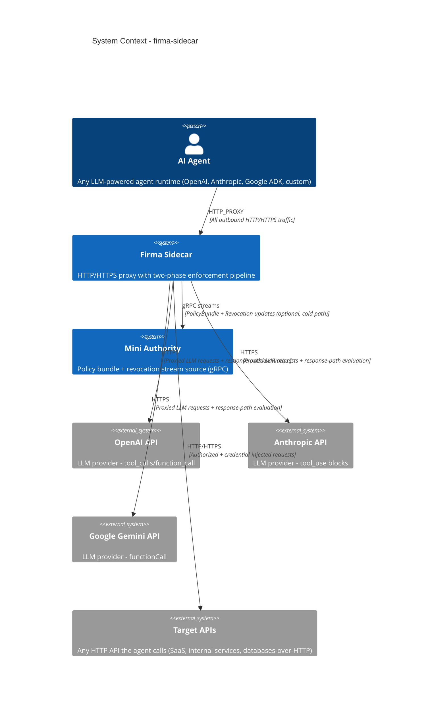

# Sidecar Proxy & Enforcement - System Context

## System Overview

The `firma-sidecar` is an HTTP/HTTPS proxy that sits between AI agents and the external world. Every outbound request from the agent passes through the Sidecar, which performs two-phase enforcement (capability validation + Cedar policy evaluation) before forwarding to the target. On the response path, LLM tool call instructions are intercepted and independently evaluated. The Sidecar is a co-located process — enforcement is fully local with no hot-path network calls.

## Context Diagram

## Actors

- **AI Agent** (System User): Any LLM-powered agent runtime. Routes all outbound traffic through the Sidecar via `HTTP_PROXY` env var. Trusts the Sidecar CA cert for HTTPS interception. Zero code changes required.
- **Mini Authority** (Internal System): Provides policy bundles and revocation streams over gRPC. Contacted only on cold path (startup, periodic sync). Optional — Sidecar can run file-only mode without it.
- **Operator** (Human): Configures the Sidecar (TOML config, Cedar policies, credential mappings). Monitors via Prometheus metrics and audit logs.

## External Integrations

- **LLM Providers (OpenAI, Anthropic, Gemini)**: HTTPS outbound. Sidecar performs request-path enforcement on outbound calls and response-path evaluation on tool call instructions in replies. Provider detection is automatic based on target host.
- **Target APIs**: Any HTTP/HTTPS endpoint the agent calls. Sidecar enforces policy and injects credentials before forwarding.
- **Mini Authority (gRPC)**: Optional. Server-streaming RPCs for policy bundle updates (`WatchPolicyBundle`) and revocation events (`WatchRevocations`). Cold-path only.
- **Prometheus / Monitoring**: Sidecar exposes `/metrics` for scraping. Audit events emitted to stdout/file sinks.

## Data Flows

### Inbound (from Agent)
- HTTP requests (method, headers, body, URL) via proxy
- HTTPS CONNECT tunnels (Sidecar performs MITM TLS interception)
- Capability tokens (carried in requests or Sidecar-managed)

### Inbound (from Authority — cold path)
- Cedar policy bundles (initial + incremental updates)
- Revocation events (token IDs to revoke)

### Outbound (to Target Systems)
- Authorized HTTP/HTTPS requests with injected credentials
- LLM API responses with denied tool calls rewritten to provider-native denial results

### Outbound (to Operator)
- ECDSA-signed audit events (JSON lines to stdout/file)
- Prometheus metrics (`/metrics`)
- Health/readiness signals (`/healthz`, `/readyz`)

## High-Level Constraints

- Enforcement is fully local — no network calls on the hot path
- Fail-closed default — deny on any uncertainty
- Single binary (`firma-sidecar`) deployed as sidecar process alongside the agent
- Depends on `firma-core` (types/traits) and `firma-proto` (gRPC definitions) — both complete and stable
- Pingora as proxy engine, Cedar for policy evaluation, rustls + rcgen for TLS

## Key NFR Goals

- < 3ms p95 end-to-end enforcement overhead
- < 100 MB RSS steady-state
- 5k–20k req/s throughput (single instance)
- Policy hot-reload < 500ms
- Best-effort async audit delivery (event loss on crash acceptable in V1)
